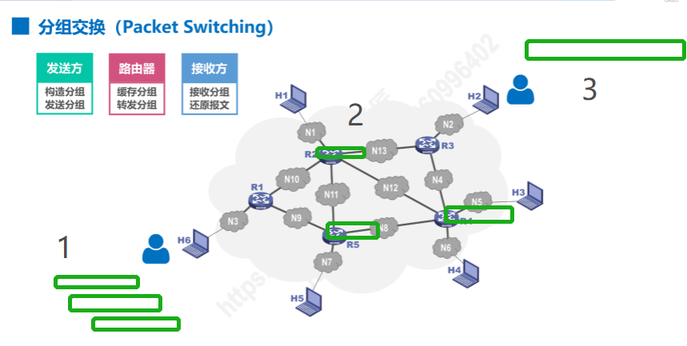
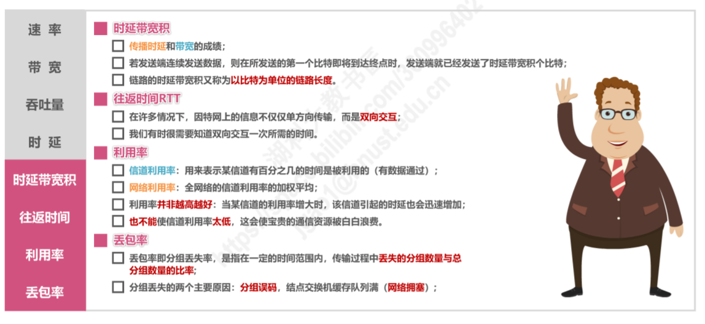

# 计算机网络（第一章）

## 1.概述

### 1.1.1 网络、互联网（互连网）与因特网

- **网络（Network）**由若干**结点（node）**和连接结点的**链路（Link）**构成

- 多个网络通过路由互连，形成覆盖范围更大的网络，即**互联网**。

  互连网又称为**网络的网络(Network of Networks)**。

- **因特网（Internet）**是世界上最大的互连网络

  

### 1.1.2 网络发展三阶段

#### ISP三层结构示意图

- ISP按层次分主要有主干ISP，地区ISP，本地ISP
- 一般由本地ISP给用户提供直接的服务

### 1.1.3 因特网的组成

#### 边缘部分

​	由所有连接在因特网上的**主机**组成。这部分是用户直接使用的，用于**通信**，和资源共享。

​	边缘部分主机示例：PC,手提电脑，手机，摄像头等。

#### 核心部分

​	由大量网络和连接网络的路由构成。这部分是为边缘部分提供服务的（提供连通性和交换）。

###  1.2 三种交换方式

- 电路交换（Circuit Switching）
- 分组交换（Packet Switching）
- 报文交换（Message Switching）

##### 电路交换

含义：

- 电话交换机**接通电话线**的方式成为电路交换
- 从通信资源分配角度来看：交换时按照某种方式动态分配传输线路的资源

电路交换的多种形式

- 一对一直连
- 两两直连
- 借助交换机连接

电路交换三步骤

- 建立连接（分配通信资源）
  - 用户打电话之前，必须线拨号请求建立连接
  - 被叫用户听到拨号音并摘机后，便从主叫端到被叫端建立了一条连接
  - 此连接为专用的物理通路，保证双方通话时所需的通信资源
    - 如此图红线从左往右则是建立连接的过程
  - 此期间该线路不可被第三方占用
- 通话（一直占用通信资源）
- 释放连接（归还通信资源） 
  

当用电路交换传输计算机的数据时，线路传输效率极低

##### 分组交换

- 发送方
  1. 发送方(H6)将要发送的信息拆分成分组（假设3组）
  2. 拆分好后进行发送
- 路由器
  1. 分组会在网络拥堵时缓存在路由器（如R2）中
  2. 网络不拥堵时再转发
     - 类似快递中转
     - 各分组无统一的路径，但起点终点应该相同
- 接收方
  1. 接收方会接受所有的分组
  2. 还原成发送方要发送的信息

#### 三种交换对比

- 在报文交换中，进行存储转发功能的是路由器

### 1.3 计算机网络的分类

#### 相关示意图

### 1.4 计算机网络性能指标

- 性能指标从不同方面度量计算机网络的性能
- 八个指标
  - 速率
  - 带宽
  - 吞吐量
  - 时延
  - 时延带宽积
  - 往返时间
  - 利用率
  - 丢包率

##### 1.4.1 速率

##### 1.4.2 带宽(带宽是速率的最大值)

##### 1.4.3 吞吐量

##### 1.4.4 时延

时延有三种

- 传播时延
- 处理时延
- 排队时延（下图中与处理时延合并）
- 发送时延

发送速率的决定由三部分组成

- 网卡发送速率
- 信道带宽
- 接口速率

电磁波在自由空间传播速率为光速

**时延的主导不具有唯一结论，主导的时延由多个条件决定**

##### 小结一

##### 1.4.5 时延带宽积

- 时延带宽积 = 传播时延 * 带宽

##### 1.4.6 往返时间

往返时间（RRT）由两部分相加

- 发送方发送源分组到接收方的时间（红色）
- 接受方发送确认分组到发送方的时间（绿色）

卫星链路中的传播时延较大

##### 1.4.7 利用率

##### 1.4.8 丢包率

##### 小结二

### 1.5 计算机网络体系结构

#### 第一部分

##### 常用结构以及其中包含的相关协议

##### 常用的计算机网络体系结构

- 网络接口层被差分为物理层+数据链路层
- OSI体系繁杂，不被众人认可
- **TCP/IP体系十分重要！！！！！**

#### 第二部分

1. 计算机网络结构分层的必要性

   - 计算机网络是个非常复杂的系统。
   - 分层可将庞大复杂的问题转为较小的局部问题

2. 对于各层问题的叙述

   - 物理层
     - 采用怎样的传输媒体
     - 采用怎样的物理接口
     - 采用怎样的信号表示比特0和1
   - 数据链路层
     - 如何表示网络中的各主机
     - 如何从信号所表示的一连串比特流中区分出地址和数据
     - 如何协调各主机争用总线
   - 网络层
     - 如何标识个网络以及网络中的各主机（网络和主机共同编址的问题，如IP地址）
     - 路由器如何转发分组，如何进行路由选择
   - 运输层
     - 如何解决进程之间基于网络的通信问题
     - 出现传输错误时，如何处理
   - 应用层
     - 通过应用进程间的交互来完成特定的网络应用

3. 图示

   

####  第三部分

**体系结构的各层在整个过程中起到怎样的作用？**

大图展示

**发送方发送**

第一步:

- **应用层**按照HTTP协议的规定构建一个**HTTP请求报文**
- 应用层将**HTTP请求报文**交付给**运输层**处理

第二步：

- **运输层**给**HTTP请求报文**添加一个**TCP首部**，使之成为**TCP报文段**
- **TCP报文段的首部格式**作用是区分应用进程以及实现可靠传输
- **运输层**将T**CP报文段**交付给**网络层**处理

第三步：

- **网络层**给**TCP报文段**添加一个**IP首部**，使之成为**IP数据报**
- **IP数据报的首部格式**作用是使**IP数据报**可以在互联网传输，也就是被路由器转发
- **网络层**将**IP数据报**交付给**数据链路层**处理

第四步：

- **数据链路层**给**IP数据报**添加一个**首部**和一个**尾部**，使之成为**帧** （图示右边为首部，左边为尾部）
- 该**首部**的作用主要是为了让**帧**能够在一段链路上或一个网络上传输，能够被相应的目的主机接收
- 该**尾部**的作用是让目的主机检查所接收到的**帧**是否有误码
- **数据链路层**将**帧**交付给**物理层**

第五步：

- **物理层**先将**帧**看做是**比特流**，这里的网络N1假设是以太网，所以**物理层**还会给该**比特流**前面添加**前导码**
- **前导码**的作用是为了让目的主机做好接收帧的准备
- **物理层**将装有**前导码**的**比特流**变换成相应的**信号**发送给传输媒体

第六步：

- **信号**通过**传输媒体**到达**路由器**

**路由器左端（接口）**

- **物理层**将**信号**变为**比特流**，然后去掉**前导码**后，将其交付给**数据链路层**
- **数据链路层**将**帧**的**首部**和**尾部**去掉后，将其交付给**网络层**，这实际交付的是**IP数据报**
- **网络层**解析**IP数据报**的**首部**，从中提取**目的网络地址**

**路由器右端（输出口）**

- 提取**目的网络地址**后查找**自身路由表**。确定**转发端口**， 以便进行转发
- **网络层**将**IP数据报**交付给**数据链路层**
- **数据链路层**给**IP数据报**添加一个**首部**和一个尾部，使之成为**帧**
- **数据链路层**将帧交付给**物理层**
- **物理层**先将**帧**看成**比特流**，这里的网络N2假设是以太网，所以**物理层**还会给该**比特流**前面添加**前导码**
- 物理层将**装有前导码的比特流**变换成相应的**信号**发送给传输媒体，信号通过传输媒体到达**Web服务器**

**接收方接收**

和发送方（主机）发送过程的封装正好是反着来

在Web 服务器上

- **物理层**将**信号**变换为**比特流**，然后去掉**前导码**后成为**帧**，交付给**数据链路层**
- **数据链路层**将**帧**的**首部**和**尾部**去掉后成为**IP数据报**，将其交付给**网络层**
- **网络层**将**IP数据报**的**首部**去掉后成为**TCP报文段**，将其交付给**运输层**
- **运输层**将**TCP报文段**的**首部**去掉后成为**HTTP请求报文**，将其交付给**应用层**
- **应用层**对**HTTP请求报文**进行**解析**，然后给主机发回**响应报文**

**发回响应报文的步骤和之前过程类似**

#### 第四部分

##### 计算机专用术语

- 实体：任何可发送或接受信息的硬件或软件进程

- 对等实体： 收发双方相同层次中的实体

- 协议：控制两个对等实体进行逻辑通信的规则的集合

- 协议三要素

  - 语法：定义所交换信息的样式
  - 语义：定义收发双方所要完成的操作
  - 同步：定义收发双方的时序关系

- 服务：在协议的控制下，两个对等实体间的逻辑通信使得本层能够向上一层提供服务

  - 要实现本次协议，还需要使用下面一层所提供的服务

  - **协议水平，服务垂直**

  - 实体看得见相邻下层提供的服务，但不知道该服务的具体协议。

    也就是说，下面的协议对上面的实体是透明的

- 服务访问点：在同一系统中相邻两层的实体交换信息的逻辑接口，用于区分不同的服务类型

- 服务原语：上层使用下层所提供的服务必须通过与下层交换一些命令，这些命令成为服务原语

- 协议数据单元PDU：对等层次之间的传送的数据包成为该层的协议数据单元

- 服务数据单元SDU：同一系统中，层与层之间的交换的数据包，成为服务数据单元

**图示**

**实体**

**协议**

**服务**

