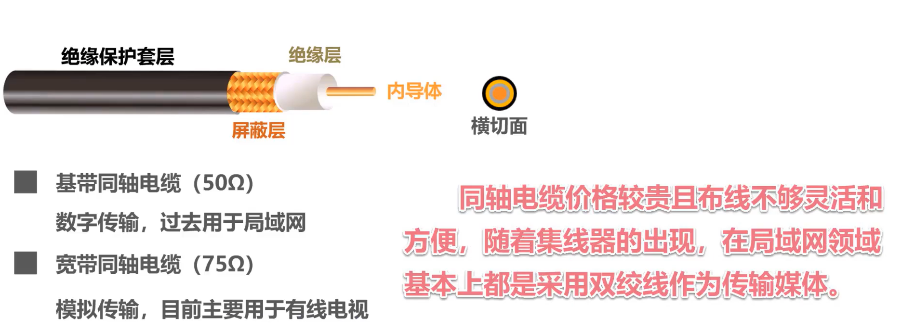
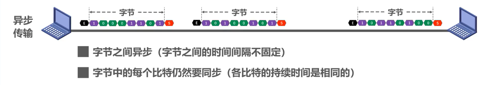
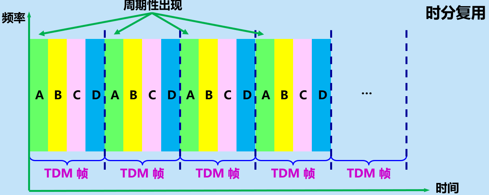

# 计算机网络（第二章）

## 物理层基本概念

- 物理层考虑的是怎样才能在连接各种计算机的传输媒体上**传输数据比特流**
- 物理层为数据链路层屏蔽了各种传输媒体的差异
  - 使数据链路层只要思考如何完成本层的协议和服务
  - 而不需要考虑网络具体的传输媒体是什么

### 物理层协议主要任务

- 机械特性：指明接口所用接线器的**形状**和**尺寸**、**引脚数目**和**排列**、**固定**和**锁定**装置。
- 电气特性：指明在接口电缆的各线上出现的**电压的范围**。
- 功能特性：指明某条线上出现的某一电平的电压表示**何种意义**。
- 过程特性：指明对于不同功能的各种可能**事件的出现顺序**。

## 物理层下面的传输媒体

**传输媒体**也称为传输介质或传输媒介

- 是数据传输系统中在发送器和接收器之间的物理通路。
- **传输媒体**可分为两大类
  - **导引型传输媒体**
  - **非导引型传输媒体**

传输媒体不属于计算机网络体系结构的任何一层。如果非要将它添加到体系结构中，那只能将其放置到物理层之下。

### 导引型传输媒体

在导引型传输媒体中，电磁波被导引沿着固体媒体传播。

**同轴电缆**

**双绞线**

**光纤**

**多模光纤**

- 可以存在多条不同角度入射的光线在一条光纤中传输。这种光纤就称为**多模光纤**。

**单模光纤**

- 若光纤的直径减小到只有一个光的波长，则光纤就像一根波导那样，它可使光线一直向前传播，而不会产生多次反射。这样的光纤称为**单模光纤**。

**电力线**

### 非导引型传输媒体

非导引型传输媒体是指自由空间

**无线电波**

**微波**

**红外线**

**可见光**

## 传输方式

### 串行传输和并行传输

---

**串行传输**：

- 数据是一个比特一个比特依次发送的，因此在发送端与接收端之间，只需要一条数据传输线路即可

**并行传输**：

- 一次发送n个比特，因此，在发送端和接收端之间需要有n条传输线路
- 并行传输的优点是比串行传输的速度n倍，但成本高

数据在传输线路上的传输采用是**串行传输**，计算机内部的数据传输常用**并行传输**

### 同步传输和异步传输

---

**同步传输**：

- 数据块以稳定的比特流的形式传输。字节之间没有间隔
- 接收端在每个比特信号的中间时刻进行检测，以判别接收到的是比特0还是比特1
- 由于不同设备的时钟频率存在一定差异，不可能做到完全相同，在传输大量数据的过程中，所产生的判别时刻的累计误差，会导致接收端对比特信号的判别错位

**所以要使收发双发时钟保持同步**

---

---

---

**异步传输**：

- 以字节为独立的传输单位，字节之间的时间间隔不是固定
- 接收端仅在每个字节的起始处对字节内的比特实现同步
- 通常在每个字节前后分别加上起始位和结束位

---

### 单工、半双工、全双工通信

​		在许多情况下，我们要使用“**信道（channel）**”这一名词。信道和电路并不等同。信道一般都是用来表示向某一个方向传送信息的媒体。因此，一条通信电路往往包含一条发送信道和一条接收信道。

从通信的双方信息交互的方式来看，可以有以下三种基本方式

1. **单向通信**

   - 即只能有一个方向的通信而没有反方向的交互。

   - 无线电广播或有线电以及电视广播就属于这种类型

2. **双向交替通信**

   - 即通信的双方可以发送信息，但不能双方同时发送（当然也就不能同时接收）。这种通信方式使一方发送另一方接收，过一段时间后可以再反过来.
   - 短信

   

3. **双向同时通信**：

   - 即通信的双发可以同时发送和接收信息

   

---

碎碎念

- **单向通信**只需要一条信道，

- **双向交替通信**或**双向同时通信**则需要两条信道（每个方向各一条）

- **双向同时通信**的传输效率最高

---

## 编码与调制

---

**常用术语**

- **数据 (data)** —— 运送消息的实体。
- **信号 (signal)** —— 数据的电气的或电磁的表现。

- **模拟信号 (analogous signal)** —— 代表消息的参数的取值是连续的。

- **数字信号 (digital signal)** —— 代表消息的参数的取值是离散的。

- **码元 (code)** —— 在使用时间域（或简称为时域）的波形表示数字信号时，代表不同离散数值的基本波形。

- **基带信号**（即基本频带信号）—— 来自信源的信号。像计算机输出的代表各种文字或图像文件的数据信号都属于基带信号。

- 基带信号往往包含有较多的低频成分，甚至有直流成分，而许多信道并不能传输这种低频分量或直流分量。因此必须对基带信号进行**调制** (modulation)。

---

在计算机网络中，常见的是将数字基带信号通过编码或调制的方法在相应信道进行传输

#### 传输媒体与信道的关系

> **信道的几个基本概念**
>
> - **信道** —— 一般用来表示向某一个方向传送信息的媒体。
> - **单向通信（单工通信）**——只能有一个方向的通信而没有反方向的交互。
> - **双向交替通信（半双工通信）**——通信的双方都可以发送信息，但不能双方同时发送(当然也就不能同时接收)。
> - **双向同时通信（全双工通信）**——通信的双方可以同时发送和接收信息。

#### 传输媒体

> 严格来说，传输媒体不能和信道划等号
>
> 对于单工传输，传输媒体只包含一个信道，要么是发送信道，要么是接收信道
>
> 对于半双工和全双工，传输媒体中要包含两个信道，一个发送信道，另一个是接收信道
>
> 如果使用信道复用技术，一条传输媒体还可以包含多个信道

### 常用编码

#### 零比特编码

如何判断码元

- 需要多一根传输线传播时钟信号
  - 时钟信号传递区间段位置（虚线位置）
  - 操作有点蠢，没有将资源用到极致
- 中间的虚线是零电平，所谓不归零编码，就是指在整个码元时间内，电平不会出现零电平
- **实际比特1和比特0的表示要看现实怎么规定**

#### 归零编码

- 零电平概念的诞生解决了码元判断问题，可不用传输时钟信号
- 还是浪费资源（因为需要归零），效率低

#### 曼彻斯特编码

在每个码元时间的中间时刻，信号都会发生跳变

- 负跳变表示比特1/0
- 正跳变表示比特0/1
- 码元中间时刻的跳变即表示时钟，又表示数据

**实际比特1和比特0的表示要看现实怎么规定**

传统以太网使用的就是曼切斯特编码

#### **差分曼彻斯特编码**

在每个码元时间的中间时刻，信号都会发送跳变，但与**曼彻斯特不同**

- **跳变仅表示时钟**
- **码元开始处电平是否变换表示数据**
  - 变化表示比特1/0
  - 不变化表示比特0/1

**实际比特1和比特0的表示要看现实怎么规定**

比曼彻斯特编码变化少，更适合较高的传输速率

### 调制

数字信号转换为模拟信号，在模拟信道中传输，例如WiFi，采用补码键控CCK/直接序列扩频DSSS/正交频分复用OFDM等**调制**方式。

模拟信号转换为另一种模拟信号，在模拟信道中传输，例如，语音数据加载到模拟的载波信号中传输。频分复用FDM技术，充分利用带宽资源。

**基本调制方法**

>- **调幅AM**：所调制的信号由两种不同振幅的基本波形构成。每个基本波形只能表示1比特信息量。
>- **调频FM**：所调制的信号由两种不同频率的基本波形构成。每个基本波形只能表示1比特信息量。
>- **调相PM**：所调制的信号由两种不同初相位的基本波形构成。每个基本波形只能表示1比特信息量。
>
>但是使用基本调制方法，1个码元只能包含1个比特信息

**混合调制**

>频率、相位：
>
>- 因为频率和相位是相关的，即频率使相位随时间的变化率。
>- 所以一次只能调制频率和相位两个中的一个。
>
>相位、振幅：
>
>- 通常情况下，相位和振幅可以结合一起调制
>- 称为正交振幅调剂QAM

## 信道的极限容量

- 任何实际的信道都不是理想的，在传输信号时会产生各种失真以及带来多种干扰。
- 码元传输的速率越高，或信号传输的距离越远，或传输媒体质量越差，在信道的输出端的波形的失真就越严重。

失真的原因：

- 码元传输的效率越高
- 信号传输的距离越远
- 噪声干扰越大
- 传输媒体质量越差

**奈氏准则和香农公式及对比**

## 频分复用、时分复用和统计时分复用

复用 (multiplexing) 是通信技术中的基本概念。

它允许用户使用一个共享信道进行通信，降低成本，提高利用率。

**频分复用 FDM (Frequency Division Multiplexing)**

- 将整个带宽分为多份，用户在分配到一定的频带后，在通信过程中自始至终都占用这个频带。
- **频分复用**的所有用户在同样的时间**占用不同的带宽资源**（请注意，这里的“带宽”是频率带宽而不是数据的发送速率）。

**时分复用TDM (Time Division Multiplexing)**

- **时分复用**则是将时间划分为一段段等长的**时分复用帧（TDM帧）**。每一个时分复用的用户在每一个 TDM 帧中占用固定序号的时隙。
- 每一个用户所占用的时隙是**周期性地出现**（其周期就是TDM帧的长度）的。
- TDM 信号也称为**等时** (isochronous) 信号。
- **时分复用的所有用户在不同的时间占用同样的频带宽度。**

- **时分复用可能会造成线路资源的浪费**
  - 使用时分复用系统传送计算机数据时，由于计算机数据的突发性质，用户对分配到的子信道的利用率一般是不高的。

**统计时分复用 STDM (Statistic TDM)**

## 波分复用

波分复用 WDM(Wavelength Division Multiplexing)

## 码分复用

码分复用 CDM (Code Division Multiplexing)

- 常用的名词是**码分多址** CDMA (Code Division Multiple Access)。
- 各用户使用经过特殊挑选的不同码型，因此彼此不会造成干扰。
- 这种系统发送的信号有很强的抗干扰能力，其频谱类似于白噪声，不易被敌人发现。

