# 计算机网络（第三章）

## 数据链路层概述

- 链路（Link）就是从一个结点到相邻结点的一段物理线路，而中间没有任何其他交换的结点。
- 数据链路（Data Link）是指把实现通信协议的硬件和软件加到链路上，就构成数据链路。
- 数据链路层以帧为单位传输和处理数据。

**仅从数据链路层观察帧的流动**

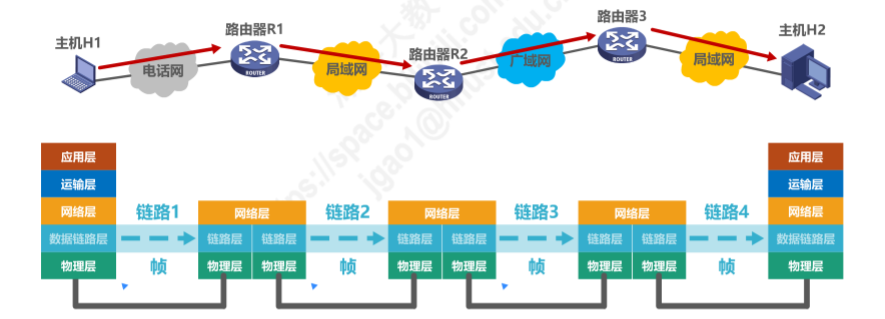

> 主机H1 到主机H2 所经过的网络可以是多种不同类型的
>
> **注意：不同的链路层可能采用不同的数据链路层协议**

**数据链路层使用的信道**

数据链路层属于计算机网路的低层。**数据链路层使用的信道主要有以下两种类型：**

- 点对点信道
- 广播信道

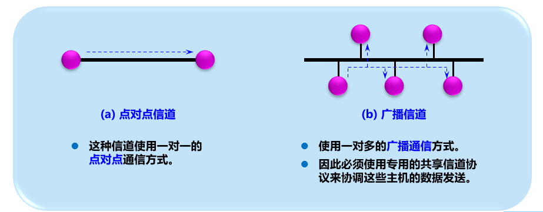

**局域网属于数据链路层**

局域网虽然是个网络。但我们并不把局域网放在网络层中讨论。这是因为在网络层要讨论的是多个网络互连的问题，是讨论分组怎么从一个网络，通过路由器，转发到另一个网络。

而在同一个局域网中，分组怎么从一台主机传送到另一台主机，但并不经过路由器转发。从整个互联网来看，**局域网仍属于数据链路层**的范围

### 数据链路层的三个重要问题

#### 封装成帧

- **封装成帧** (framing) 就是在一段数据的前后分别添加首部和尾部，然后就构成了一个帧。
- 首部和尾部的一个重要作用就是进行**帧定界**。

 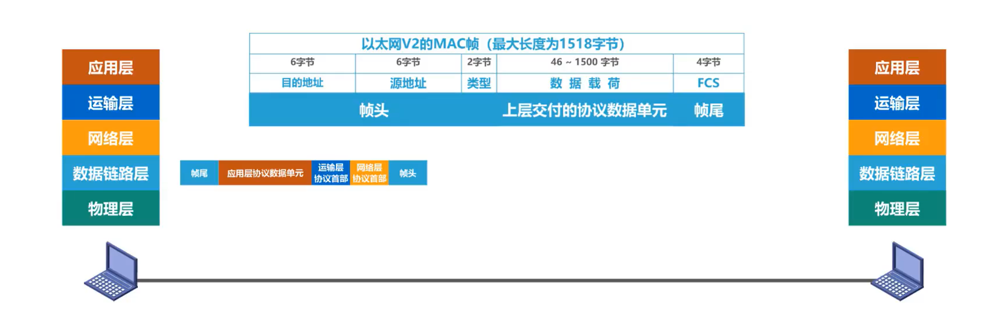

#### 差错检测

- 在传输过程中可能会产生**比特差错**：1 可能会变成 0， 而 0 也可能变成 1。

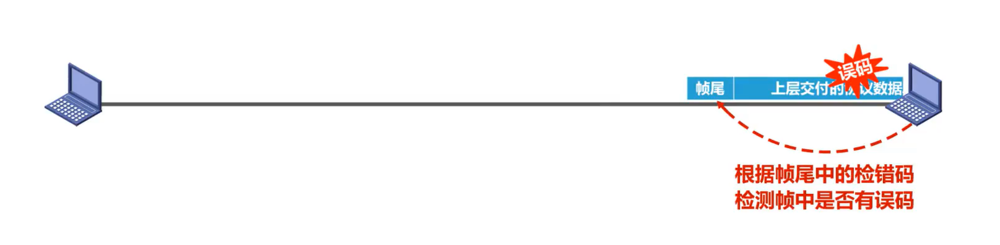

#### 可靠传输

- 接收方主机收到有误码的帧后，是不会接受该帧的，会将它丢弃

- 如果数据链路层向其上层提供的是不可靠服务，那么丢弃就丢弃了，不会再有更多措施

- **如果数据链路层向其上层提供的是可靠服务，那就还需要其他措施，来确保接收方主机还可以重新收到被丢弃的这个帧的正确副本**

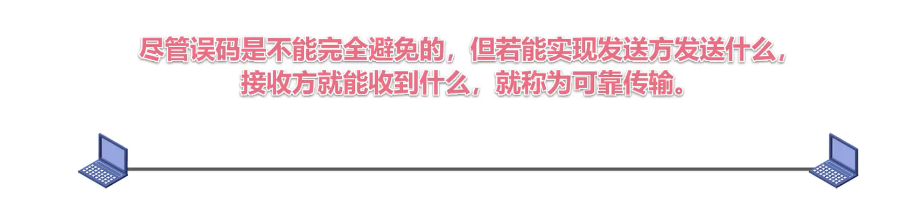

> 以上三个问题都是使用**点对点信道的数据链路层**来举例的

**其余的问题**

> - 如何知道帧是给本机的？
>
>   - 可以用编址（地址）的来解决，将帧的目的地址添加在帧中一起传输
>
> - 数据碰撞怎么办
>
>   有线（局域网）领域 使用**点对点链路**和**链路层交换机**的**交换式局域网**取代了
>
>   共享式局域网

## 封装成帧

- 封装成帧是指数据链路层交给上层交付的协议数据单元添加帧头帧尾使之成为帧

  - 帧头帧尾中包含重要的控制信息。

  - 帧头和帧尾的作用之一就是帧定界

    > 但比不是每一种数据链路层协议的帧都包含有帧定界标志

- 透明传输是指**数据链路层对上层交付的传输数据没有任何限制**，就好像数据链路层不存在一样。

  >**透明** : 指某一个实际存在的事物看起来却好像不存在一样。
  >
  >但数据链路层应该对上层交付的数据有限制，其内容不能包含帧定界符的值

  - 面向字节的物理链路使用字节填充（或称字符填充）的方法实现透明传输。

    - 发送端的数据链路层在数据中出现控制字符“SOH”或“EOT”的前面**插入一个转义字符“ESC”**(其十六进制编码是1B)。

    - 接收端的数据链路层在将数据送往网络层之前删除插入的转义字符。

    - 如果转义字符也出现在数据当中，那么应在转义字符前面插入一个转义字符 ESC。当接收端收到连续的两个转义字符时，就删除其中前面的一个。

      

    

  - 面向比特的物理链路使用比特填充的方法实现透明传输。

    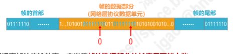

- 为了提高真的传输效率，应当使帧的数据部分的长度尽量大些

- 考虑道差错控制的多种因素，每一种数据链路层协议都规定了真的数据部分的长度上限，即最大传送单元MTU。

  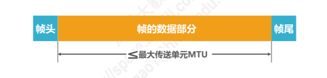

## 差错检测

- 实际的通信链路都不是理想的，比特在传输过程中可能出现差错（1->0,0->1）。这称为比特差错。
- 在一段时间内，传输错误的比特占所传输比特总书的比率成为误码率BER(Bit Error Rate)
- 使用差错检测码来检测数据在传输过程中是否产生了比特差错，是数据链路层所要解决的重要问题之一。

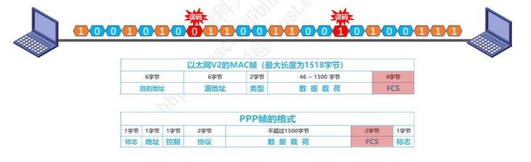

**奇偶检验**

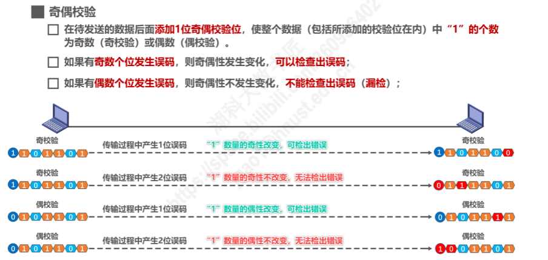

**循环冗余检验**

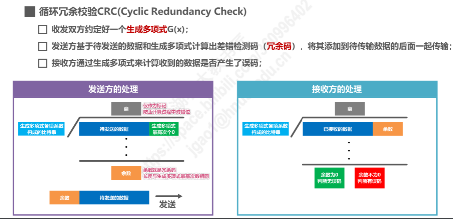

**流程**

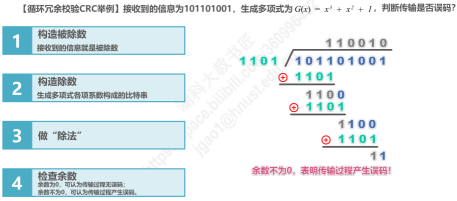

---

$$
G(x) = x^3 + x^2 + 0 + 1
$$

- 此G(X)为除数算子，按找二进制换算为1101
- 够四位则进行异或算法
  - 第三个“0”处要填1的话，则是 0011^^1101,无意义
- 取余数判断结果
- 循环冗余校验 CRC 是一种检错方法，而帧校验序列 FCS 是添加在数据后面的冗余码

---

相关结论

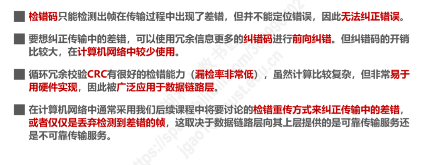

## 可靠传输

**概念**

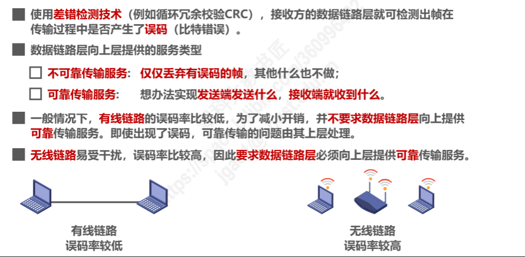

---

其余差错

- 分组丢失：路由器输入队列快满了，主动丢弃收到的分组
- 分组失序：数据并未按照发送顺序依次到达接收端
- 分组重复：由于某些原因，有些分组在网络中滞留了，没有及时到达接收端，这可能会造成发送端对该分组的重发，重发的分组到达接收端，但一段时间后，滞留在网络的分组也到达了接收端，这就造成**分组重复**的传输差错

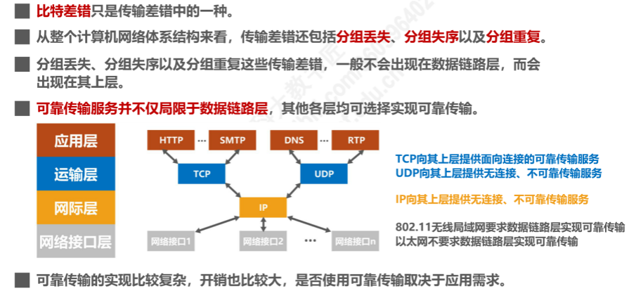

---

## 三种可靠协议

- 停止-等待协议SW
- 回退N帧协议GBN
- 选择重传协议SR

> 这三种可靠传输实现机制的基本原理并不仅限于数据链路层，可以应用到计算机网络体系结构的各层协议中

## 停止-等待协议

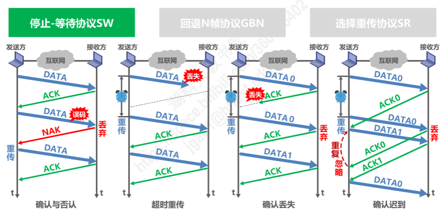

---

1. 确认与否认

    - 对于误码的数据发送NAK
    - 对于接受到的正常数据发送ACK

2. 超时重传

    - 若data发送过程中丢失，一段时间没有接受到ACK的确认，则会触发超时重传计时器
    - 再次发送数据，知道收到ACK

3. 确认丢失

    - 若接收方发送的ACK未被发送端收到
      - 则发送端会等到超时重传器触发后重新发送数据
      - 但这数据会被接受端丢弃，然后补发ACK

4. 确认迟到

    - 接收端的ACK发送时间过久导致发送端超时重传器触发

    - 发送端进行超时重传
    - 多余重复的ACK直接被忽略

---

碎碎念

​		像停止-等待协议这样通过确认和重传机制实现的可靠传输协议，常称为自动请求重传协议ARQ(**A**utomatic **R**epeat re**Q**uest)，意思是重传的请求是自动进行，因为不需要接收方显式地请求，发送方重传某个发送的分组

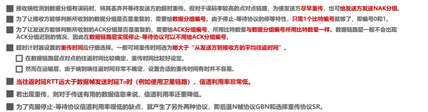

习题

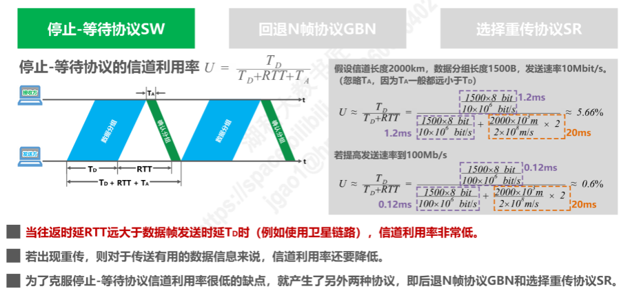

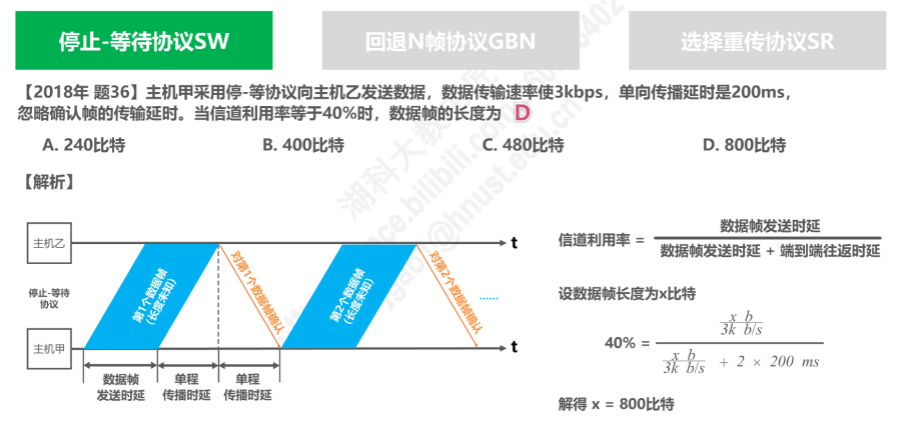

## 回退N帧协议

### 为什么用回退N帧协议

在相同的时间内，使用停止-等待协议的发送方只能发送一个数据分组，而采用流水线传输的发送方，可以发送多个数据分组

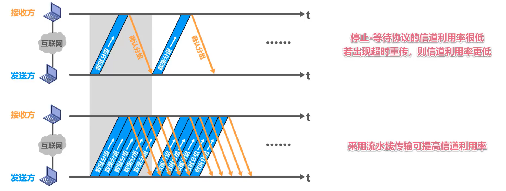

### 无差错情况流程

发送方将序号落在发送窗口内的0~4号数据分组，依次连续发送出去

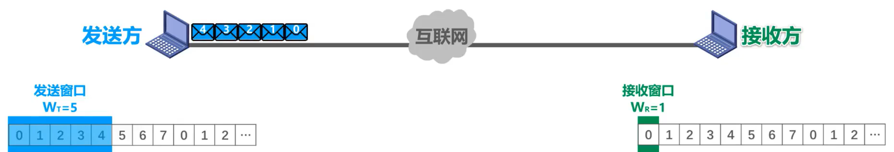

他们经过互联网传输正确到达接收方，就是没有乱序和误码，接收方按序接收它们，每接收一个，接收窗口就向前滑动一个位置，并给发送方发送针对所接收分组的确认分组，在通过互联网的传输正确到达了发送方

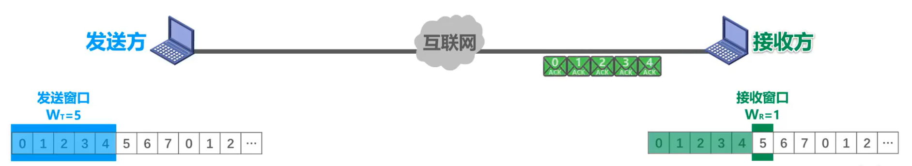

发送方每接收一个、发送窗口就向前滑动一个位置，这样就有新的序号落入发送窗口，发送方可以将收到确认的数据分组从缓存中删除了，而接收方可以择机将已接收的数据分组交付上层处理

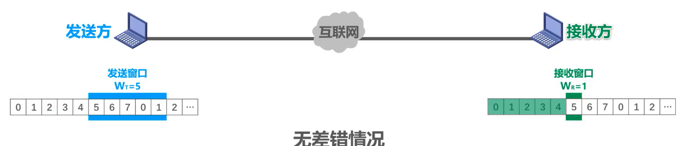

### 累计确认

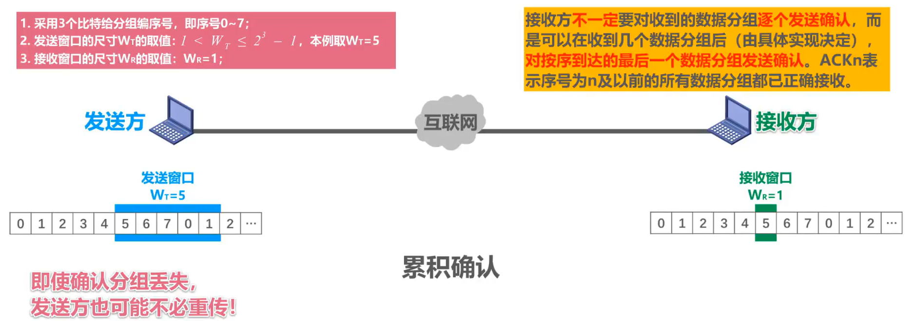

> 累计确认
>
> 优点:
>
> - 即使确认分组丢失，发送方也可能不必重传
> - 减小接收方的开销
> - 减小对网络资源的占用
>
> 缺点：
>
> - 不能向发送方及时反映出接收方已经正确接收的数据分组信息

### 有差错情况

例如

在传输数据分组时，5号数据分组出现误码，接收方通过数据分组中的检错码发现了错误

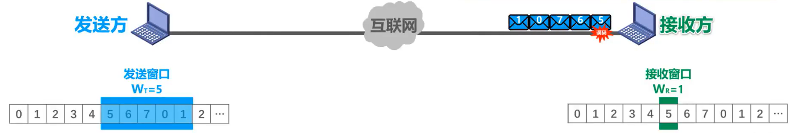

于是丢弃该分组，而后续到达的这剩下四个分组与接收窗口的序号不匹配

接收同样也不能接收它们，讲它们丢弃，并对之前按序接收的最后一个数据分组进行确认，发送ACK4，**每丢弃一个数据分组，就发送一个ACK4**

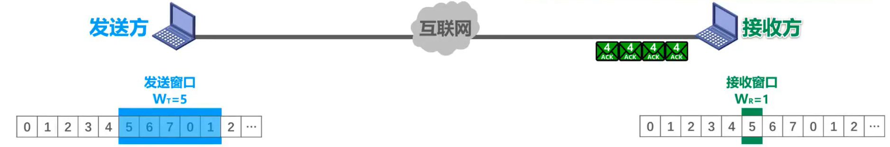

当收到重复的ACK4时，就知道之前所发送的数据分组出现了差错，于是可以不等超时计时器超时就立刻开始重传，具体收到几个重复确认就立刻重传，根据具体实现决定

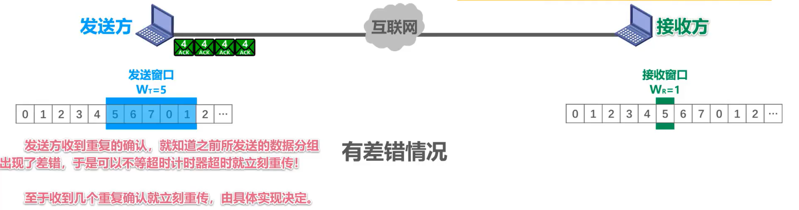

如果收到这4个重复的确认并不会触发发送立刻重传，一段时间后。超时计时器超时，也会将发送窗口内以发送过的这些数据分组全部重传

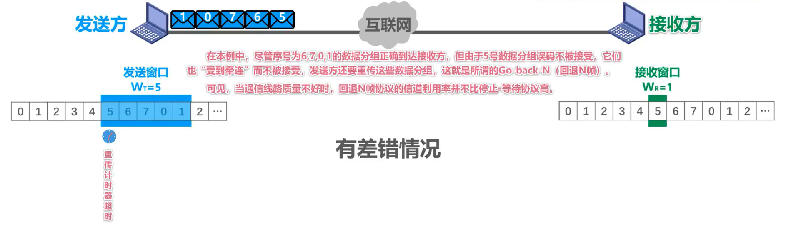

若WT超过取值范围，例如WT=8，会出现什么情况？

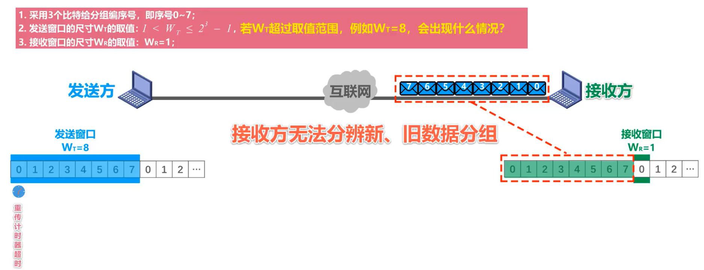

习题

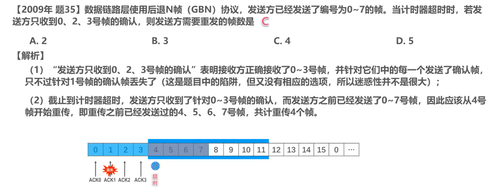

**总结**

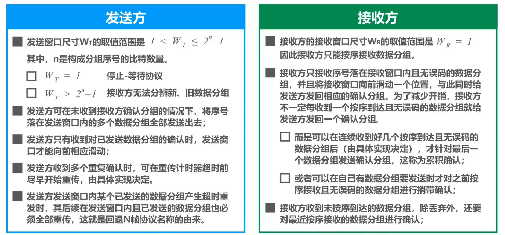

- 回退N帧协议在流水线传输的基础上利用发送窗口来限制发送方连续发送数据分组的数量，是一种连续ARQ协议
- 在协议的工作过程中发送窗口和接收窗口不断向前滑动，因此这类协议又称为滑动窗口协议
- 由于回退N帧协议的特性，当通信线路质量不好时，其信道利用率并不比停止-等待协议高

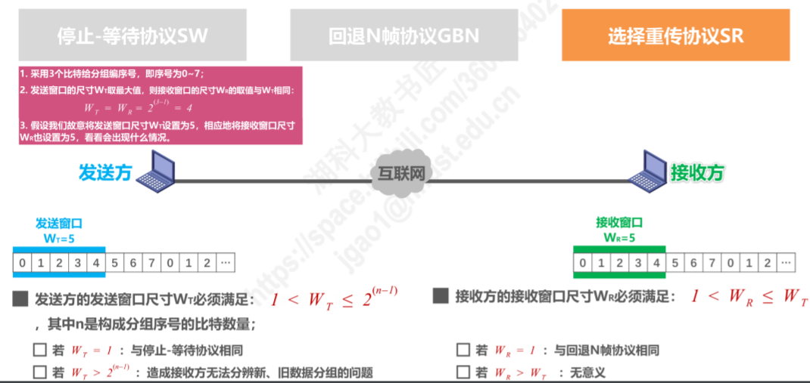

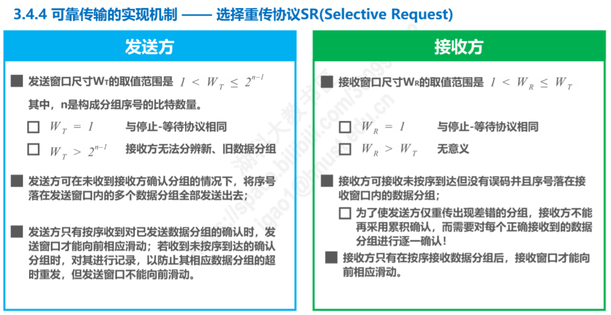

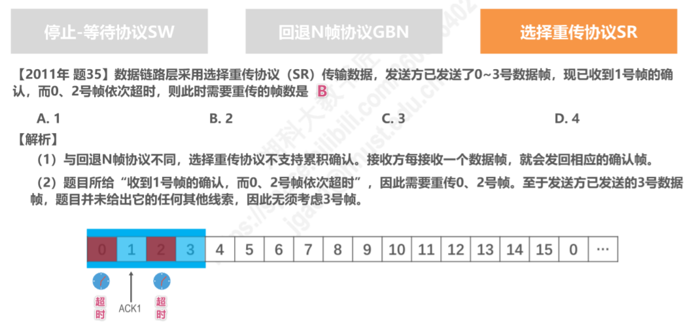

## 点对点协议PPP

- 点对点协议PPP(Point-to-Point Protocol)是目前使用最广泛的点对点数据链路层协议
- PPP协议是因特网工厂任务组IETF在1992年制定的。
  - 经过1993年和1994年的修订，现在的PPP协议已成为因特网的正式标注
- PPP协议为在点对点链路传输各种协议数据包提供了一种标准方法，主要由三部分构成
  - 对各种协议数据报的封装方法（封装成帧）
  - 链路控制协议LCP   用于建立、配置以及测试数据链路的连接
  - 一套网络控制协议NCPs    其中的每一个协议支持不同的网络层协议

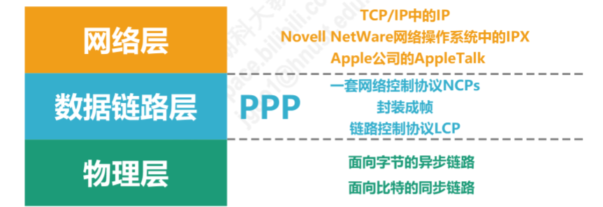

**帧格式**

必须规定特殊的字符作为帧定界符

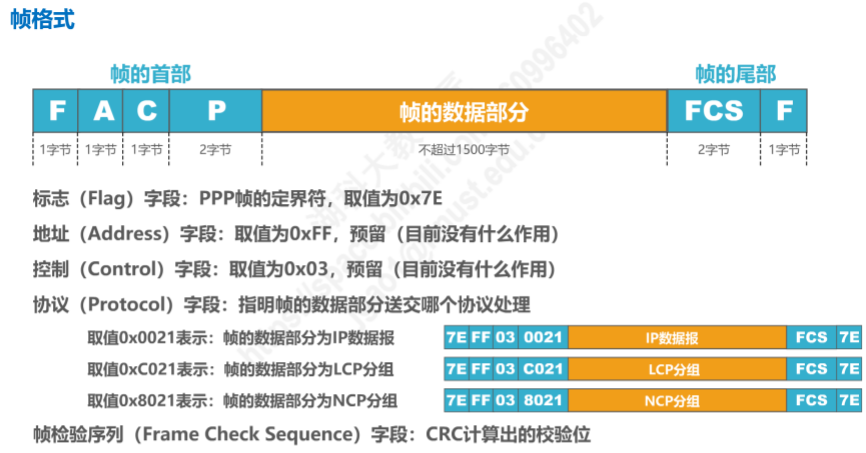

**透明传输**

- 主要靠两种办法：字节填充，比特填充
- 针对的地方是数据部分

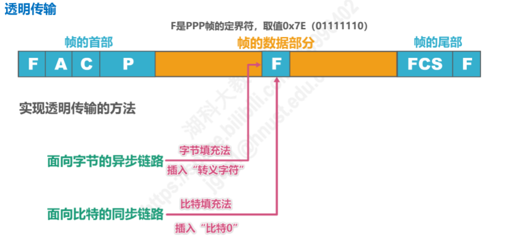

**字节填充**

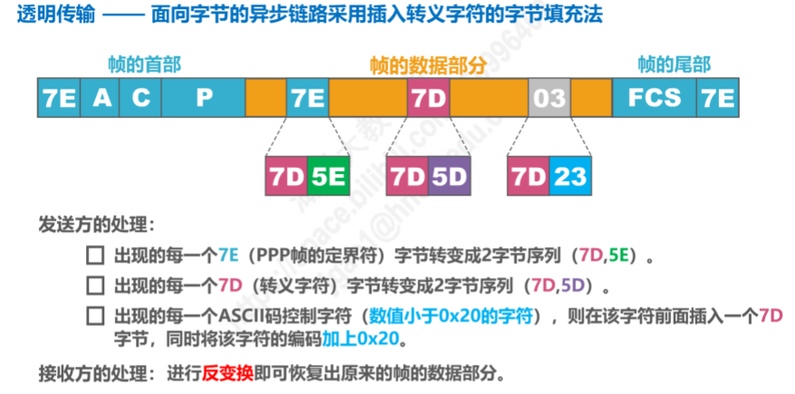

**比特填充**

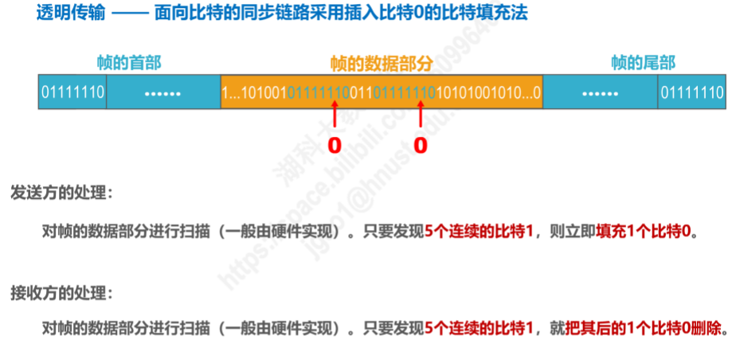

**工作状态**

- 当用户拨号接入 ISP 时，路由器的调制解调器对拨号做出确认，并建立一条物理连接。

- PC 机向路由器发送一系列的 LCP 分组（封装成多个 PPP 帧）。

- 这些分组及其响应选择一些 PPP 参数，并进行网络层配置，NCP 给新接入的 PC 机

- 分配一个临时的 IP 地址，使 PC 机成为因特网上的一个主机。

- 通信完毕时，NCP 释放网络层连接，收回原来分配出去的 IP 地址。接着，LCP 释放数据链路层连接。最后释放的是物理层的连接。

可见，PPP 协议已不是纯粹的数据链路层的协议，它还包含了物理层和网络层的内容。

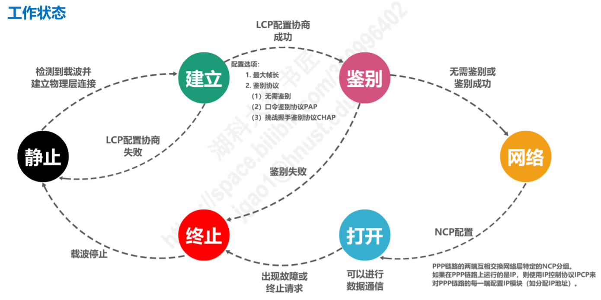

## 媒体介入控制

###  基本概念

- 共享信道要着重考虑的一个问题就是如何协调多个发送和接收站点对一个共享传输媒体的使用，即**媒体介入控制MAC**（Medium Access Control）

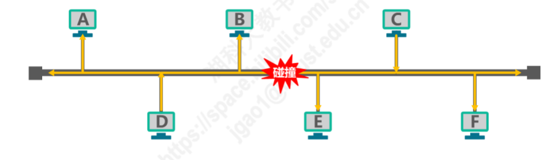

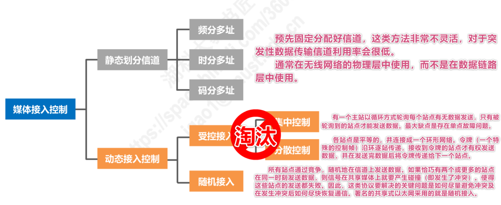

### 静态划分信道

**复用的基本概念**

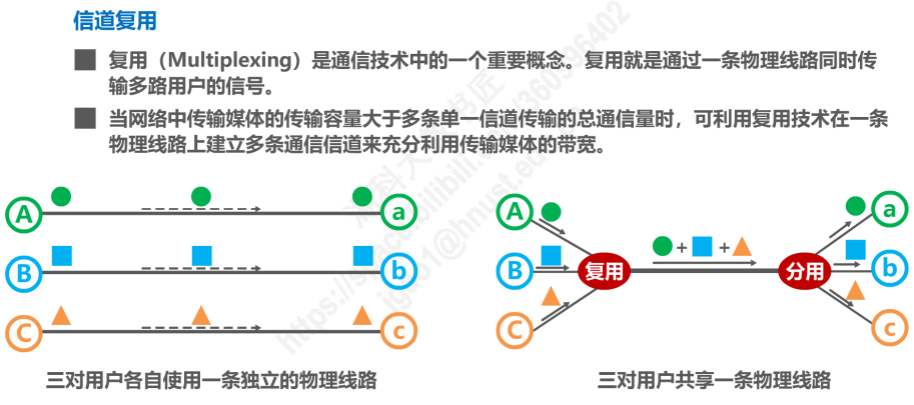

**复用四种形式**

- 频分复用FDM
- 时分复用TDM
- 波分复用WDM
- 码分复用CDM

**频分复用**

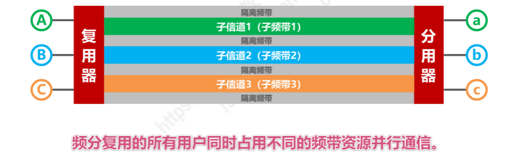

**时分复用**

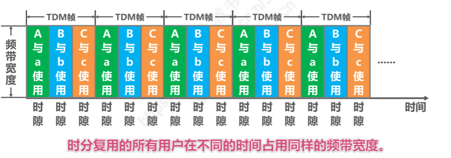

**波分复用**

> 波分复用就是光的频分复用，使用一根光纤来同时传输多个光载波信号
>
> 光信号传输一段距离后悔衰减，所以要用 掺铒光纤放大器 放大光信号

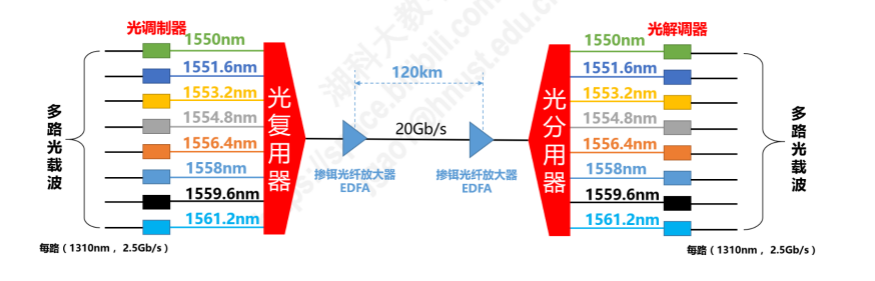

**码分复用 CDM (Code Division Multiplexing)**

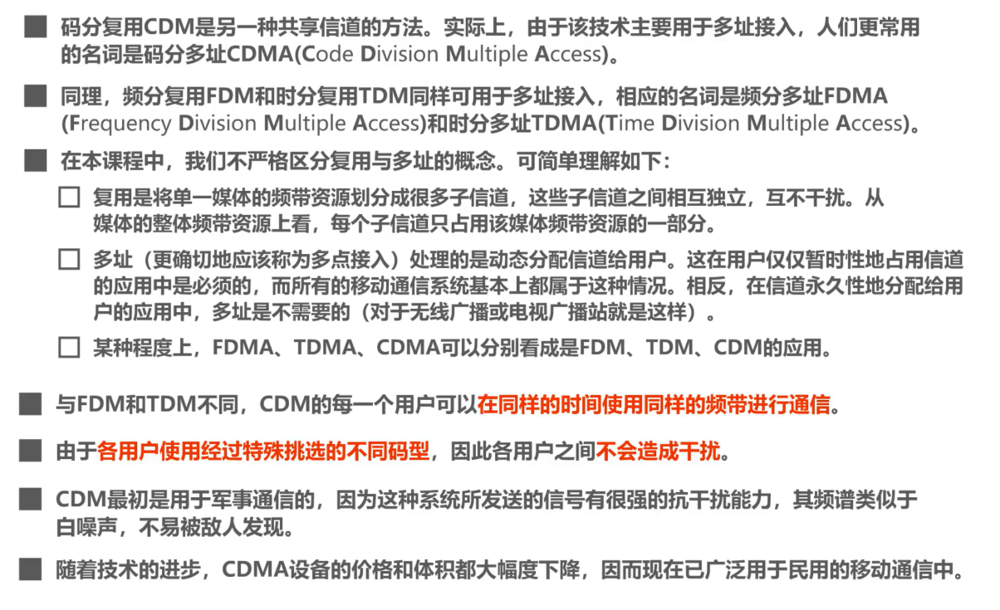

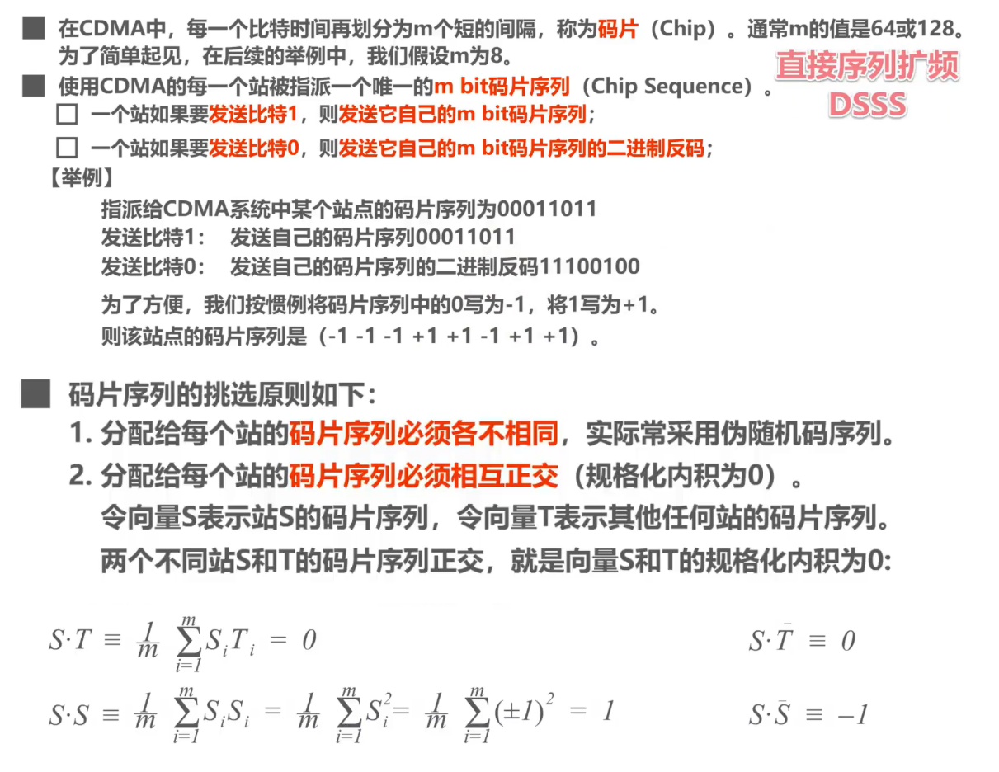

## 动态接入控制

## 随机接入（CSMA/CD协议!!!!!!!!!）

**总线局域网使用协议：CSMA/CD**

### 基本概念

**最初**的**以太网**是将许多计算机都连接到一根总线上。易于实现广播通信。当初认为这样的连接方法既简单又可靠，因为总线上没有有源器件。

> **以太网（Ethernet）**是一种计算机**局域网技术**。IEEE组织的IEEE 802.3标准制定了**以太网（Ethernet）**的技术标准
>
> 以太网采用无连接的工作方式，对发送的数据帧不进行编号，也不要求对方发回确认。目的站收到有差错帧就把它丢弃，其他什么也不做

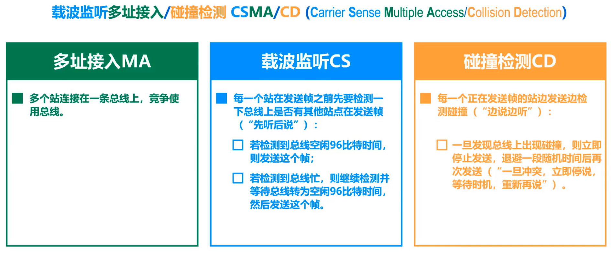

### 多址接入MA

表示许多主机以多点接入的方式连接在一根总线上。

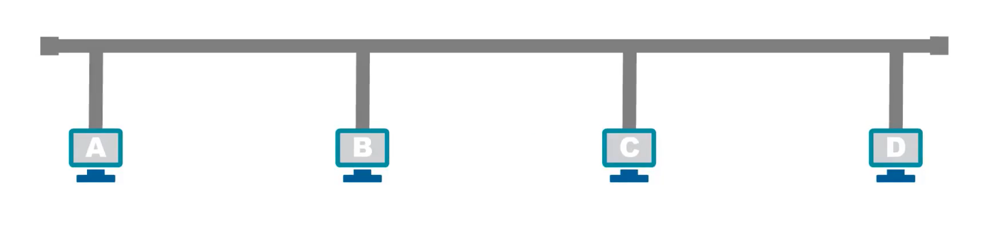

### 载波监听CS

是指每一个站在发送数据之前先要检测一下总线上是否有其他计算机在发送数据，如果有，则暂时不要发送数据，以免发生碰撞。

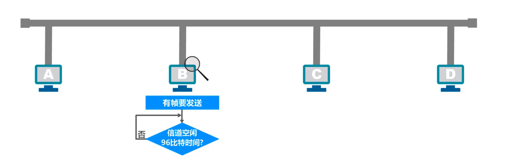

总线上并没有什么“载波”。因此， **“载波监听”就是用电子技术检测总线上有没有其他计算机发送的数据信号。**

### 碰撞检测CD

* **“碰撞检测”**就是计算机**边发送数据边检测**信道上的信号电压大小。
* 当几个站同时在总线上发送数据时，总线上的信号电压摆动值将会增大（互相叠加）。
* 当一个站检测到的信号电压摆动值超过一定的门限值时，就认为总线上至少有两个站同时在发送数据，表明产生了碰撞。
* **所谓“碰撞”就是发生了冲突。因此“碰撞检测”也称为“冲突检测”。**
* 在发生碰撞时，总线上传输的信号产生了严重的失真，无法从中恢复出有用的信息来。
* **每一个正在发送数据的站，一旦发现总线上出现了碰撞，就要立即停止发送，免得继续浪费网络资源，然后等待一段随机时间后再次发送。**


> 为什么要进行碰撞检测？ 因为信号传播时延对载波监听产生了影响
>
> 
>
> A 需要单程传播时延的 2 倍的时间，才能检测到与 B 的发送产生了冲突

### CSMA/CD 协议工作流程


 **CSMA/CD 协议工作——争用期（碰撞窗口）**


 CSMA/CD 协议工作——最小帧长


 CSMA/CD 协议工作——最大帧长


**CSMA/CD 协议工作——截断二进制指数退避算法**


**CSMA/CD 协议工作——信道利用率**


**CSMA/CD 协议工作——帧接收流程**


 **CSMA/CD 协议的重要特性**

* 使用 CSMA/CD 协议的以太网不能进行全双工通信而**只能进行双向交替通信（半双工通信）。**
* 每个站在发送数据之后的一小段时间内，存在着遭遇碰撞的可能性。 
* 这种**发送的不确定性**使整个以太网的平均通信量远小于以太网的最高数据率。 

> CSMA/CD协议曾经用于各种总线结构以太网和双绞线以太网的早起版本中。
>
> **现在的以太网基于交换机和全双工连接，不会有碰撞，因此没有必要使用CSMA/CS协议**

## 随机接入（CSMA/CA协议）

**无线局域网使用的协议：CSMA/CA**

### 为什么无线局域网要使用CSMA/CA协议


### 帧间间隔IFS（InterFrame Space）


### CSMA/CA协议的工作原理


> **源站为什么在检测到信道空闲后还要再等待一段时间DIFS？**
>
> * 考虑到可能有其他的站有高优先级的帧要发送。若有，就要让高优先级帧先发送
>
> **目的站为什么正确接收数据帧后还要等待一段时间SIFS才能发送ACK帧？**
>
> * SIFS是最短的帧间间隔，用来分隔开属于一次对话的各帧，在这段时间内，一个站点应当能够从发送方式切换到接收方式


> **信道由忙转为空闲且经过DIFS时间后，还要退避一段随机时间才能使用信道？**
>
> 防止多个站点同时发送数据而产生碰撞

**使用退避算法的时机**


### CSMA/CA协议的退避算法


**退避算法的示例**


### CSMA/CA协议的信道预约和虚拟载波监听


**虚拟载波监听机制能减少隐蔽站带来的碰撞问题的示例**


------

## MAC地址、IP地址以及ARP协议


**MAC地址**

> * 使用点对点信道的数据链路层不需要使用地址
> * 使用广播信道的数据链路层必须使用地址来区分各主机


### 广播信道的数据链路层必须使用地址（MAC）

> **MAC地址又称为硬件地址或物理地址**。请注意：不要被 “物理” 二字误导认为物理地址属于物理层范畴，物理地址属于数据链路层范畴

### IEEE 802局域网的MAC地址格式

> **组织唯一标识符OUI**
>
> * 生产网络设备的厂商，需要向IEEE的注册管理机构申请一个或多个OUI
>
> **网络接口标识符**
>
> * 由获得OUI的厂商自行随意分配
>
> **EUI-48**
>
> * 48是这个MAC地址的位数

> 对于使用EUI-48空间的应用程序，IEEE的目标寿命为100年（直到2080年），但是鼓励采用EUI-64作为替代

**关于无效的 MAC 帧**

* 数据字段的长度与长度字段的值不一致；
* 帧的长度不是整数个字节；
* 用收到的帧检验序列 FCS 查出有差错；
* 数据字段的长度不在 46 ~ 1500 字节之间。
* 有效的 MAC 帧长度为 64 ~ 1518 字节之间。

> **对于检查出的无效** **MAC** **帧就简单地丢弃。以太网不负责重传丢弃的帧。** 

### IEEE 802局域网的MAC地址发送顺序

### 单播MAC地址举例

> 主机B给主机C发送**单播帧**，主机B首先要构建该**单播帧**，**在帧首部中的目的地址字段填入主机C的MAC地址**，源地址字段填入自己的MAC地址，再加上帧首部的其他字段、数据载荷以及帧尾部，就构成了该**单播帧**


> 主机B将该**单播帧**发送出去，主机A和C都会收到该**单播帧**
>
> 主机A的网卡发现该**单播帧**的目的MAC地址与自己的MAC地址不匹配，丢弃该帧
>
> 主机C的网卡发现该**单播帧**的目的MAC地址与自己的MAC地址匹配，接受该帧
>
> 并将该帧交给其上层处理

### 广播MAC地址举例

> 假设主机B要发送一个**广播帧**，主机B首先要构建该**广播帧**，**在帧首部中的目的地址字段填入广播地址**，也就是十六进制的全F，源地址字段填入自己的MAC地址，再加上帧首部中的其他字段、数据载荷以及帧尾部，就构成了该**广播帧**


> 主机B讲该**广播帧**发送出去，主机A和C都会收到该**广播帧**，**发现该帧首部中的目的地址字段的内容是广播地址**，就知道该帧是**广播帧**，主机A和主机C都接受该帧，并将该帧交给上层处理

### 多播MAC地址举例


> 假设主机A要发送**多播帧**给该**多播地址**。将该**多播地址**的左起第一个字节写成8个比特，第一个字节的最低比特位是1，这就表明该地址是**多播地址**。
>
> 快速判断地址是不是**多播地址**，就是上图所示箭头所指的第十六进制数不能整除2（1,3,5,7,9,B,D,F），则该地址是**多播地址**
>
> 假设主机B，C和D支持多播，各用户给自己的主机配置多播组列表**如下所示**


> 主机B属于两个多播组，主机C也属于两个多播组，而主机D不属于任何多播组


> 主机A首先要构建该**多播帧**，**在帧首部中的目的地址字段填入该多播地址**，源地址点填入自己的MAC地址，再加上帧首部中的其他字段、数据载荷以及帧尾部，就构成了该**多播帧**


> 主机A将该**多播帧**发送出去，主机B、C、D都会收到该**多播帧**
>
> **主机B和C发现该多播帧的目的MAC地址在自己的多播组列表中**，主机B和C都会接受该帧
>
> 主机D发现该**多播帧**的目的MAC地址不在自己得多播组列表中，则丢弃该**多播帧**

> 给主机配置多播组列表进行私有应用时，不得使用公有的标准多播地址

## IP地址

IP地址属于网络层的范畴，不属于数据链路层的范畴

下面内容讲的是IP地址的使用，详细的IP地址内容在网络层中介绍

### 基本概念


### 从网络体系结构看IP地址与MAC地址


### 数据包转发过程中IP地址与MAC地址的变化情况

图上各主机和路由器各接口的IP地址和MAC地址用简单的标识符来表示


> 如何从IP地址找出其对应的MAC地址？
>
> ARP协议

## ARP协议

如何从IP地址找出其对应的MAC地址？

ARP（地址解析协议）

### 流程


ARP高速缓存表


> 当主机B要给主机C发送数据包时，会首先在自己的ARP高速缓存表中查找主机C的IP地址所对应的MAC地址，但未找到，因此，主机B需要发送ARP请求报文，来获取主机C的MAC地址


> ARP请求报文有具体的格式，上图的只是简单描述
>
> ARP请求报文被封装在MAC帧中发送，目的地址为广播地址
>
> 主机B发送封装有ARP请求报文的广播帧，总线上的其他主机都能收到该广播帧


> 收到ARP请求报文的主机A和主机C会把ARP请求报文交给上层的ARP进程
>
> 主机A发现所询问的IP地址不是自己的IP地址，因此不用理会
>
> 主机C的发现所询问的IP地址是自己的IP地址，需要进行相应


动态与静态的区别


**ARP协议只能在一段链路或一个网络上使用，而不能跨网络使用**


> ARP协议的使用是逐段链路进行的

### 总结

> ARP表中的IP地址与MAC地址的对应关系记录，是**会定期自动删除的**，**因为IP地址与MAC地址的对应关系不是永久性的**

------

## 集线器与交换机的区别

## 集线器-在物理层扩展以太网

### 概念


> * 传统以太网最初是使用粗同轴电缆，后来演进到使用比较便宜的细同轴电缆，最后发展为使用更便宜和更灵活的双绞线。
> * 采用双绞线的以太网采用星形拓扑，在星形的中心则增加了一种可靠性非常高的设备，叫做**集线器** (hub)。
> * **集线器**是也可以看做多口中继器，每个端口都可以成为一个中继器，中继器是对减弱的信号进行放大和发送的设备
> * **集线器**的以太网在逻辑上仍是个总线网，需要使用CSMA/CD协议来协调各主机争用总线，只能工作在半双工模式，收发帧不能同时进行

### 集线器HUB在物理层扩展以太网

**使用集线器扩展**：将多个以太网段连成更大的、多级星形结构的以太网


> * **优点**
>   1. 使原来属于不同碰撞域的以太网上的计算机能够进行跨碰撞域的通信。
>   2. 扩大了以太网覆盖的地理范围。
> * **缺点**
>   1. 碰撞域增大了，但总的吞吐量并未提高。
>   2. 如果不同的碰撞域使用不同的数据率，那么就不能用集线器将它们互连起来。 

**碰撞域**

* **碰撞域（collision domain）**又称为**冲突域**，是指网络中一个站点发出的帧会与其他站点发出的帧产生碰撞或冲突的那部分网络。
* 碰撞域越大，发生碰撞的概率越高。

## 以太网交换机-在数据链路层扩展以太网

### 概念

* 扩展以太网更常用的方法是在数据链路层进行。
* 早期使用**网桥**，现在使用**以太网交换机**。


> **网桥**
>
> * 网桥工作在数据链路层。
> * 它根据 MAC 帧的目的地址对收到的帧进行转发和过滤。
> * 当网桥收到一个帧时，并不是向所有的接口转发此帧，而是先检查此帧的目的MAC 地址，然后再确定将该帧转发到哪一个接口，或把它丢弃。 
>
> **交换机**
>
> * 1990 年问世的交换式集线器 (switching hub) 可明显地提高以太网的性能。
> * 交换式集线器常称为**以太网交换机** (switch) 或**第二层交换机** (L2 switch)，强调这种交换机工作在数据链路层。
> * 以太网交换机实质上就是一个**多接口的网桥**

### **集线器HUB与交换机SWITCH区别**


> 使用**集线器**互连而成的共享总线式以太网上的某个主机，要给另一个主机发送单播帧，该单播帧会通过共享总线传输到**总线上的其他各个主机**
>
> 使用交换机互连而成的交换式以太网上的某个主机，要给另一个主机发送单播帧，该单播帧进入交换机后，交换机会将该单播帧转发给目的主机，**而不是网络中的其他各个主机**
>
> **这个例子的前提条件是忽略ARP过程，并假设交换机的帧交换表已经学习或配置好了**

> **以太网交换机的交换方式**
>
> * 存储转发方式
>   * 把整个数据帧**先缓存**后再进行处理。
> * 直通 (cut-through) 方式
>   * 接收数据帧的同时就**立即按数据帧的目的 MAC 地址决定该帧的转发接口**，因而提高了帧的转发速度。
>   * **缺点**是它不检查差错就直接将帧转发出去，因此有可能也将一些无效帧转发给其他的站。
>
> **这个例子的前提条件是忽略ARP过程，并假设交换机的帧交换表已经学习或配置好了**

**对比集线器和交换机**


> 多台主机同时给另一台主机发送单播帧
>
> 集线器以太网：会产生碰撞，遭遇碰撞的帧会传播到总线上的各主机
>
> 交换机以太网：会将它们缓存起来，然后逐个转发给目的主机，不会产生碰撞
>
> **这个例子的前提条件是忽略ARP过程，并假设交换机的帧交换表已经学习或配置好了**

**集线器扩展以太网和交换机扩展以太网区别**

**单播**


**广播**


**多个单播**


广播域（broadcast domain）：指这样一部分网络，其中任何一台设备发出的广播通信都能被该部分网络中的所有其他设备所接收。

**总结**


> 工作在数据链路层的以太网交换机，其性能远远超过工作在物理层的集线器，而且价格并不贵，这就使得集线器逐渐被市场淘汰

------

## 以太网交换机自学习和转发帧的流程

**概念**

**自学习和转发帧的例子**

以下例子假设各主机知道网络中其他各主机的MAC地址（无需进行ARP）

**A -> B**


> 1. A 先向 B 发送一帧。该帧从接口 1 进入到交换机
> 2. 交换机收到帧后，先查找（图中左边）交换表。没有查到应从哪个接口转发这个帧给 B
> 3. 交换机把这个帧的源地址 A 和接口 1 写入（图中左边）交换表中
> 4. 交换机向除接口 1 以外的所有的接口广播这个帧
> 5. 接口 4到接口 2，先查找（图中右边）交换表。没有查到应从哪个接口转发这个帧给 B
> 6. 交换机把这个帧的源地址 A 和接口 1 写入（图中右边）交换表中
> 7. 除B主机之外与该帧的目的地址不相符，将丢弃该帧
> 8. 主机B发现是给自己的帧，接受该帧

**B -> A**


> 1. B 向 A 发送一帧。该帧从接口 3 进入到交换机
> 2. 交换机收到帧后，先查找（图中左边）交换表。发现（图中左边）交换表中的 MAC 地址有 A，表明要发送给A的帧应从接口1转发出去。于是就把这个帧传送到接口 1 转发给 A。
> 3. 主机 A 发现目的地址是它，就接受该帧
> 4. 交换机把这个帧的源地址 B 和接口 3 写入（图中左边）交换表中

**E -> A**


> 1. E 向 A发送一帧
> 2. 交换机收到帧后，先查找（图中右边）交换表。发现（图中右边）交换表中的 MAC 地址有 A，表明要发送给A的帧应从接口2转发出去。于是就把这个帧传送到接口 2 转发给 接口 4。
> 3. 交换机把这个帧的源地址 E 和接口 3 写入（图中右边）交换表中
> 4. 接口 4 到 左边的交换机，先查找（图中左边）交换表。发现（图中左边）交换表中的 MAC 地址有 A，表明要发送给A的帧应从接口1转发出去。于是就把这个帧传送到接口 1 转发给 A。
> 5. 交换机把这个帧的源地址 E 和接口 4 写入（图中左边）交换表中
> 6. 主机 A 发现目的地址是它，就接受该帧

**G -> A**


> 主机 A、主机 G、交换机 1的接口 1就共享同一条总线（相当于总线式网络，可以想象成用集线器连接了）
>
> 1. 主机 G 发送给 主机 A 一个帧
> 2. 主机 A 和 交换机接口 1都能接收到
> 3. 主机 A 的网卡收到后，根据帧的目的MAC地址A，就知道是发送给自己的帧，就接受该帧
> 4. 交换机 1收到该帧后，首先进行登记工作
> 5. 然后交换机 1对该帧进行转发，该帧的MAC地址是A，在（图中左边）交换表查找MAC 地址有 A
> 6. MAC 地址为 A的接口号是1，但是该帧正是从接口 1 进入交换机的，交换机不会再从该接口 1 将帧转发出去，因为这是没有必要，于是丢弃该帧

随着网络中各主机都发送了帧后，网络中的各交换机就可以学习到各主机的MAC地址，以及它们与自己各接口的对应关系


> 考虑到可能有时要在交换机的接口更换主机，或者主机要更换其网络适配器，这就需要更改交换表中的项目。为此，在交换表中每个项目都设有一定的**有效时间**。**过期的项目就自动被删除**。
>
> **以太网交换机的这种自学习方法使得以太网交换机能够即插即用，不必人工进行配置，因此非常方便。**

**总结**

**交换机自学习和转发帧的步骤归纳**


------

## 以太网交换机的生成树协议STP

**如何提高以太网的可靠性**


**生成树协议STP**

> * IEEE 802.1D 标准制定了一个**生成树协议 STP**  (Spanning Tree Protocol)。
> * 其**要点**是：**不改变**网络的实际拓扑，但在逻辑上则切断某些链路，使得从一台主机到所有其他主机的路径是**无环路的树状结构**，从而消除了兜圈子现象。


------

# 虚拟局域网VLAN

## 为什么要虚拟局域网VLAN

**广播风暴**


**分割广播域的方法**


> 为了分割广播域，所以虚拟局域网VLAN技术应运而生

**概念**


> * 利用以太网交换机可以很方便地实现虚拟局域网 VLAN (Virtual LAN)。
> * IEEE 802.1Q 对虚拟局域网 VLAN 的**定义**：
>   **虚拟局域网 VLAN** 是由一些局域网网段构成的**与物理位置无关的逻辑组**，而这些网段具有某些共同的需求。每一个 VLAN 的帧都有一个明确的标识符，指明发送这个帧的计算机是属于哪一个 VLAN。
> * 同一个VLAN内部可以广播通信，不同VLAN不可以广播通信
> * **虚拟局域网其实只是局域网给用户提供的一种服务，而并不是一种新型局域网。**
> * 由于虚拟局域网是用户和网络资源的逻辑组合，因此可按照需要将有关设备和资源非常方便地重新组合，使用户从不同的服务器或数据库中存取所需的资源。

## 虚拟局域网VLAN的实现机制

虚拟局域网VLAN技术是在交换机上实现的，需要交换机能够实现以下功能

* 能够处理带有VLAN标记的帧——IEEE 802.1 Q帧
* 交换机的各端口可以支持不同的端口类型，不同端口类型的端口对帧的处理方式有所不同


**Access端口**

交换机与用户计算机之间的互连


> 同一个VLAN内部可以广播通信，不同VLAN不可以广播通信

**Truck端口**

交换机之间或交换机与路由器之间的互连


**小例题**


**华为交换机私有的Hybrid端口类型**


## 总结

> **虚拟局域网优点**
>
> 虚拟局域网（VLAN）技术具有以下主要优点：
>
> 1. 改善了性能
> 2. 简化了管理
> 3. 降低了成本
> 4. 改善了安全性 
