# 计算机网络第四章

## 概述

- 网络层的主要任务是**实现网络互连**，进而**实现数据包在各网络之间的传输**
- 要实现网络层任务，需要解决一下问题
  - **网络层向运输层提供怎样的服务（可靠传输还是不可靠传输服务）**
  - **网络层寻址问题**
  - **路由选择问题**
- **因特网（Internet）**是目前全世界用户数量最多的互联网，它**使用TCP/IP协议栈**
- 由于TCP/IP协议栈使用**网际协议IP**，它是整个协议栈的核心协议，因此在TCP/IP协议栈中网络层常称为**网际层**
- 综上所述，我们通过学习TCP/IP协议栈的网际层来学习网络层的理论知识和实践技术

## 网络层提供的两种服务

### 面向连接的虚电路服务

### 无连接的数据报服务

**两者对比**

| 对比方面       | 虚电路服务                                         | 数据报服务                                         |
| -------------- | -------------------------------------------------- | -------------------------------------------------- |
| 思路           | 可靠通信应当由网络来保证                           | 可靠通信应当由用户主句来保证                       |
| 连接的建立     | 必须建立网络层连接                                 | 不需要建立网络层连接                               |
| 终点地址       | 仅在连接建立阶段使用 每个分组使用短的虚电路号 | 每个分组都有终点的完整地址                         |
| 分组的转发     | 属于同一条虚电路的分组均按照同意路由进行转发       | 每个分组可走不同的路由                             |
| 当结点出故障时 | 所有通过出故障的结点的虚电路均不能工作             | 出故障的结点可能会丢失分组，一些路由可能会发生变化 |
| 分组的顺序     | 总是按照发送顺序到达中点                           | 到达终点不一定按照发送顺序                         |
| 服务质量保证   | 可以将通信资源提前分配给每一个虚电路，容易实现     | 很难实现                                           |

## IPV4地址概述

> 32比特的IPv4地址不方便阅读、记录以及输入等，故用点分十进制表示IPV4

### 点分十进制表示IPV4

## 分类编址的IPv4地址

### A

### B

### C

### 习题

### 总结

## 划分子网的IPv4地址

### 为什么要这样做？

> 1. 图一：一个正常的网络
> 2. 图二：当要增加多个网络时，难道要再去重新申请多个网络号吗？
>    - 不，因为会有多个问题产生
> 3. 图三：接用主机位的8位再去划分子网

### 如何划分

### 习题

**小结**

## 无分类编制的IPv4地址

### 习题

### 小结

## IPv4地址的应用规划

### 定长的掩网字码

**举例**

#### 划分详解

1. 划分5个子网需要3个比特
2. 因为是C类地址，前三个字节已被使用，故须第四个字节为提供3位
3. 3个比特可造8个子网，随意分5个
4. 剩下的地址为32个，但是要去掉全0和全1

### 变长的掩网字码VLSM

**举例**

## IP数据报的发送和转发过程

- IP数据报的发送和转发包含以下两部分：
  - 主机发送IP数据报
  - 路由器转发IP数据报

举例

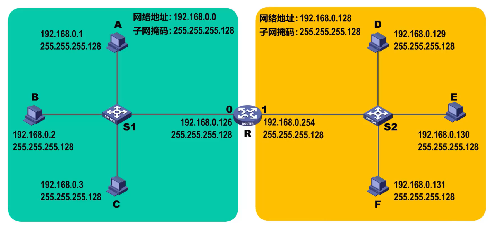

源主机如何知道目的主机是否与自己在同一个网络中，是直接交付，还是间接交付？

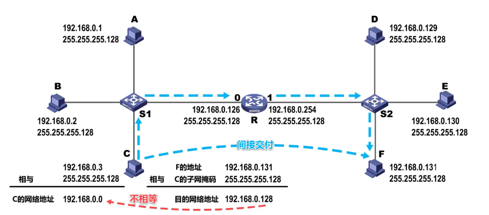

> 可以通过**目的地址IP**和**源地址的子网掩码**进行**逻辑与运算**得到**目的网络地址**
>
> - 如果**目的网络地址**和**源网络地址** **相同**，就是**在同一个网络**中，属于**直接交付**
> - 如果**目的网络地址**和**源网络地址** **不相同**，就**不在同一个网络**中，属于**间接交付**，传输给主机所在网络的**默认网关**（路由器——下图会讲解）,由默认网关帮忙转发

主机C如何知道路由器R的存在？

> 用户为了让本网络中的主机能和其他网络中的主机进行通信，就必须给其指定本网络的一个路由器的接口，由该路由器帮忙进行转发，所指定的路由器，也被称为**默认网关**
>
> 例如。路由器的接口0的IP地址192.168.0.128做为左边网络的默认网关

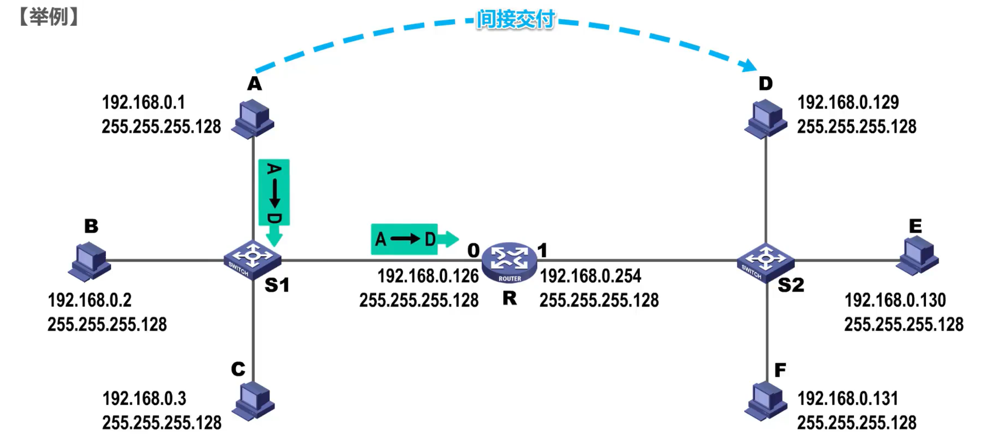

> 主机A会将该IP数据报传输给自己的默认网关，也就是图中所示的路由器接口0

路由器收到IP数据报后如何转发？

- 检查IP数据报首部是否出错：
  - 若出错，则直接丢弃该IP数据报并通告源主机
  - 若没有出错，则进行转发
- 根据IP数据报的目的地址在路由表中查找匹配的条目：
  - 若找到匹配的条目，则转发给条目中指示的吓一跳
  - 若找不到，则丢弃该数据报并通告源主机

假设IP数据报首部没有出错，路由器取出IP数据报首部各地址字段的值

接下来路由器对该IP数据报进行查表转发

> 逐条检查路由条目，将目的地址与路由条目中的地址掩码进行逻辑与运算得到目的网络地址，然后与路由条目中的目的网络进行比较，如果相同，则这条路由条目就是匹配的路由条目，按照它的下一条指示，图中所示的也就是接口1转发该IP数据报

路由器是隔离广播域的

## 静态路由配置及其可能产生的路由环路问题

### 多种情况举例

#### 静态路由配置

> 在路由表中自己人工将路径设置好

#### 默认路由配置

> 默认路由可以被所有网络匹配，但路由匹配有优先级，默认路由是优先级最低的

#### 特定主机路由

> 有时候，我们可以给路由器添加针对某个主机的特定主机路由条目
>
> 一般用于网络管理人员对网络的管理和测试
>
> 多条路由可选，匹配路由最具体的

**静态路由配置错误导致路由环路**

举例

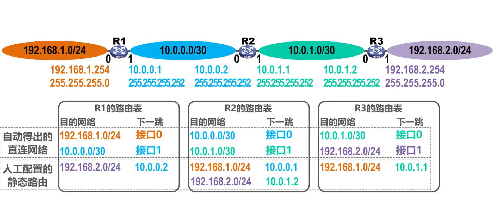

假设将R2的路由表中第三条目录配置错了下一跳

这导致R2和R3之间产生了路由环路

**聚合了不存在的网络而导致路由环路**

举例

正常情况

错误情况

解决方法

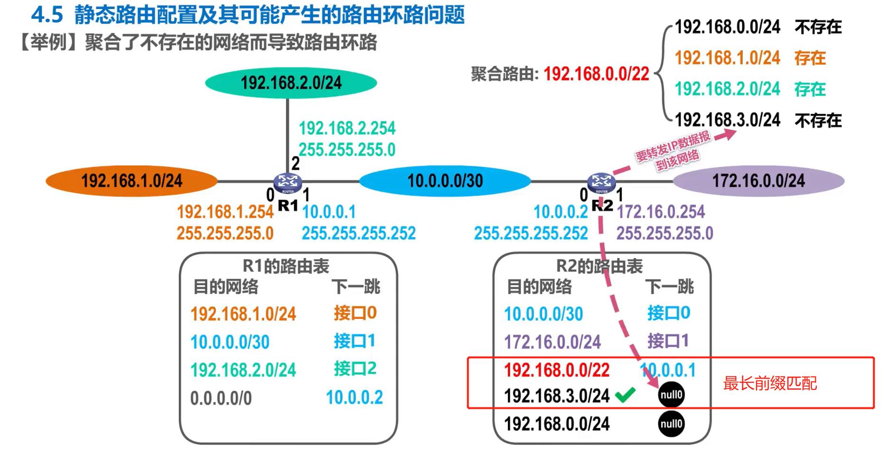

> 黑洞路由的下一跳为null0，这是路由器内部的虚拟接口，IP数据报进入它后就被丢弃

**网络故障而导致路由环路**

举例

解决方法

添加故障的网络为黑洞路由

假设。一段时间后故障网络恢复了

R1又自动地得出了其接口0的直连网络的路由条目

针对该网络的黑洞网络会自动失效

如果又故障

则生效该网络的黑洞网络

## 路由选择协议概述

**概述**

- 静态路由选择
  - 由**人工配置**的网络路由、默认路由、特定主机路由、黑洞路由属于静态路由
  - 优：配置方式简单开销小
  - 劣：**不能及时适应网络状态（流量、拓扑等）的变化**
  - 一般在**小规模网络**中使用
- 动态路由选择
  - 通过路由选择协议**自动获取路由信息**
  - 劣：比较复杂，开销大
  - 优：较好地适应网络状态的变化
  - 一般在**大规模网络**中使用

**因特网所采用的路由选择协议主要特点**

- 自适应：动态路由选择，能较好地适应网络状态的变化
- 分布式：路由之间交换路由信息
- 分层次：将整个因特网分为许多较小的自制系统AS(Autonomous System)

#### 路由器

> 交换结构左右两端应该有输入cache 和 输出cache
>
> 数据报从输入端口进，输出端口出

### 路由信息协议RIP

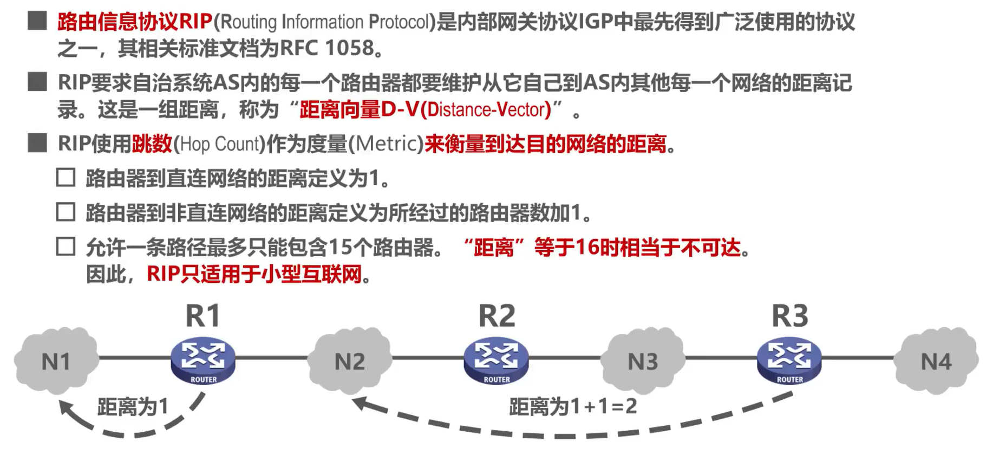

**RIP的基本工作过程**

举例

**RIP的路由条目的更新规则**

举例1

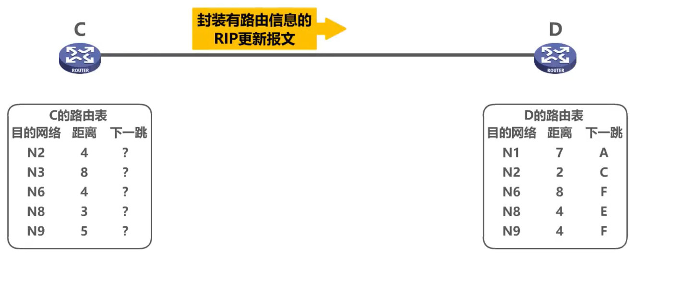

> 路由器C的表到达各目的网络的下一条都记为问号，可以理解为路由器D并不需要关心路由器C的这些内容
>
> 假设路由器C的RIP更新报文发送周期到了，则路由器C将自己路由表中的相关路由信息封装到RIP更新报文中发送给路由器D

> 路由器C能到达这些网络，说明路由器C的相邻路由器也能到达，只是比路由器C的距离大1，于是根据距离的对比，路由器D更新自己的路由表

举例2

**RIP存在“坏消息传播得慢”的问题**

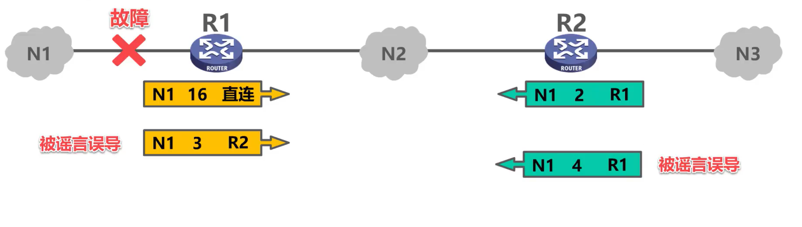

解决方法

> 但是，这些方法也不能完全解决“坏消息传播得慢”的问题，这是距离向量的本质决定

**总结**

> RIP 协议的优缺点
>
> 优点：
>
> 1. 实现简单，开销较小。
>
> 缺点：
>
> 1. RIP 限制了网络的规模，它能使用的最大距离为 15（16 表示不可达）。
> 2. 路由器之间交换的路由信息是路由器中的完整路由表，因而随着网络规模的扩大，开销也就增加。
> 3. “坏消息传播得慢”，使更新过程的收敛时间过长。

#### **开放最短路径优先 OSPF (Open Shortest Path First)**

**注意**：OSPF 只是一个协议的名字，它并不表示其他的路由选择协议不是“最短路径优先”。

**概念**

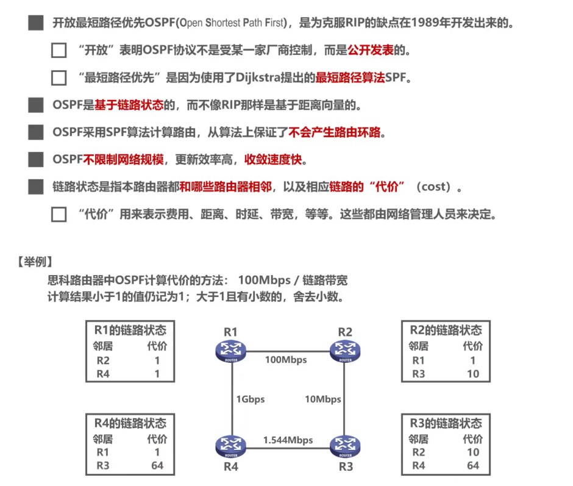

**问候（Hello）分组**

> IP数据报首部中协议号字段的取值应为89，来表明IP数据报的数据载荷为OSPF分组

**发送链路状态通告LSA**

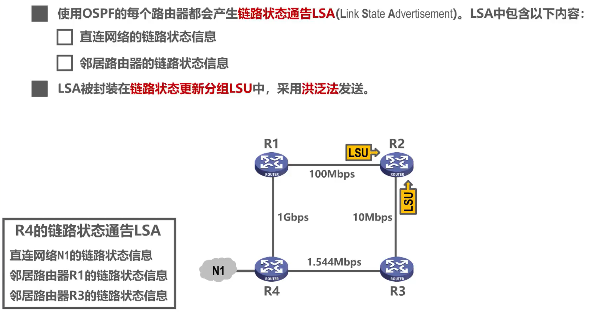

> 洪泛法有点类似于广播，就是从一个接口进来，从其他剩余所有接口出去

**链路状态数据库同步**

**使用SPF算法计算出各自路由器到达其他路由器的最短路径**

**OSPF五种分组类型**

**OSPF的基本工作过程**

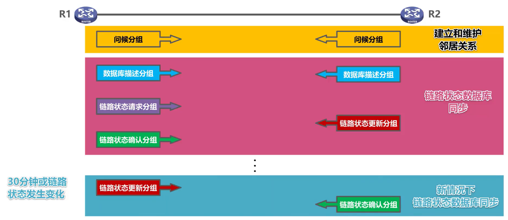

**OSPF在多点接入网络中路由器邻居关系建立**

如果不采用其他机制，将会产生大量的多播分组

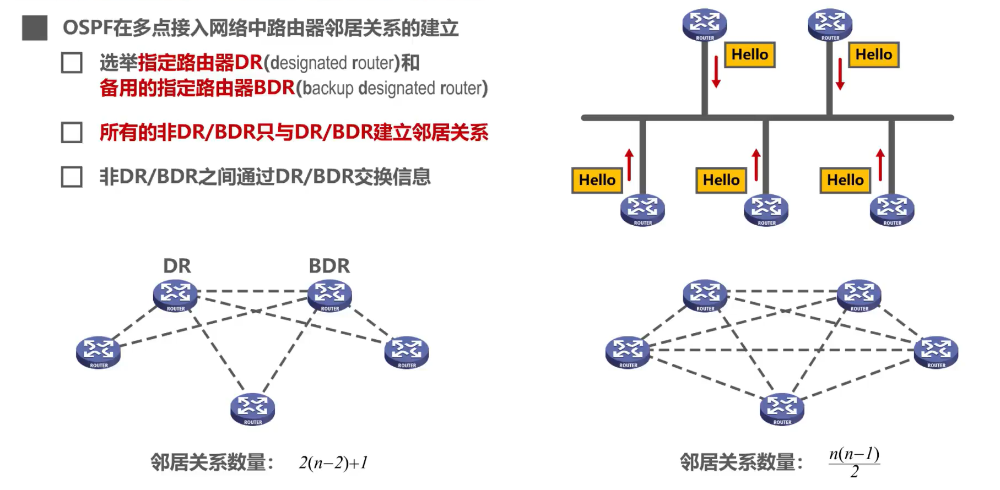

> 若DR出现问题，则由BDR顶替DR

**为了使OSPF能够用于规模很大的网络，OSPF把一个自治系统再划分为若干个更小的范围，叫做区域（Area）**

- 在该自治系统内，所有路由器都使用OSPF协议，OSPF将该自治系统再划分成4个更小的区域
- 每个区域都有一个32比特的区域标识符
- 主干区域的区域标识符必须为0，主干区域用于连通其他区域
- 其他区域的区域标识符不能为0且不相同
- 每个区域一般不应包含路由器超过200个
- 划分区域的好处就是，利用洪泛法交换链路状态信息局限于每一个区域而不是自治系统，这样减少整个网络上的通信量

**总结**

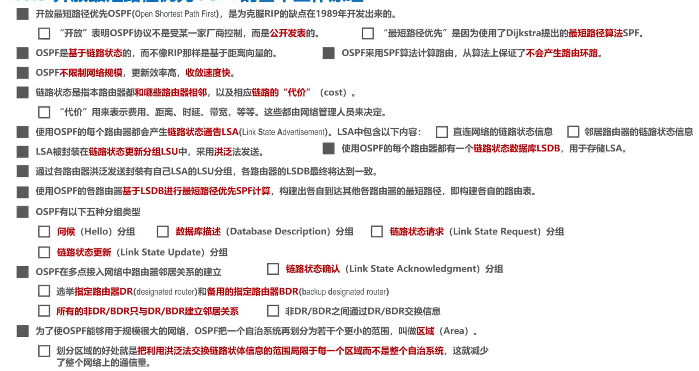

### 边界网关协议BGP

BGP（Border Gateway Protocol） 是**不同自治系统的路由器之间**交换路由信息的协议

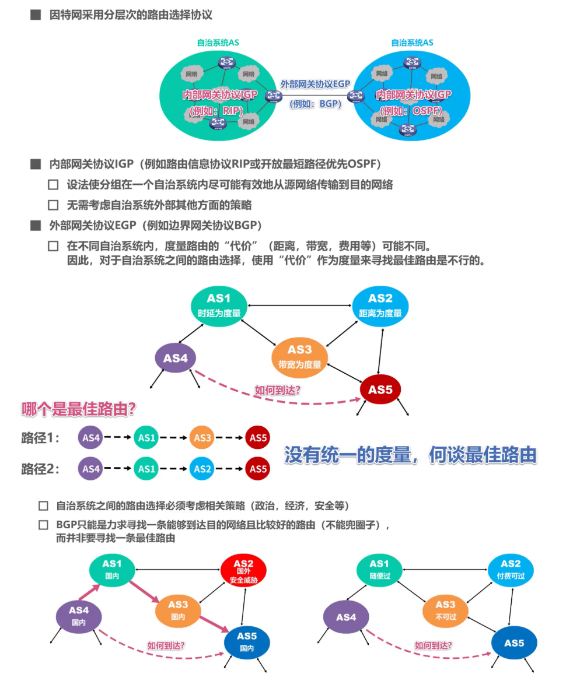

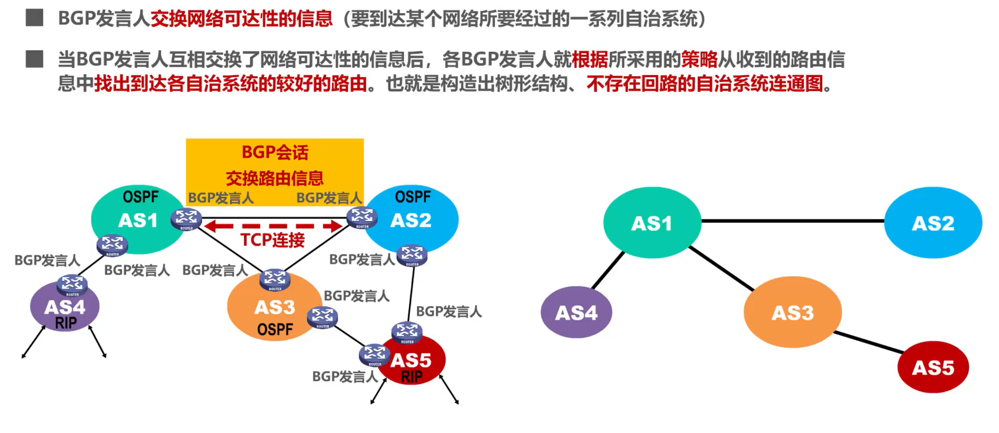

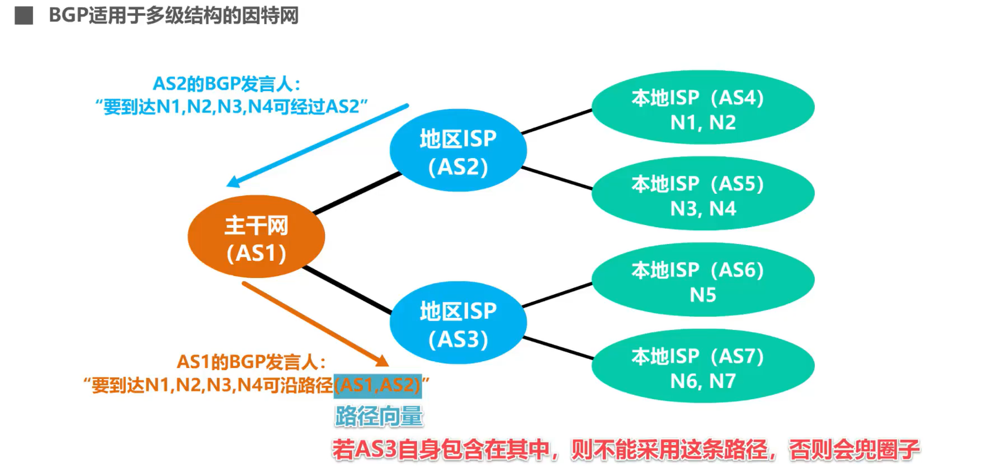

**总结**

### 直接封装RIP、OSPF和BGP报文的协议

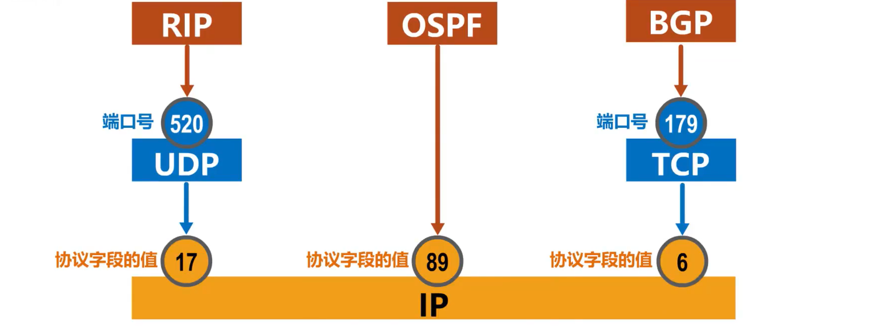

## IPv4数据报格式

- 一个 IP 数据报由**首部**和**数据**两部分组成。
- **首部的前一部分是固定长度，共 20 字节，是所有 IP 数据报必须具有的。**
- 在首部的固定部分的后面是一些可选字段，其长度是可变的。

图中的每一行都由32个比特（也就是4个字节）构成，每个小格子称为字段或者域，每个字段或某些字段的组合用来表达IP协议的相关功能

> **IP数据报的首部长度一定是4字节的整数倍**
>
> 因为首部中的可选字段的长度从1个字节到40个字节不等，那么，当20字节的固定部分加上1到40个字节长度不等的可变部分，**会造成首部长度不是4字节整数倍时，就用取值为全0的填充字段填充相应个字节**，以确保IP数据报的首部长度是4字节的整数倍

**对IPv4数据报进行分片**

现在假定分片2的IP数据报经过某个网络时还需要进行分片

### 总结

## 网际控制报文协议ICMP

- ICMP差错报告报文共有以下5种
  - 终点不可达
  - 源点抑制
  - 时间超过
  - 参数问题
  - 改变路由（重定向）

#### 终点不可达

#### 源点抑制

- 当路由器或主机由于拥塞而丢弃数据报时，就向源点发送源点抑制报文，使源点知道应当把数据报的发送速率放慢

#### 时间超过

#### 参数问题

#### 改变路由

#### 碎碎念

#### ICMP应用举例

## 虚拟专用网VPN与网络地址转换NAT

## 虚拟专用网VPN（Virtual Private Network）

- 由于 **IP 地址的紧缺**，一个机构能够申请到的IP地址数往往远小于本机构所拥有的主机数。
- 考虑到**互联网并不很安全**，一个机构内也并不需要把所有的主机接入到外部的互联网。
- 假定在一个机构内部的计算机通信也是采用 TCP/IP 协议，那么从原则上讲，对于这些仅在**机构内部使用**的计算机就可以由本机构**自行分配其 IP 地址**。

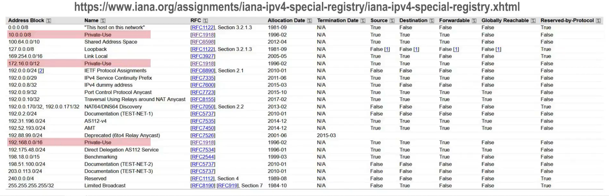

> 上图是因特网数字分配机构IANA官网查看IPv4地址空间中特殊地址的分配方案
>
> 用粉红色标出来的地址就是无需申请的、可自由分配的专用地址，或称私有地址

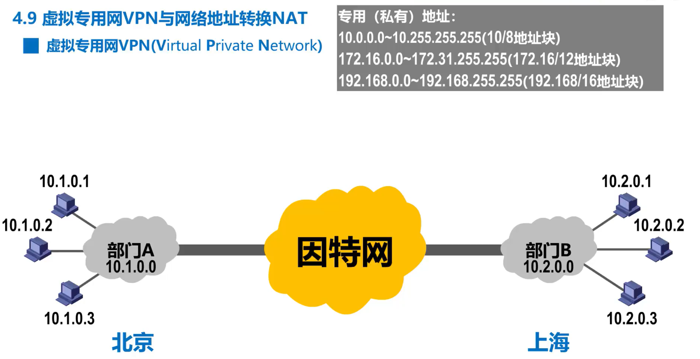

> 私有地址只能用于一个机构的内部通信，而不能用于和因特网上的主机通信
>
> 私有地址只能用作本地地址而不能用作全球地址
>
> 因特网中所有路由器对目的地址是私有地址的IP数据报一律不进行转发
>
> **本地地址与全球地址**
>
> - **本地地址**——仅在机构内部使用的 IP 地址，可以由本机构自行分配，而不需要向互联网的管理机构申请。
> - **全球地址**——全球唯一的 IP 地址，必须向互联网的管理机构申请。
> - **问题**：在内部使用的本地地址就有可能和互联网中某个 IP 地址重合，这样就会出现地址的二义性问题。

所以部门A和部门B至少需要一个 路由器具有合法的全球IP地址，这样各自的专用网才能利用公用的因特网进行通信

部门A向部门B发送数据流程

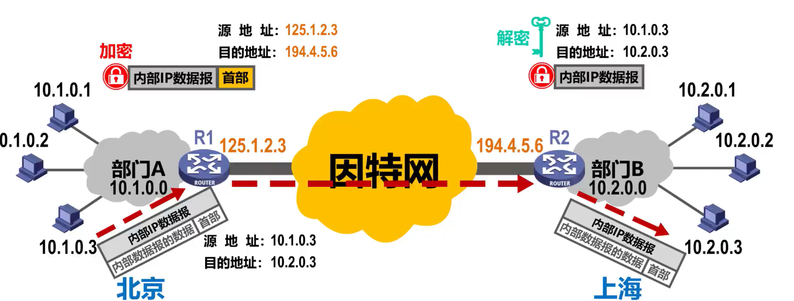

> 两个专用网内的主机间发送的数据报是通过了公用的因特网，但在效果上就好像是在本机构的专用网上传送一样
>
> 数据报在因特网中可能要经过多个网络和路由器，但从逻辑上看，R1和R2之间好像是一条直通的点对点链路
>
> 
>
> 因此也被称为IP隧道技术

## 网络地址转换NAT（Network Address Translation）

举例

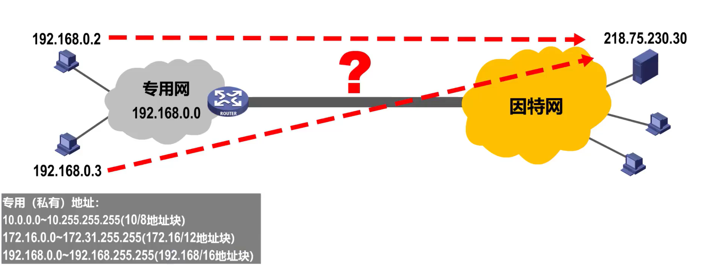

> 使用私有地址的主机，如何才能与因特网上使用全球IP地址的主机进行通信？
>
> 这需要在专用网络连接到因特网的路由器上安装NAT软件

> 专有NAT软件的路由器叫做NAT路由器
>
> 它至少有一个有效的外部全球IP地址
>
> 这样，所有使用私有地址的主机在和外界通信时，都要在NAT路由器上将其私有地址转换为全球IP地址

假设，使用私有地址的主机要给因特网上使用全球IP地址的另一台主机发送IP数据报

因特网上的这台主机给源主机发回数据报

当专用网中的这两台使用私有地址的主机都要给因特网使用全球地址的另一台主机发送数据报时，在NAT路由器的NAT转换表中就会产生两条记录，分别记录两个私有地址与全球地址的对应关系

这种基本转换存在一个问题

解决方法

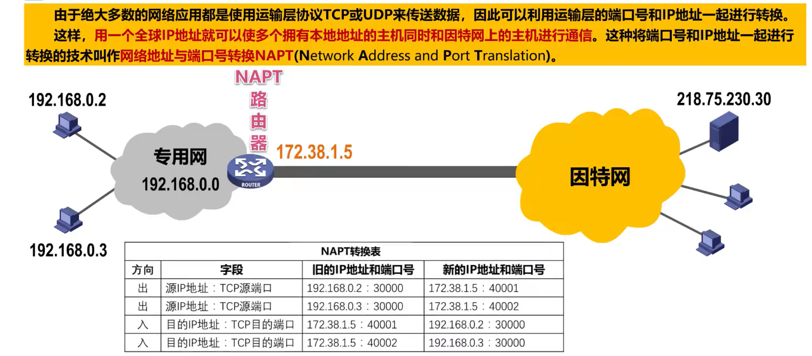

> 我们现在用的很多家用路由器都是这种NART路由器

内网主机与外网主机的通信，是否能由外网主机首先发起？

否定

## 总结

