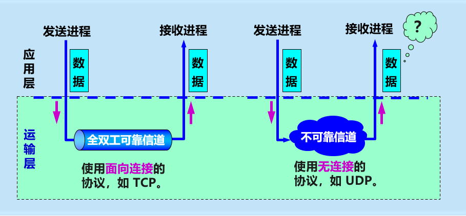
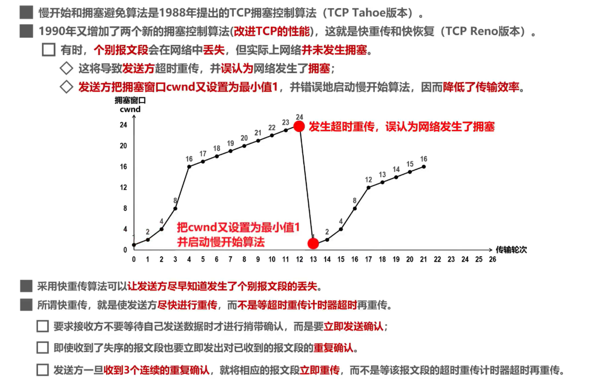
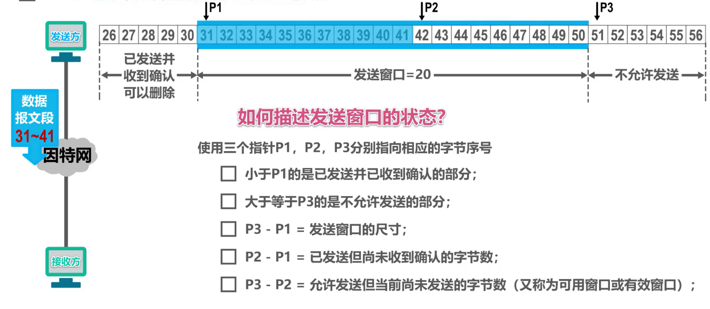
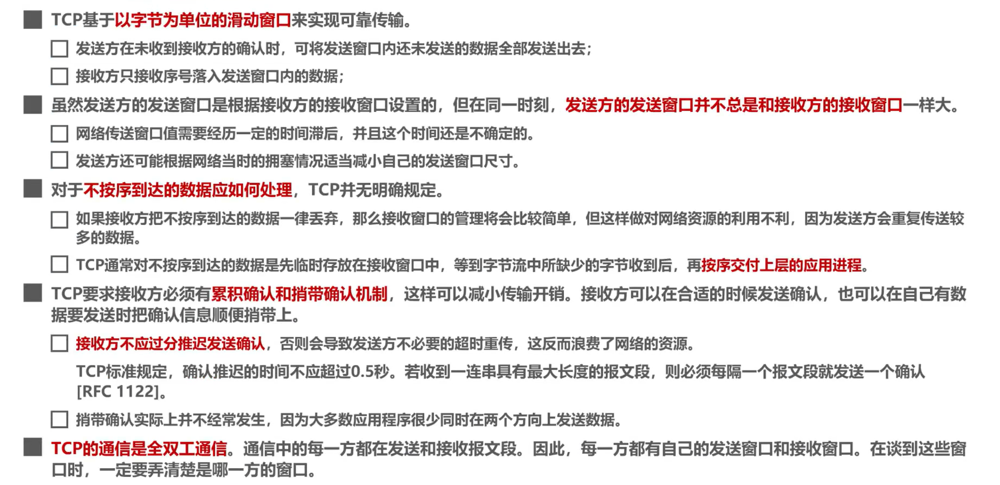

# 计算机网络（第五章）

## 1 概述

- 计算机网络体系结构中的**物理层**、**数据链路层**以及**网络层**它们共同解决了将主机通过异构网络互联起来所面临的问题，**实现了主机到主机的通信**。
- 但实际上在计算机网络中进行**通信的真正实体是位于通信两端主机中的进程**。
- 运输层的任务：为运行在不同主机上的应用进程提供直接的通信服务是运输层的任务
  - 运输层协议又称为端到端协议

- 运输层向高层用户屏蔽下面的网络核心细节（如网络拓扑），它使使用进程看见的就像是两个运输层实体之间有一条端到端的逻辑通信信道。
- 运输层两种协议
  - 面向连接的TCP
  - 无连接的UDP

## 2 端口号、复用与分用的概念

- 运行在计算机上的进程使用**进程标识符PID**来表示
- 因特网的计算机不是统一的操作系统，不同操作系统（windows,Linux,Mac Os）使用不同格式的进程标识符。
- 为了使运行不同操作系统的计算机的应用进程之间能够进行网络通信，就必须**使用统一的方法对TCP/IP体系的应用进程进行标识**。
- TCP/IP体系的运输层使用**端口号**来区分应用层的不同应用进程。
  - 端口号使用**16比特表示**，取值范围**0~65535**
    - 熟知端口号：0~1023，IANA把这些端口号指派给TCP/IP体系中最重要的一些应用协议
      - FTP  使用 21/20
      - HTTP 使用 80
      - DNS 使用 53 
    - 登记端口号：1024~49151，为没有熟知端口号的应用程序使用。使用这类端口号必须在IANA按照规定的手续登记，以防止重复。
      - 例子：Microsoft RDP 微软远程桌面端口：3389
      - tomcat ： 默认 8080
    - 短暂端口号：49152~65535，留给客户进程选择暂时使用。当服务器收到客户进程的报文时，就知道了客户进程所使用的动态端口号。
      - 通信结束后，这个端口号可供其他客户进程以后使用
  - 端口号只具有本地意义，即端口号只是为了标识计算机应用层中的各进程，在因特网中，不同计算机中相同端口号时没有联系的。

**多个进程（这里一个端口表示一个进程）** 利用一个运输层协议（或者称为运输层接口）**发送**数据称为 **复用**

**多个进程（这里一个端口表示一个进程）** 利用一个运输层协议（或者称为运输层接口）**接收**时叫做 **分用**。

TCP/IP体系的应用层常用协议所使用的运输层熟知端口号

## 3 UDP和TCP的对比

### 概念

- **UDP**和**TCP**是TCP/IP体系结构**运输层**中的两个重要协议
- 当运输层采用面向连接的**TCP**协议时，尽管下面的网络是不可靠的（只提供尽最大努力服务），但这种逻辑通信信道就相当于一条**全双工的可靠信道**。
- 当运输层采用无连接的UDP协议时，这种逻辑通信信道是一条**不可靠信道**。

可靠信道与不可靠信道

**发送方**

- TCP会把应用进程交付下来的数据块看作是一连串无结构的字节流，TCP并不知道这些待传送的字节流的含义
- 并将他们编号，并存储在自己发送缓存中
- TCP会根据发送策略，提取一定量的字节构建TCP报文并发送

**接收方**

- 一方面从所接受到的TCP报文段中，取出数据载荷部分并存储在接收缓存中；一方面将接收缓存中的一些字节交付给应用进程
- TCP不保证接收方应用进程所收到的数据块与发送方发送的数据块，具有对应大小的关系（例如，发送方应用进程交给发送方的TCP共10个数据块，但接收方的TCP可能只用了4个数据块，就把收到的字节流交付给了上层的应用进程，但接收方收到的字节流必须和发送方应用进程发出的字节流完全一样）
- 接收方的应用进程必须有能力识别收到的字节流，把它还原成有意义的应用层数据

TCP是面向字节流的，这正是TCP实现可靠传输、流量控制、以及拥塞控制的基础

**TCP**和**UDP**对比

|                      |           TCP           |             UDP              |
| -------------------- | :---------------------: | :--------------------------: |
| 网络节点之间通讯方式 |          单播           |         单、多、广播         |
| 数据单位协议         | **TCP 报文段**(segment) | **UDP 报文**或**用户数据报** |
| 关于连接             |       面向连接的        |           无连接的           |
| 关于数据形式         |     面向应用报文的      |         面向字节流的         |
| 首部                 |      开销小，8字节      |    最小20字节，最大60字节    |
| 传输服务             |        可靠传输         |          不可靠传输          |

---

碎碎念：

- 两个对等运输实体在通信时传送的数据单位叫做**运输协议数据单元**TPDU
  - TPDU：Transport Protocol Data Unit

- TCP 传送的数据单位协议是 **TCP 报文段**(segment)
- TCP是面向连接的，TCP之间的通信必须要在两个套接字（Socket）之间建立连接
- UDP 传送的数据单位协议是 **UDP 报文**或**用户数据报**
- UDP的通信是无连接的，不需要套接字（Socket）
- UDP支持单播、多播、以及广播
- TCP仅支持单播
- UDP面向应用报文的
  - UDP对应用进程交下来的报文既不合并也不拆分，而是保留这些报文的边界
- TCP面向字节流的

---

## 4 TCP流量控制

- 一般来说，我们总是希望数据传输更快一些
  - 但如果发送方把数据发送得过快，接收方可能来不及接受，就会造成数据的丢失
- 流量控制（flow control）:让发送方的发送速率不要太快，要让接收方来得及接收
- 利用**滑动窗口**机制可以很方便地在TCP上实现对发送方地流量控制
  - TCP接收方利用自己的**接收窗口**的大小限制发送方**发送窗口**的大小
  - TCP发送方收到接收方的零窗口通知后，应启动持续计时器。持续计时器超市后，向接收方发送**零窗口探测报文**。

#### **流量控制流程**

---
碎碎念：

- 假设一开始滑动窗口为400
- seq=1 DATA：1号字节数据
- ack=201：对收到的201号以前的数据进行累计确认
- rwnd=300：将接受窗口调整为300，对主机A进行流控
- 需要等到接受端回馈ack后发送端才进行窗口的滑动

流程：

- 主机A可将发送缓存中序号1~200的字节数据全部删除，因为已经收到了主机B对它们的累计确认（第一条ACK返回时）
- 主机A现在可将发送缓存中序号201~500的字节数据全部删除，因为已经收到了主机B对它们的累计确认（第二条ACK返回时）
- 主机A可将发送缓存中序号501~600的字节数据全部删除，因为已经收到了主机B对它们的累计确认（第三条ACK返回时）

注意：

- 超时重传，会将原滑动窗口的数据重新整合成报文段发送
- 第三条ACK返回时，rwnd=0，发送端不能再发送数据了

---

#### 流量控制额外情况

---

- 如果零窗口探测报文在发送过程中如果丢失，还是能打破死锁局面
- 因为零窗口探测报文段也有重传计时器，重传计时器超时后，零窗口探测报文段会被重传

---

**尴尬的情况**

**计时器的加入打破现状**

## 5 TCP的拥塞控制

- 在某段时间，若对网络中某一资源的需求超过了该资源所提供的可用部分，网络性能就要变坏。这种情况就叫做拥塞。
  - 在计算机网络中链路容量（即带宽）、交换节点中的缓存和处理机等，都是网络的资源。
- 若出现拥塞而不进行控制，整个网络的吞吐量将随输入符合的增大而下降。

---

拥塞控制

---

**网络拥塞往往是由许多因素引起的。**

**例如：**

1. 点缓存的容量太小；
2. 链路的容量不足；
3. 处理机处理的速率太慢；
4. 拥塞本身会进一步加剧拥塞；

**拥塞控制的一般原理**

- 拥塞控制的前提：网络能够承受现有的网络负荷。
- 实践证明，拥塞控制是很难设计的，因为它是一个**动态问题**。
- 分组的丢失是网络发生拥塞的**征兆**而不是原因。
- 在许多情况下，甚至正是**拥塞控制本身**成为引起网络性能恶化、甚至发生死锁的原因。

**开环控制和闭环控制**

- 开环控制：在设计网络时，事先考虑周全，力求工作时不发生拥塞
  - 思路：力争避免发生拥塞
- 闭环控制：基于反馈环路的概念；根据网络当前运行状态才去相应控制措施；
  - 思路：在发生拥塞后，采取措施进行控制，消除拥塞。

**监测网络的拥塞**

主要指标有：

1. 由于缺少缓存空间而被丢弃的分组的百分数；
2. 平均队列长度；
3. 超时重传的分组数；
4. 平均分组时延；
5. 分组时延的标准差，等等。

上述这些指标的上升都标志着拥塞的增长。

#### 拥塞控制的算法

---

四种拥塞算法

- 慢开始 （slow-start）
- 拥塞避免 （congestion avoidance）
- 快重传（fast retransmit）
- 快恢复（fast recovery）

---

介绍--条件假设

---

- 数据是单方向传输，另一方只传输确认
- 接收方总是有足够大的缓存空间，因而发送大小由网络拥塞程度来决定。
- 以最大报文段MSS的个数为问题的讨论单位，而不是以字节为单位

---

---

#### **慢开始与拥塞避免**

**慢开始**

目的：用来确定网络的负载能力或拥塞程度。

算法的思路：由小到大逐渐增大拥塞窗口数值。

两个变量：

- **拥塞窗口（cwnd）**：初始拥塞窗口值：2 种设置方法。窗口值逐渐增大。
  - 1 至 2 个最大报文段 （旧标准）
  - 2 至 4 个最大报文段 （RFC 5681）
- **慢开始门限（ssthresh）**：防止拥塞窗口增长过大引起网络拥塞。

碎碎念：

- 每经过一个传输轮次，拥塞窗口就加倍

- 窗口大小按**指数增加**，2的n-1次方

**拥塞避免（congestion avoidance）**

- 思路：让拥塞窗口 cwnd **缓慢地增大**，避免出现拥塞。
- 每经过一个传输轮次，拥塞窗口 **cwnd = cwnd + 1**。
- 使拥塞窗口 cwnd 按线性规律缓慢增长。
- 在拥塞避免阶段，具有 “**加法增大**” (Additive Increase) 的特点。

在第12次传播数据时，假设发生重传计时器超时，判断网络很可能出现拥塞，进行以下工作

1. 将ssthresh的值更新为发生拥塞时cwnd值得一半；
2. 将cwnd值减少为一，重新执行慢开始算法

---

#### 快开始与快重传

---

#### 快重传（fast retrasmit）

- 在丢失M3后，立即发送报文重复3次
- 不会等待发送方的超时重传计时器响应

#### 快恢复（fast recovery）

#### 改进后的整体算法的示意图

---

## 6 TCP超时重传时间的选择

#### 1 超时重传设置的大小引发的问题

**过小**：假设RTO大于RTT0：会引起不必要的重传，使网络负荷增大

**过大**：会使空闲时间增大，降低传输效率

**理想状态**：RTO略大于RTT

#### 2 超时重传时间的调节

##### 基本调节方案

##### Karn算法对调节方案的意义和改进

**意义**

**改进**

##### 计算流程

---

---

---

---

---

## 7 TCP的可靠传输实现

## 8 TCP的运输连接管理（非常重要的三握四挥!!!）

运输连接管理大致示意图

- TCP是面向连接的协议，它基于运输连接来传送TCP报文段
- TCP运输连接的建立和释放是每一次面向连接的通信中必不可少的过程
- TCP运输有以下三阶段
  - 建立TCP连接
  - 数据传送
  - 释放TCP连接
- TCP的运输管理就是使运输连接的建立和释放都能正常运行。

### 三报文握手（连接建立）

TCP的连接建立要解决以下三个问题

- 使TCP双方能够明确知道对方的存在；
- 使TCP双方能够协商一些参数（如最大窗口值，服务质量等）
- 使TCP双方能够对运输实体资源（如缓存大小、连接表中的项目等）进行分配

大致流程

#### 正常的三次握手

---

一开始两边处于关闭状态

1. 第一次握手

- 服务端
  - 先创建传输控制块，存储重要信息（信息内容见表）
  - 等待TCP客户端的连接请求，进入到监听状态。
    - 因为使等待连接请求，而不是主动发起，又称为被动打开连接
- 发送端
  - 先创建传输控制块，存储重要信息（信息内容见表）
  - 打算建立TCP连接时，向TCP服务器发送TCP连接请求报文段（即第一条箭头示意）
    - SYN = 1: SYN为同步位，表明这是一个TCP连接请求报文段
    - seq = x: 作为TCP客户进程所选择的初始序号
    - SYN=1的报文段不能携带数据，但要消耗掉一个序号seq
    - 因为连接是客户端主动打开，即成为主动打开连接
  - 进入同步已发送状态

2. 第二次握手

- ​	服务端
  - TCP服务器进程收到TCP连接请求报文段后，如果同意建立连接，则向TCP客户进程发送TCP连接请求确认报文段。
    - 同步位SYN和确认为ACK都设置为1，表明这是一个TCP连接请求确认报文段
    - 序号字段seq被设置了一个初始值y，作为TCP服务器进程所选择的初始序号，
    - 确认号字段ack的值被设置成了x+1，这是对TCP客户进程所选择的初始序号（seq）的确认
  - 进入同步已接收状态。
  - 请注意：这个报文段也不能携带数据，因为它是SYN被设置为1的报文段，但同样要消耗掉一个序号

3. 第三次握手

- 发送端

  - TCP客户进程收到TCP连接请求确认报文段后，还要向TCP服务器进程发送一个普通的TCP确认报文段
    - 确认位ACK被设置为1，表明这是一个普通的TCP确认报文段
    - 序号字段seq被设置为x+1，
      - 这是因为TCP客户进程发送的第一个TCP报文段的序号为x，所以TCP客户进程发送的第二个报文段的序号为x+1
    - 确认号字段ack被设置为y+1，这是对TCP服务器进程所选择的初始序号的确认
  - 进入连接已连接状态
  - 请注意：TCP规定普通的TCP确认报文段可以携带数据，但如果不携带数据，则不消耗序号

  

现在，TCP双方都进入了连接已建立状态，它们可以基于已建立好的TCP连接，进行可靠的数据传输

---

#### 为什么要三次握手，两次出现什么问题

- 为了防止已失效的连接请求报文段突然又传送到了TCP服务器，因而导致错误
  - TCP服务器处于被动打开连接状态，当他受到消息时，会针对请求确认
  - 只会确认求认的服务器不知道哪条才是真正需要确认的
  - 发送方对确认的确认方便服务器更好地执行“主人的任务”

### 四报文挥手（连接释放）

- TCP 连接释放过程比较复杂。
- 数据传输结束后，通信的双方都可释放连接。
- TCP 连接释放过程是**四报文握手**。

#### 正常的四次握手

具体流程图示

- TCP 连接的建立**采用客户服务器方式**。
- 主动发起连接建立的应用进程叫做**TCP客户** (client)。
- 被动等待连接建立的应用进程叫做**TCP服务器** (server)。
- **任何一方都可以在数据传送结束后发出连接释放的通知**

.jpg)

一开始两边处于连接已建立状态

1. 第一次握手

- 客户端
  - TCP客户进程的应用进程通知其主动关闭TCP连接
  - TCP客户进程会发送TCP连接释放报文段
  - TCP连接释放报文段首部中
    - 终止位FIN和确认为ACK的值都被设置为1，表明这是一个TCP连接释放报文段，同时也对之前收到的报文段进行确认
    - 序号seq字段的值设置为u，它等于TCP客户进程之前已传送过的数据的最后一个字节的序号加1
    - 确认号ack字段的值设置为v，它等于TCP客户进程之前已收到的、数据的最后一个字节的序号加1
  - 请注意：TCP规定终止位FIN等于1的报文段即使不携带数据，也要消耗掉一个序号
  - 进入终止等待1状态

2. 第二次握手

- 服务器

  - TCP服务器进程收到TCP连接释放报文段后，会发送一个普通的TCP确认报文段

  - 普通的TCP确认报文段首部中

    - 确认位ACK的值被设置为1，表明这是一个普通的TCP确认报文段

    - 序号seq字段的值设置为v，它等于TCP服务器进程之前已传送过的数据的最后一个字节的序号加1，

      这也与之前收到的TCP连接释放报文段中的确认号匹配

    - 确认号ack字段的值设置为u+1，这是对TCP连接释放报文段的确认

  - 进入关闭等待状态

3. 服务器若还有数据未发完（数据传输的箭头）

- TCP服务器进程应该通知高层应用进程，TCP客户进程要断开与自己的TCP连接

  - 此时，从TCP客户进程到TCP服务器进程这个方向的连接就释放了
  - 这时的TCP连接属于半关闭状态，也就是TCP客户进程已经没有数据要发送了

  - 如果TCP服务器进程还有数据要发送，TCP客户进程仍要接收。

    也就是说从TCP服务器进程到TCP客户进程这个方向的连接并未关闭。

4. 第三次握手

- TCP客户进程收到TCP确认报文段后

- 进入终止等待2状态，并且

  - 等待TCP服务器进程发出的TCP连接释放报文段
  - 若使用TCP服务器进程的应用进程已经没有数据要发送了，应用进程就通知其TCP服务器进程释放连接
  - 由于TCP连接释放是由TCP客户进程主动发起的，因此TCP服务器进程对TCP连接的释放称为被动关闭连接

  

5. 第四次握手

- TCP服务器进程发送TCP连接释放报文段

- 该报文段首部中
  - 终止位FIN和确认位ACK的值都被设置为1，表明这是一个TCP连接释放报文段，同时也对之前收到的报文段进行确认
  - 序号seq字段的值为w，这是因为在半关闭状态下，TCP服务器进程可能又发送
  - 确认号ack字段的值为u+1，这是对之前收到的TCP连接释放报文段的重复确认
- 进入最后确认状态

6.最后的等待

- TCP客户进程收到TCP连接释放报文段后，必须针对该报文段发送普通的TCP确认报文段，之后进入时间等待状态
- 该报文段首部中
  - 确认为ACK的值被设置为1，表明这是一个普通的TCP确认报文段
  - 序号seq字段的值设置为u+1，这是因为TCP客户进程之前发送的TCP连接释放报文段虽然不携带数据，但要消耗掉一个序号
  - 确认号ack字段的值设置为w+1，这是对所收到的TCP连接释放报文段的确认

- TCP服务器进程收到该报文段后就进入关闭状态，而TCP客户进程还要进过2MSL后才能进入关闭状态

#### 发送完最后一个报文后，为什么不直接关闭呢？

- 因为时间等待状态以及处于该状态2MSL时长，可以确保TCP服务器进程可以收到最后一个TCP确认报文段而进入关闭状态

- 另外，TCP客户进程在发送完最后一个TCP确认报文段后，在经过2MSL时长，就可以使本次连接持续时间内所产生的所有报文段都从网络中消失，这样就可以使下一个新的TCP连接中，不会出现旧连接中的报文段。

#### TCP保活计时器的作用

---

TCP双方已经建立了连接，后来，TCP客户进程所在的主机突然出现了故障

TCP服务器进程以后就不能再收到TCP客户进程发来的数据

因此，应当有措施使TCP服务器进程不要再白白等待下去

---

## 9 TCP报文格式

**TCP报文是TCP层传输的数据单元，也叫报文段。**

**1、端口号**：用来标识同一台计算机的不同的应用进程。

​	**1）源端口**：源端口和IP地址的作用是标识报文的返回地址。

​	**2）目的端口**：端口指明接收方计算机上的应用程序接口。

TCP报头中的源端口号和目的端口号同IP数据报中的源IP与目的IP唯一确定一条TCP连接。

**2、序号和确认号**：

​		是TCP可靠传输的关键部分。

​		**序号**是本报文段发送的数据组的第一个字节的序号。在TCP传送的流中，每一个字节一个序号。

---

e.g.  一个报文段的序号为300，此报文段数据部分共有100字节，则下一个报文段的序号为400。所以序号确保了TCP传输的有序性。确认号，即ACK，指明下一个期待收到的字节序号，表明该序号之前的所有数据已经正确无误的收到。确认号只有当ACK标志为1时才有效。比如建立连接时，SYN报文的ACK标志位为0。

---

**3、数据偏移／首部长度**：4bits。由于首部可能含有可选项内容，因此TCP报头的长度是不确定的，报头不包含任何任选字段则长度为20字节，4位首部长度字段所能表示的最大值为1111，转化为10进制为15，15*32/8 = 60，故报头最大长度为60字节。首部长度也叫数据偏移，是因为首部长度实际上指示了数据区在报文段中的起始偏移值。

**4、保留**：为将来定义新的用途保留，现在一般置0。

**5、控制位**：URG  ACK  PSH  RST  SYN  FIN，共6个，每一个标志位表示一个控制功能。

​	**1）URG**：紧急指针标志，为1时表示紧急指针有效，为0则忽略紧急指针。

​	**2）ACK**：确认序号标志，为1时表示确认号有效，为0表示报文中不含确认信息，忽略确认号字段。

​	**3）PSH**：push标志，为1表示是带有push标志的数据，指示接收方在接收到该报文段以后，应尽快将这个报文段交给应用程序，而不是在缓冲区排队。

​	**4）RST**：重置连接标志，用于重置由于主机崩溃或其他原因而出现错误的连接。或者用于拒绝非法的报文段和拒绝连接请求。

​	**5）SYN**：同步序号，用于建立连接过程，在连接请求中，SYN=1和ACK=0表示该数据段没有使用捎带的确认域，而连接应答捎带一个确认，即SYN=1和ACK=1。

​	**6）FIN**：finish标志，用于释放连接，为1时表示发送方已经没有数据发送了，即关闭本方数据流。

**6、窗口**：滑动窗口大小，用来告知发送端接受端的缓存大小，以此控制发送端发送数据的速率，从而达到流量控制。窗口大小时一个16bit字段，因而窗口大小最大为65535。

**7、校验和**：奇偶校验，此校验和是对整个的 *TCP* 报文段，包括 *TCP* 头部和 *TCP* 数据，以 *16* 位字进行计算所得。由发送端计算和存储，并由接收端进行验证。

**8、紧急指针**：只有当 *URG* 标志置 *1* 时紧急指针才有效。紧急指针是一个正的偏移量，和顺序号字段中的值相加表示紧急数据最后一个字节的序号。 *TCP* 的紧急方式是发送端向另一端发送紧急数据的一种方式。

**9、选项和填充**：最常见的可选字段是最长报文大小，又称为MSS（Maximum Segment Size），每个连接方通常都在通信的第一个报文段（为建立连接而设置SYN标志为1的那个段）中指明这个选项，它表示本端所能接受的最大报文段的长度。选项长度不一定是32位的整数倍，所以要加填充位，即在这个字段中加入额外的零，以保证TCP头是32的整数倍。

**10、数据部分**： *TCP* 报文段中的数据部分是可选的。在一个连接建立和一个连接终止时，双方交换的报文段仅有 *TCP* 首部。如果一方没有数据要发送，也使用没有任何数据的首部来确认收到的数据。在处理超时的许多情况中，也会发送不带任何数据的报文段。

