# OS第十一章

>   死锁和进程通信

**死锁现象**

- 车进交叉口：抢占资源
- 车资源推出：让出资源

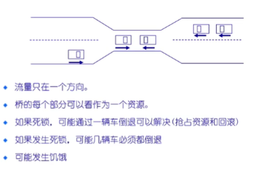

### **死锁问题**

一组阻塞的进程持有一种资源等待获取另一个进程所占有的一个资源

示例:

- 系统有2个磁带驱动器
  - P1和P2各有一个
  - 都需要另外一个

### **系统模型**

- 资源类型R1,R2,..,Rm
  - (CPU, memory space, I/O devices)
- 每个资源类型Ri有Wi个实例.
- 每个进程使用资源如下:
  - require,get ← free resource
  - use,hold    ← requested,used resource
  - release     ← free resource
- 可重复使用的资源

  - 在一个时间只能有一个进程使用且不能被删除
  - 进程获得资源,后来释放由其他进程重用
  - 处理器,IO通道,主和副存储器,设备和数据结构,如文件,数据库和信号量
  - 如果每个进程拥有一个资源并请求其他资源,死锁可能发生

- 使用资源
  - 创建和销毁
  - 在IO缓存区的中断,信号,消息,信息
  - 如果接收消息阻塞可能会发生死锁
  - 可能少见的组合事件会引起死锁

- 资源分配**图**(图是指数据结构中的图)
  - 一组顶点V和边E的集合
  - V有两种类型:
    - P={P1,P2,...,Pn},集合包括系统中的所有进程
    - R={R1,R2,...,Rm},集合包括系统中的所有资源类型
  - requesting,claiming edge - directed edge **Pi → Rj**（有向边：进程需要该资源）
  - assignment,holding  edge - directed edge **Rj → Pi**（有向边：资源被进程使用）

**资源分配案例**

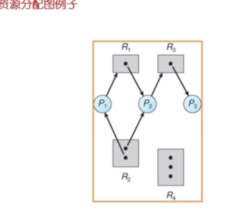

> 碎碎念
>
> 有 p1 p2 p3 三个进程
>
> 有 R1（1） R2（2） R3（1） R4（3） 四个资源（括号中为资源实例）
>
>  此过程中无死锁

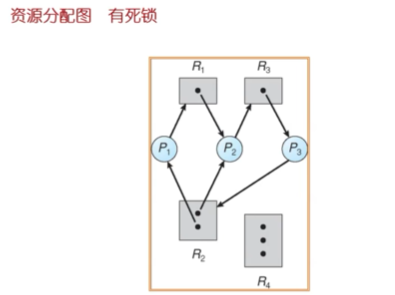

> 死锁发生：
>
> ​	p1 等 p2 , 为了R1
>
> ​	p2 等 p3 , 为了R3
>
> ​	p3 等 p1 , 为了R2
>
> 因为拿到资源后会（**持有并等待**）

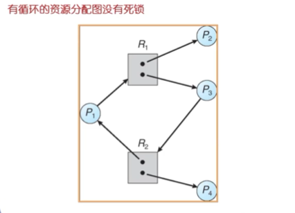

> 没有死锁：
>
> ​	每个资源类都有多实例，不用等着拿

基本情况

如果图中不包含循环:

- 没有死锁

如果图中包含循环:

- 如果每个资源类只有一个实例,那么死锁
- 如果每个资源类有几个实例,可能死锁

**死锁特征**

死锁出现一定会出现以下四个条件,但是出现以下四个条件不一定死锁:

- 互斥: 在一个时间只能有一个进程使用资源

  - 一个叉子只能由一个哲学家拿着

- 持有并等待: 进程保持至少一个资源正在等待获取其他进程持有的额外资源

  - 哲学家都拿左边的叉子不放下

- 无抢占: 一个资源只能被进程资源释放,进程已经完成了它的任务之后

  - 礼貌等待资源会僵住，但是直接抢就不用僵住了

- 循环等待: 

  存在等待进程集合{P0,P1,...,Pn}

  P0正在等待P1所占用的资源

  P1正在等待P2占用的资源...

  Pn-1在等待Pn的资源

  Pn正在等待P0所占用的资源

  - 哲学家等待右手的叉子

## 死锁处理方法

常见方法

- 确保系统永远不会进入死锁状态
- 运行系统进入死锁状态,然后恢复.
- 忽略这个问题,假装系统中从来没有发生死锁
  - 用于大多数操作系统,包括UNIX
  - 这样做的原因：处理开销大，忽略掉吧

### Deadlock Prevention    预防

> 出现死锁是因为四个必要条件同时出现了，那我只需要打破其中一个即可。

限制申请方式：

- 互斥 - 共享资源不是必须的,必须占用非共享资源
- 占用并等待 - 必须保证当一个进程请求的资源,它不持有任何其他资源
  - **核心思路：要么不拿，要拿就拿所有**	
  - 需要进程请求并分配其所有资源,它开始执行之前或允许进程请求资源仅当进程没有资源
  - 资源利用率低,可能发生饥饿
- 无抢占 -
  - **核心思路：直接把占着资源又不操作的进程kill掉**
  - 如果进程占有某些资源,并请求其他不能被立即分配的资源,则释放当前正占有的资源
  - 被抢占资源添加到资源列表中
  - 只有当它能够获得旧的资源以及它请求新的资源,进程可以得到执行
- 循环等待
  - 对所有资源类型进行排序,并要求每个进程按照资源的顺序进行申请

### Deadlock Avoidance     避免

> 当进程需要资源时，先申请，然后对申请判断，如果资源给你就会死锁，我不给

需要系统具有一些额外的先验信息提供

- 最简单和最有效的模式是要求每个进程声明它可能需要的每个类型资源的**最大数目**

- 资源的分配状态是通过限定**提供**与**分配**的资源数量,和进程的最大需求

- 死锁避免算法**动态检查**的资源分配状态,以**确保永远不会有一个环形等待状态**

  - 环形等待有概率死锁，是不安全状态，不允许出现此情况

- **当一个进程请求可用资源,系统必须判断立即分配是否能使系统处于安全状态**

- 系统处于安全状态： 针对所有进程,存在**安全序列**

- **序列<P1,P2,...,Pn>是安全的**: 

  针对每个Pi , Pi要求的资源能够由当前可用的资源+所有的Pj持有的资源来满足,其中j<i.

  - 如果Pi资源的需求不是立即可用,那么Pi可以等到所有Pj完成
  - 当Pi完成后,Pi+1可以得到所需要的资源,执行,返回所分配的资源,并终止.
  - 用同样的方法,Pi+2,Pi+3和Pn能获得其所需的资源.

- 如果系统处于安全状态→无死锁

- 如果系统处于不安全状态→可能死锁

- 避免死锁: 确保系统永远不会进入不安全状态

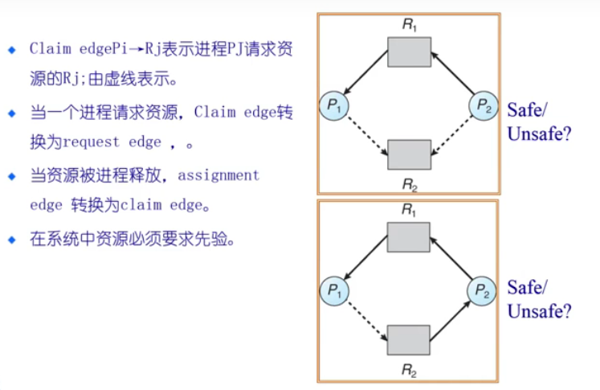

#### 银行家算法（Banker's Algorithm）

> Banker's Algorithm 是一个著名的死锁避免算法，由迪杰斯特拉设计的避免死锁产生的算法
>
> 背景：银行贷款，一定要能收回来，收不回不贷。

Banker's Algorithm 前提条件：

- 多个实例
- 每个进程都必须能最大限度地利用资源
- 当一个进程请求一个资源，就不得不等待
- 当一个进程获得所有地资源，就必须在一段有限地时间释放它们。

基于上述前提，Banker's Algorithm通过尝试寻找允许每个进程获得的最大资源并结束（把资源还给系统）的进程请求的一个理性执行时序，来决定一个状态是否是安全的。

不存在满足要求的执行时序状态都是不安全的。

Banker's Algorithm 数据结构

- n  = 进程数量

- m = 资源类型数量

- **Max（总需求量）**： n*m 矩阵 
  - 若 Max[i,j] = k：表示 Pi 最多请求资源类型 Rj 的 k 个实例
- **Available（剩余空闲量）**：长度为 m 的向量 
  - 若 Available[j] = k：有 k 个类型 Rj 的资源实例可用
- **Allocation（已分配量）**：n*m 矩阵 
  - 若 Allocation[i,j] = k, 则 Pi 当前分配了 k 个 Rj 的实例
- **Need（未来需要量）**：n*m 矩阵 
  - 若 Need[i,j] = k , 则 Pi 可能需要 k 个Rj 实例完成任务
  - Need[i,j] = Max[i,j] - Allocation[i,j]

算法实践

安全状态判断：

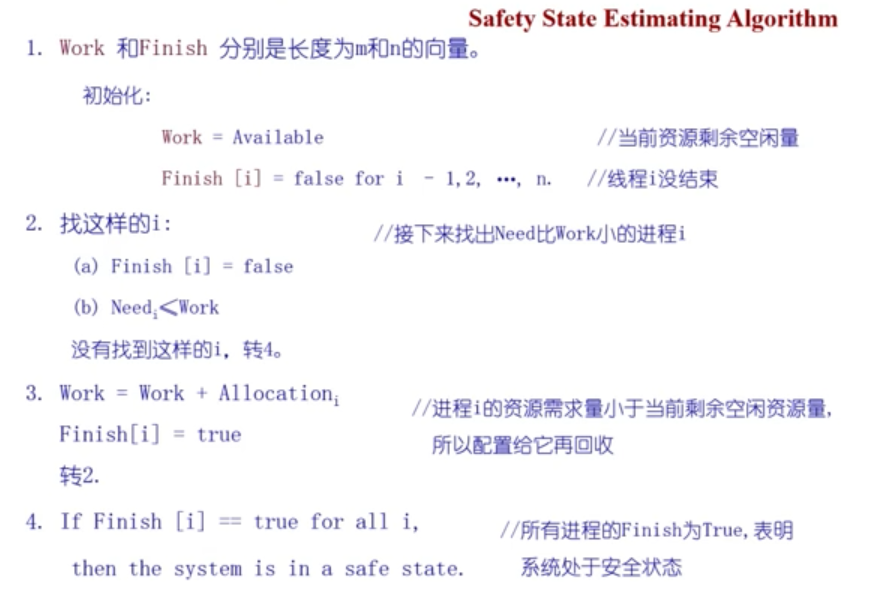

实际操作

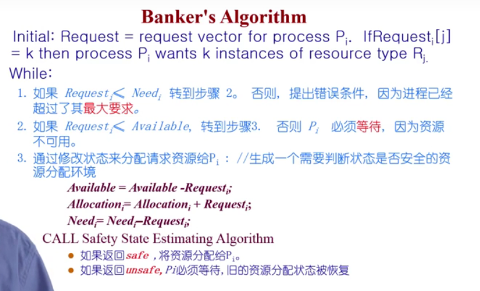

---

安全性算法:
系统所执行的安全性算法可描述如下:
　　(1) 设置两个向量:①工作向量Work，它表示系统可提供给进程继续运行所需的各类资源数目，它含有m个元素，在执行安全算法开始时，Work = Available；② Finish:它表示系统是否有足够的资源分配给进程，使之运行完成。开始时先做 Finish[i] = false；当有足够资源分配给进程时，再令Finish[i] = true。
　　(2) 从进程集合中找到一个能满足下述条件的进程
　　　　① Finish[i] = false;
　　　　② Need[i,j] ≤ Work[j];
		若找到，执行步骤(3)，否则，执行步骤(4)。
　　(3)当进程Pi获得资源后，可顺利执行，直至完成，并释放出分配给它的资源，故应执行:
　　　　Work[j] = Work[j] + Allocation[i,j];
　　　　Finish[i] = true;
　　　　go to step 2;(goto语句不推荐使用 _ )
　　(4)如果所有进程的 Finish[i] =true都满足，则表示系统处于安全状态；否则，系统处于不安全状态。

银行家算法详述：
　　设 Request；是进程Pi的请求向量，如果 Requesti[j] = K，表示进程Pi需要K个Rj类型的资源。当Pi发出资源请求后，系统按下述步骤进行检査:
　　(1) 如果 Requesti[j] ≤ Need[i,j]便转向步骤(2)；否则认为出错，因为它所需要的资源数已超过它所宣布的最大值。
　　(2) 如果 Requesti[j] ≤ Available[j]，便转向步骤(3)；否则，表示尚无足够资源，Pi须等待。
　　(3) 系统试探着把资源分配给进程Pi，并修改下面数据结构中的数值
　　　　Available[j] = Available[j] - Requesti[j];
　　　　Allocation[i,j] = Allocation[i,j] + Requesti[j];
　　　　Need[i,j] = Need[i,j] - Requesti[j];
　　(4) 系统执行安全性算法，检查此次资源分配后系统是否处于安全状态。若安全，才正式将资源分配给进程Pi，以完成本次分配；否则，将本次的试探分配作废，恢复原来的资源分配状态，让进程Pi等待。
原文链接：https://blog.csdn.net/qq_36260974/article/details/84404369

---

### Deadlock Detection     检测

> 是死锁发生了，就回复，不死锁，你继续
>
> 主要用于调试

每个资源类型单一实例

Maintain wait-for graph

- 节点是进程
- Pi→Pj: Pi等待Pj

定期调用检测算法来搜索图中是否存在循环

算法需要n^2次操作,n是图中顶点的数目

图中内容：资源分配图简化成等待图

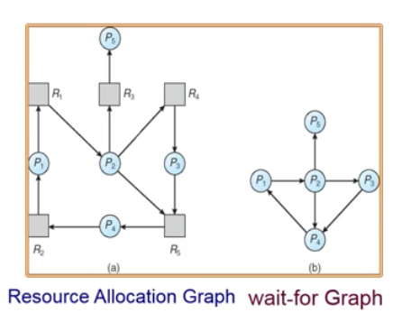

数据结构:

- Available： 长度为M的向量表示每种类型可用资源的数量
- Allocation:：一个n*m矩阵定义了当前分配给各个进程每种类型资源的数量,如果Alocation[i, j] = k, 进程Pi拥有资源Rj的k个实例
- Request：一个n*m矩阵表示各进程的当前请求.如果Request[i, j] = k,表示进程Pi请求k个资源Pj的实例

死锁检测算法

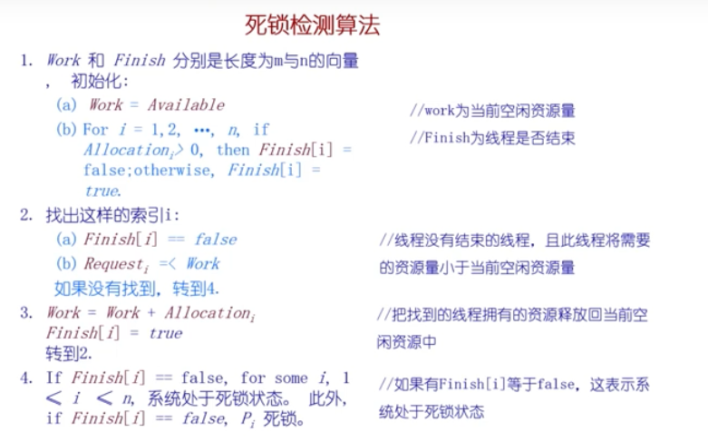

死锁检测算法实例：

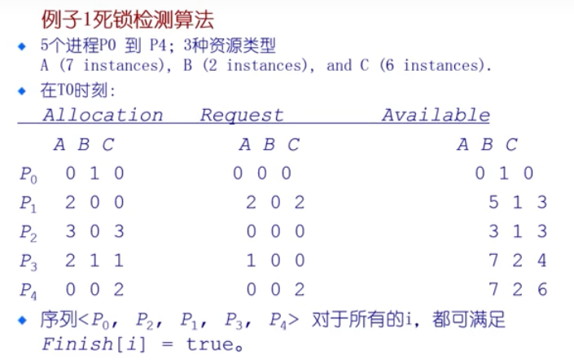

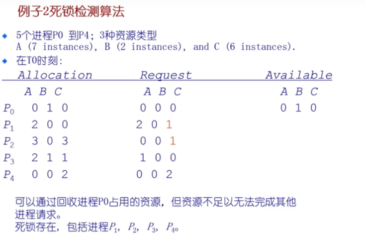

> p1 p2 p3 p4 形成环

何时,使用什么样的频率来检测依赖于:

- 死锁多久可能会发生?
- 多少进程需要被回滚? one for each disjoint cycle

如果检测算法多次被调用

- 有可能是资源图有多个循环，所以我们无法分辨出多个可能死锁进程中的哪些"造成"死锁

### Recovery from Deadlock 恢复

- 终止所有的死锁进程（形成环的进程kill掉）

- 在一个时间内终止一个进程直到死锁消除

- 终止进程的顺序应该是:
  - 进程的优先级
  - 进程运行了多久以及需要多少时间才能完成
  - 进程占用的资源
  - 进程完成需要的资源
  - 多少进程需要被终止
  - 进程是交互还是批处理

选择一个受害者 - 最小的成本

回滚 - 返回到一些安全状态,重启进程到安全状态

饥饿 - 同一进程可能一直被选作受害者,包括回滚的数量

## IPC（Inter-Process Communication，进程间通信）

### 概述

进程通信的机制及同步

不使用共享变量的进程通信

IPC facility 提供2个操作:

- send(message) - 消息大小固定或者可变
- receive(message)

如果P和Q想通信,需要:

- 在它们之间建立通信链路
- 通过send/recevie交换消息

通信链路的实现

- 物理(例如,共享内存,硬件总线)
- 逻辑(例如,逻辑属性)

### 直接通信

进程必须正确的命名对方:

- send(P, message) - 发送消息到进程P
- receive(Q, message) - 从进程Q接收信息

通信链路的属性

- 自动建立链路
- 一条链路恰好对应一对通信进程
- 每对进程之间只有一个链路存在
- 链路可以是单向的,但通常是双向的

### 间接通信

定向从消息队列接收消息

- 每个消息对垒都有一个唯一的ID
- 只有它们共享了一个消息队列,进程才能够通信

通信链路的属性

- 只有进程共享一个共同的消息队列,才建立链路
- 链接可以与许多进程相关联
- 每对进程可以共享多个通信链路
- 链接可以是单向或者双向

操作

- 创建一个新的消息队列
- 通过消息队列发送和接收消息
- 销毁消息队列

原语的定义如下:

- send(A, message)
- receive(A, message)
- 通信链路缓冲

队列消息被附加到链路，可以是以下3种方式之一

通信链路缓存大小:

1. 0容量 - 0 message : 发送方必须等待接收方
2. 有限容量 - n messages的有限长度 : 发送方必须等待,如果队列满
3. 无限容量 - 无限长度 : 发送方不需要等待

### 信号

信号Signal

- 软件中断通知事件处理
- Examples: SIGFPE, SIGKILL, SIGUSRI, SIGSTOP, SIGCONT

接收到信号时会发生什么?

- catch:  指定信号处理函数被调用
- ignore: 依靠操作系统的默认操作(abort, memory dump, suspend or resume process)
- mask:   闭塞信号因此不会传送(可能是暂时的,当处理同样类型的信号)

不足:

- 不能传输要交换的任何数据

### 管道

数据交换

- 子进程从父进程继承文件描述符(0 stdin, 1 stdout, 2 stderr)

- 进程不知道(或不关心)从键盘,文件,程序读取或写入到终端,文件,程序.

- 例如: $ ls | more (两个进程, 管道是缓存,对于ls来说是stdout,对于more来说是stdin )

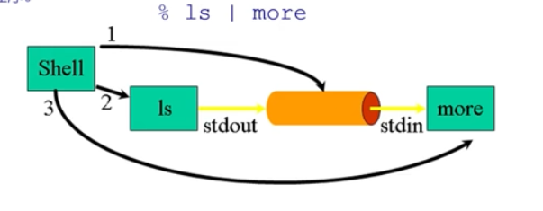

### 消息队列

消息队列按FIFO来管理消息

- message: 作为一个字节序列存储
- message queues: 消息数组
- FIFO &  FILO configuration

### 共享内存

进程

- 每个进程都有私有地址空间
- 在每个地址空间内,明确地设置了共享内存段

优点

- 快速,方便地共享数据

不足

- 必须同步数据访问

最快的方法

一个进程写另一个进程立即可见

没有系统调用干预

没有数据复制

不提供同步

- Socket

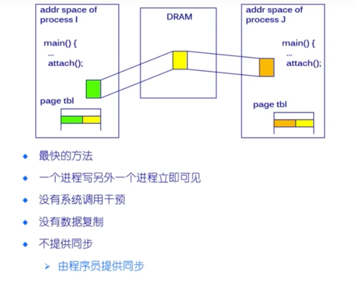