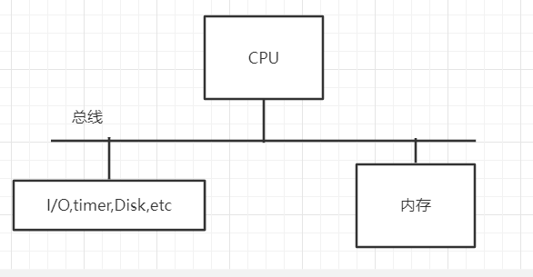
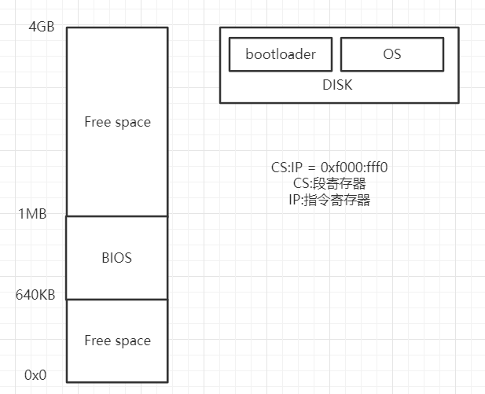
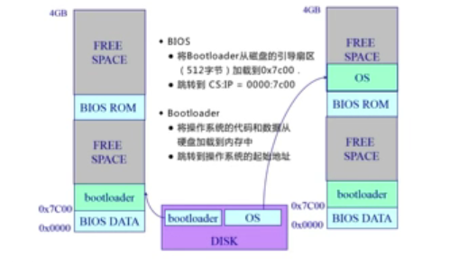

# OS 第二章

了解OS相关内容

- 启动
  - 计算机体系给狗概述
  - 计算机内存和硬盘布局
  - 开机顺序
- 中断、异常和系统调用
  - 背景
  - 中断、异常和系统调用相比较
  - 中断和异常的处理机制
  - 系统调用的概念
  - 系统调用的实现
  - 程序调用与系统调用的不同之处
  - 开销

## 启动

启动涉及的内容

**DISK**：存放os，bootloader程序
**bootloader**：一段执行程序，负责将os放入内存，硬盘第一个扇区，512字节
**BIOS**：基本IO处理系统，负责检测各种外设是否正常
**POST**：加电自检 寻找显卡和执行BIOS 初始化检查

**启动过程**：

- 计算机开机后，首先从BIOS首地址执行，在这个过程中会完成POST,并且将bootloader从磁盘的引导扇区加载到0x7c00
- 此时cpu控制权交给bootloader，它 将os的代码和数据从disk加载到内存，pc跳转到os的起始位置，开始执行。

**开机流程**

## 中断、异常、系统调用

**概念**

- 系统调用(来源于应用程序)
  - 应用程序主动向os发出服务请求
- 异常(来源不良的应用程序)
  -  非法指令或者其他坏的处理状态（内存出错）
- 中断：(来源于外设)
  -  来自不同的硬件设备的计时器和网络的中断

**为什么应用程序不直接访问外设，而是经过OS？**

- 在计算机运行中，内核时被信任的第三方
- 只有内核可以执行特权指令
- 为了方便应用程序
  - 屏蔽底层复杂性和差异性，使应用程序简洁可移植

### 对比

| 类型     | 源头                     | 处理时间   | 响应                 |
| -------- | ------------------------ | ---------- | -------------------- |
| 中断     | 外设                     | 异步       | 持续，对应用程序透明 |
| 异常     | 应用程序意向不到的行为   | 同步       | 杀死或重新执行指令   |
| 系统调用 | 应用程序请求系统提供服务 | 同步或异步 | 等待和持续           |

>   碎碎念
>
>   源头
>
>   - 中断：敲键盘
>
>   - 异常：除0、恶意访问
>
>   - 系统调用：应用程序主动发出请求
>
>   处理时间
>
>   - 异步：应用程序不知道什么时候会发生中断
>
>   - 同步：执行到某一条指令一定会发生该事件
>
>   响应
>
>   - 中断：打断程序正常执行，悄悄完成
>   - 异常：强制杀死程序  或 重新执行（可能重开就好了吧）
>
>   - 系统调用：等待服务完成后继续执行指令（相较异常而言不会停止）

### 中断

中断来源于外设，来自不同的硬件设备的计时器和网络的中断。

**中断流程**

硬件：设置中断标记（CPU初始化）

1.  将内部、外部事件设置中断标记
2.  中断事件的ID

软件

1.  保存当前处理状态（寄存器之类的一些数据）
2.  根据中断事件的ID跳转到中断服务程序，中断服务程序处理
3.  清楚中断标记

### 异常

异常来源于不良的应用程序，非法指令或者其他坏的处理状态（如：内存出错）。

**异常处理流程**

1.  保存现场
2.  异常处理
    1.  杀死了产生异常的程序
    2.  重新执行异常指令
3.  恢复现场

### 系统调用

系统调用来源于应用程序，应用程序主动向操作系统发出服务请求。程序访问主要是通过高层次的API，而不是直接调用系统调用函数。

**APIs**

-   Win32 API 用于Windows
-   POSIX API 用于 POSIX-based systems（包括UNIX，LINUX，Mac OS X）
-   Java API 用于JAVA虚拟机

**特点**

-   通常情况下，每个系统调用有对应的序号
    -   系统调用接口根据这些序号来维护表的索引
-   系统调用接口调用内核态中预期的系统调用
    -   并返回系统调用的状态和其他任何返回值
-   用户不需要知道系统调用是如何实现的
    -   只需要获取API和了解操作系统将什么作为返回结果
    -   操作系统接口的细节大部分都隐藏在API中

**用户态**：操作系统运行中，CPU处于的特权级别，不能直接执行特权指令

**内核态**：操作系统运行中，CPU处于的特权级别，可以执行任何一条指令

**系统调用**：触发CPU从用户态到内核态的转换，切换程序和内核的堆栈，需要一定的开销

**跨越操作系统边界的开销（值得的且必须的，保证了操作系统的安全性）**

-   在执行时间上的开销超过程序调用
-   开销：
    -   建立中断、异常、系统调用号与对应服务例程映射关系的初始化开销
    -   建立内核堆栈
    -   验证参数
    -   内核态映射到用户态的地址空间（更新页面映射权限）
    -   内核态独立地址空间（TLB）