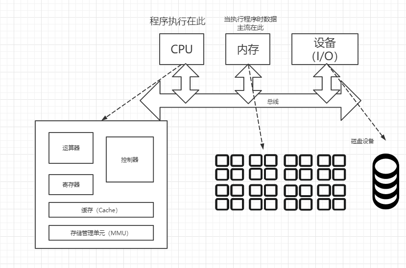
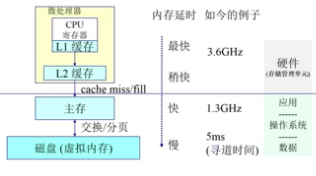
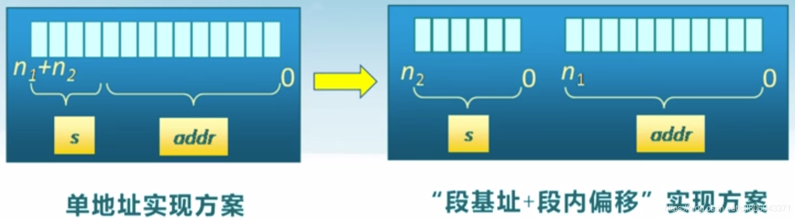
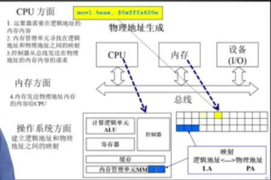
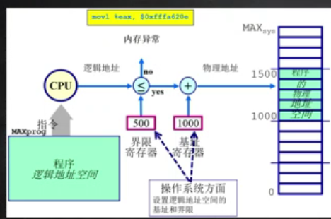
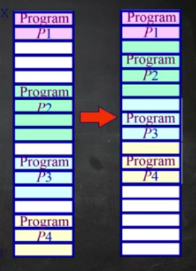
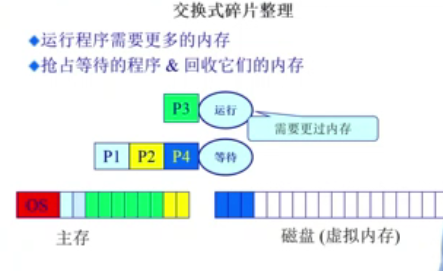

# OS 第三章

**主要内容**

- 计算机体系结构/内存分层体系
- 地址空间 & 地址生成
- 连续内存分配

#### 计算机体系结构/内存分层体系

- 计算机体系结构
- 内存分层体系
- 在操作系统的内存管理范例

计算机基本硬件结构

- CPU:完成程序或软件执行的控制
- 内存：放置程序代码和处理的数据
- 设备：配合程序工作

### 内存的层次结构

内存的层次

- L1内存延时最快，但存储量小
- 主存掉电后数据会消失，需要把永久保存的数据代码放到硬盘
- 运行内存(主存) / 磁盘(虚拟内存)
  -  主存是在运行程序时所需要保存的数据空间
  - 磁盘是用于持久化数据保存的数据空间.
- CPU可以访问的内存包括两大类 : 寄存器 / cache(L1缓存 / L2缓存)

**层次结构**

微处理器(CPU访问)

- CPU寄存器 / L1缓存

- L2缓存

主存(程序访问)

磁盘(程序访问)

>   从CPU寄存器到磁盘，读写速度不断降低，单位成本不断降低，大小不断增大。

### 内存管理目标

*   抽象：逻辑地址空间
    *   不用考虑底层细节，访问连续的地址空间即可
*   保护：独立地址空间
    *   隔离多个进程，避免相互破坏
*   共享：访问相同内存
    *   进程交互，安全可靠有效传输数据
*   虚拟：更多的地址空间
    *   当多个应用程序存在时，内存不足：把最需要的数据放到内存中，次要放在硬盘中

>P4不是那么重要所以先放到硬盘
>
>P123在执行故放在主存上
>
>- 相互隔离
>- 有边界
>
>程序看到的空间时逻辑空间（虚拟空间）
>
>主存硬盘是物理空间

### 内存管理方法

*   程序重定位
*   分段
*   分页
*   虚拟内存
*   按需分页虚拟内存

>   - 实现高度依赖于硬件,
>
>   - 内存管理单元(MMU)负责处理CPU的内存访问请求

## 地址空间&地址生成

**地址空间的定义**

*   物理地址空间 —— 硬件支持的地址空间( address : [0, Max_sys] )
    *   由硬件完成
*   逻辑地址空间 —— 一个运行在程序所拥有的的内存范围( address : [0, Max_prog] )
    - 由软件完成

> 最后的内容都是落实在物理地址空间

**逻辑地址生成**

生成过程如下图

---

1. 写了一段代码  |.c文件

   有一个函数foo()；  

2. 编译  |.s文件

   编译为机器能够识别的汇编语言  

3. 汇编    |.o文件

   将函数名从字符串变为地址75

   而这个函数可能是某个函数库中的成员

   而函数库的位置程序是不知道的

4. 链接    |.exe文件

   将需要的文件拼接起来，此时可能在原先的代码前面插入了一段代码，

   比如地址偏移了100，此时函数地址变为了175；

5. 程序加载即重定位    |程序活在内存中

   因为这段程序不一定是从逻辑地址的0位开始的

   比如是从1000开始的，那么函数地址成为1175

   经历了这么多步骤之后，生成的1175才是我们需要的逻辑地址

> 此时程序看到逻辑地址，还没有落实到物理地址

---

**逻辑地址到物理地址的映射**

CPU方面

- ALU需要逻辑地址中的内容（读或写）

- MMU对逻辑地址进行转换，转换为物理地址

- CPU控制逻辑给总线发送物理地址请求

内存

- 发送物理地址的内容给CPU或者将CPU给的数据存储到物理地址

操作系统

- 做的是建立逻辑地址LA和物理地址PA之间的映射。

**地址检查**
CPU执行到某条指令，得到它的逻辑地址

- 首先根据逻辑地址判断所在它的偏移量是否在所在段（比如数据段）的长度之内
- 如果超出了段长度，认为是非法请求，否则认为是合法的。
- 此时加上段基址得到物理地址，进行访问。在这个过程中操作系统要做的就是设置段起始地址和最大逻辑地址空间（段长度）。

## 连续内存分配

- 连续内存分配：给进程分配一块不小于指定大小的连续的物理内存区域。
- 内存碎片：不能被利用的空闲内存，内存碎片又分为外部碎片和内部碎片。
- 外部碎片：分配单元之间的未被利用的内存，比如两个进程之间的进程结束后的空间，如果后续请求的大小都大于这一部分空间，这部分空间就不能被利用，也就形成了外部碎片。
- 内部碎片：分配单元内部的未被使用的内存，这是由于分配时可能只能分配2的幂次方大小内存比如512字节，而实际使用了510字节，那么就有2字节的内部碎片。
  

**内存碎片问题**指的是空闲的内存无法被利用

*   外部碎片 : 分配单元间的未使用内存
*   内部碎片 : 分配单元内的未使用内存

> 二者都希望尽量避免

### 分区的动态分配

分配方式的区别

| 分配方式         | 第一匹配分配                                                 | 最优适配分配                                                 | 最差适配分配                                                 |
| ---------------- | ------------------------------------------------------------ | ------------------------------------------------------------ | ------------------------------------------------------------ |
| 分配方式实现需求 | 1. 按地址排序的空闲块列表 2. 分配需要寻找一个合适的分区 3. 重分配需要检查是否可以合并相邻空闲分区 | 1. 按尺寸排序的空闲块列表 2. 分配需要寻找一个合适的分区 3. 重分配需要检查是否可以合并相邻空闲分区 | 1. 按尺寸排序的空闲块列表 2. 分配最大的分区 3. 重分配需要检查是否可以合并相邻空闲分区 |
| 优势             | 简单 / 易于产生更大空闲块                                    | 比较简单 / 大部分分配是小尺寸时高效                          | 分配很快 / 大部分分配是中尺寸时高效                          |
| 劣势             | 产生外部碎片 / 不确定性                                      | 产生外部碎片 / 重分配慢 / 产生很多没用的微小碎片             | 产生外部碎片 / 重分配慢 / 易于破碎大的空闲块以致大分区无法被分配 |

>   第一匹配分配：按地址顺序找足够的空间块
>
>   最优适配分配：找又小又合适的空间快
>
>   最差适配分配：找最大的空间块
>
>   三种分配方式并无优劣之分，因为我们无法判断内存请求的大小

## 碎片整理方法

可以看到的是，三种分区动态分配的方式都会产生外部碎片，因此我们可以对碎片进行一定的整理来解决碎片问题。

1.  压缩式碎片整理
    *   重置程序以合并碎片
    *   要求所有程序是动态可重置的
    *   问题 : 
        *   何时重置 ? 
            *   (在程序处于等待状态时才可以重置)
        *   需要考虑内存拷贝的开销

2. 交换式碎片整理

   - 将等待的程序挪到磁盘

   * 运行程序需要更多的内存时，抢占等待的程序并且回收它们的内存

   * 问题 :

     *   哪些程序应该被回收 ?
         *   等待的程序去回收

   * 情况 :

   * 运行中 : P3

     等待中 : P1 P2 P4

     内存分布 -> 主存 : OS / P1 / P3 / P2 / P4  磁盘 : 空

   * 当P3程序需要更大的内存时 ->

     内存分布 -> 主存 : OS / P1 / P3 / P2         磁盘 : P4

