# **OS 第四章**

第三章介绍的是连续内存管理

- 连续内存管理：操作系统加载到内存以及程序加载到内存中时, 分配一块连续的空闲(内存)块
- 但是容易出现碎片问题, 这一章介绍的非连续内存分配可以有效的减少碎片的出现.

---

- 非连续内存分配的手段
  - 分段（Segmentation）
  - 分页（Paging）
  - 页表（Page Table）

- 连续内存分配的缺点
  - 分配给一个程序地物理内存是连续的
  - 内存利用率低
  - 有内外碎片问题

- **非连续内存分配的优点**
  - 设计目标：**提高内存利用效率和管理灵活性**
  - 一个程序的物理地址空间是非连续的
  - 更好的内存利用和管理
  - 允许共享代码与数据(共享库等...)
  - 支持动态加载和动态链接

- 非连续内存分配的缺点
  - 建立虚拟地址和物理地址的转换难度大
  - 软件方案
  - 硬件方案(采用硬件方案) : 分段 / 分页

> 关于缺点1：
>
> ​        虚拟地址到物理地址的转换。当进程的内存地址连续时，只要知道进程内存起头的位置，就知道整个内存区域的位置了。而非连续分配则不然，逻辑地址中不同位置可能存储于物理内存中不同的区域，因此转换会比较复杂。

**非连续分配的硬件辅助机制**

- 段式存储管理，内存基本块较大
- 页式存储管理，内存基本块较小

---

## 分段

### 程序的地址分段空间

在分段的支持之下，应用程序看起来如下图所示

- 有各种各样的段组成
- **段的概念：**
  - 段表示访问方式和存储数据等属性相同的一段地址空间；
  - 一个段对应一个连续的内存块；
  - 若干个段共同组成进程的逻辑地址空间。
- 不同段有不同属性
- 若有一种方式将其隔离，则可更好的分离和共享数据

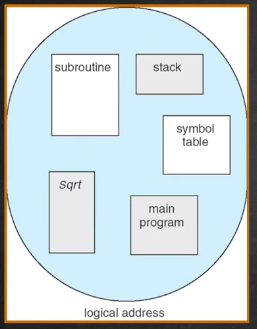

段式存储管理中

- 将程序的逻辑地址空间内容分为不同的段进行管理，
- 逻辑地址空间与物理地址空间之间的映射关系图可以如下所示：
  - 每个段内部是连续的，但是不同的段在物理内存上是不连续的。

- 逻辑地址空间连续，但是物理地址空间不连续，使用映射机制进行关联.

- 大小不一
- 位置不一

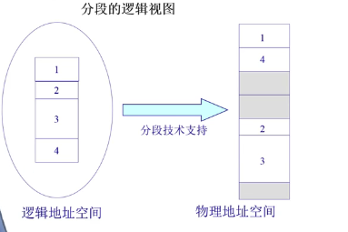

### 分段寻址方案

- 概念：一个段 : 一个内存"块"

- 程序访问内存地址需要 :
  -  一个二维的二元组(s, addr) 
    - s：段号
    - addr：段内偏移

- 操作系统维护一张段表, 存储(段号, 物理地址中的起始地址, 长度限制)

- 物理地址 : 段表中的起始地址 + 二元组中的偏移地址

硬件实现:

- 在程序P运行过程中，
  - CPU要访问逻辑地址中的某个位置，已经知道段号与偏移。
- 操作系统中维护段表，段表记录段号对应的基址与长度
  - 首先MMU比对偏移量与段号对应的长度，
    - 如果偏移量大于长度说明操作不合法内存异常，否则是合法的
- 此时将段基址与偏移相加得到真实物理地址，然后进行访问。

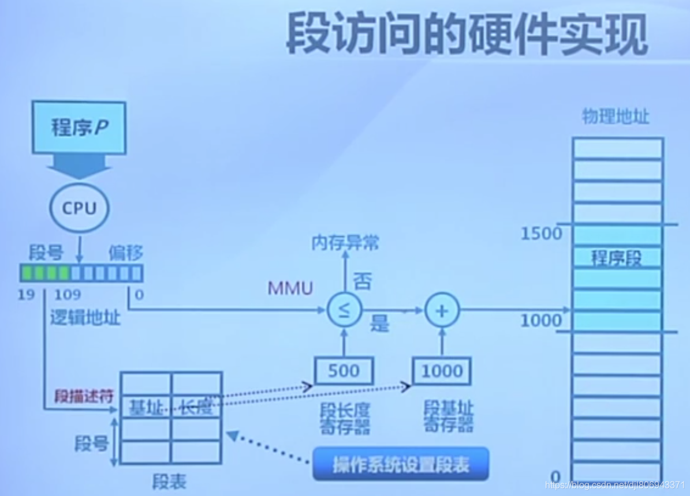

## 分页

#### 分页地址空间

划分物理内存至固定大小的帧(Frame)   | 逻辑页

-   大小是2的幂, 512 / 4096 / 8192

划分逻辑地址空间至相同大小的页(Page)  | 物理页

-   大小是2的幂, 512 / 4096 / 8192

建立方案 → 转换逻辑地址为物理地址(pages to frames)

-   页表
-   MMU / TLB

**帧(Frame)**

- 物理内存被分割为**大小相等**的帧.
-  一个内存物理地址是一个二元组(f, o) → (帧号, 帧内偏移)
- 帧号 : F位, 共有 $$ 2^f $$个帧
- 帧内偏移 : S位, 每帧有$$ 2^s$$个字节
- 物理地址 = $$2^S * f + o$$

> 16-bit地址空间, 9-bit(512 byte) 大小的页帧 
>
> - 物理地址 = (3,6) 
> - 物理地址 = $$2^9 * 3 + 6 = 1542$$
>
> 分页和分段的最大区别 : 这里的 S 是一个固定的数, 而分段中的长度限制不定

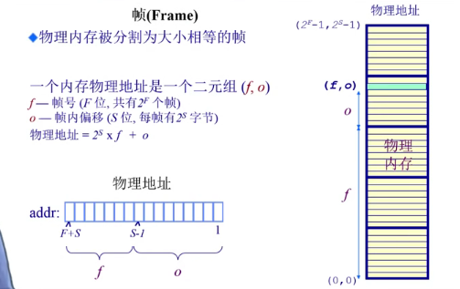

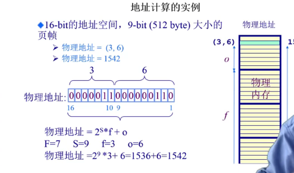

**页(Page)**

- 一个程序的逻辑地址空间被划分为大小相等的页
  - 页内偏移的大小 = 帧内偏移的大小
  - 页号大小 <> 帧号大小

- 一个逻辑地址是一个二元组(p, o) → (页号, 页内偏移)

- 页号 : P位, 共有个页

- 页内偏移 : S位, 每页有$$2^S$$个字节

- 虚拟地址  =$$ 2^S * p + o$$

> 逻辑内存被划分为大小相等的页，表示方式与帧类似。
>
> 由于帧与页的大小是相等的。
>
> 因此在映射关系中 ，页内偏移与帧内偏移是相等的，但是页号与帧号通常是不相等的。
>
> 因为逻辑内存是连续的，物理地址不是连续的。

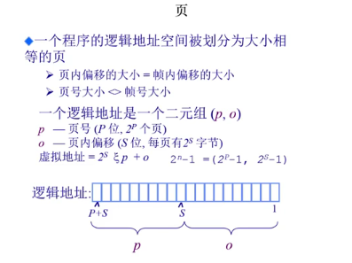

### 分页寻址

> 页表由操作系统初始化时建立，存在特定编号的内存中
>
> 操作系统维护页表，页表内存储页号与帧号之间的映射关系
>
> 页表基址表明了页表存储在什么地方
>
> 存储 : (页号, 帧号)
>
> -   逻辑地址空间应当大于物理内存空间
> -   页映射到帧
> -   页是连续的虚拟内存
> -   帧是非连续的物理内存(有助于减少碎片的产生)
> -   不是所有的页都有对应的帧

页寻址机制

> 比如当程序P执行过程中，
>
> - CPU要访问(p, o)
> - 操作系统通过页表得到帧号f
> - 通过(f, o)找到物理内存地址。
> - 而由于帧和页的大小是2的幂次方
> - 因此实际上地址就是将 f 左移 S 位之后加上 o 即得到物理地址。
>   

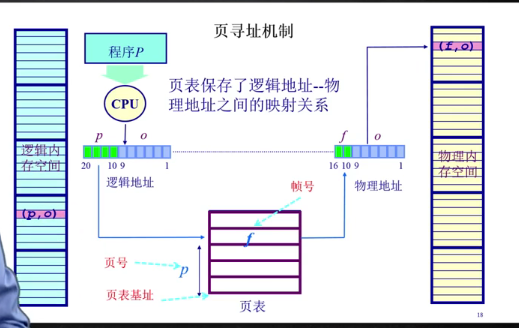

### 页表(Page Table)

#### 页表概述

每一个运行的程序都有一个页表

-   属于程序运行状态, 会动态变化
-   PTBR : 页表基址寄存器

页表中还有一些特殊标志位

-   dirty bit（修改位）：记录页面的内容是否修改了
-   resident bit（存在位）：(0 : 对应的物理页帧在内存中不存在 ; 1 : 存在)
-   clock / reference bit（引用位）：记录是否有对该页面的引用

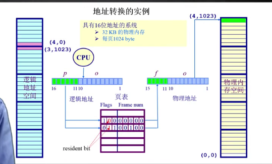

> 如上图，标志位为0（红色）意味着没有给页分配帧，就可以动态的进行变化。

**转换流程**

- CPU根据程序的page的页号的若干位, 计算出索引值index,

- 在页表中搜索这个index, 得到的是帧号,

- 帧号和原本的offset组成物理地址.

**转换实例**

16位地址的系统

-   32KB的物理内存
-   每页的 1024 byte

> 逻辑地址空间 : (4, 0) ... (3, 1023)
>页表 :
>Flags |  Frame nums
>1 0 1    0 0 0 0 0          → 内存访问异常(可能要杀死程序)
>0 1 1    0 0 1 0 0           → 页帧是4 偏移是 1023 → 物理地址 (4, 1023)

#### 分页机制的性能问题

访问一个内存单元需要2次内存访问

-   一次用于获取页表项
-   一次用于访问数据

页表可能非常大

-   64位机器如果每页1024字节, 那么一个页表的大小会是多少？(2^64 / 2^10 = 2^54 存放不下)
-   每一个运行的程序都需要有一个页表

如何处理？

-   缓存(Caching)
-   间接(Indirection)访问

#### 转换后备缓冲区(TLB)

缓解时间问题

Translation Look-aside Buffer(TLB) 是一个缓冲区

CPU中有快表TLB(可以将经常访问的页表存放在这边)

快表是指缓存近期访问过的页表项。它有以下特点：

- TLB使用关联存储（associative memory）实现，具备快速访问性能
  - 因为关联存储在CPU内；
- 如果TLB命中，可以直接访问物理内存；
- 如果TLB未命中，仍需查询页表，并将对应表项更新到TLB中。

> 如果能够很大比例地命中，就可以大幅度提高访问效率。

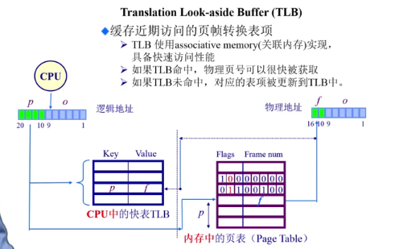

#### 二级/多级页表

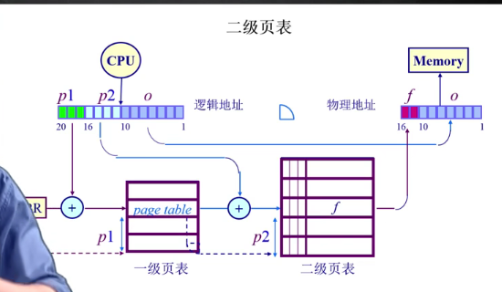

时间换空间

二级页表

-   将页号分为两个部分, 页表分为两个, 一级页号对应一级页表, 二级页号对应二级页表.
-   一级页号查表获得在二级页表的起始地址, 地址加上二级页号的值, 在二级页表中获得帧号
-   节约了一定的空间, 在一级页表中如果resident bit = 0, 可以使得在二级页表中不存储相关index,而只有一张页表的话, 这一些index都需要保留

多级页表

图中是三级页表，逻辑地址的表示由四元组$$(p1,p2,p3,o)$$表示。

p1、p2、p3 分别表示在各级页表中的偏移，o 则表示物理内存中的偏移。

通过多级页表可以有效减少每级页表的长度。

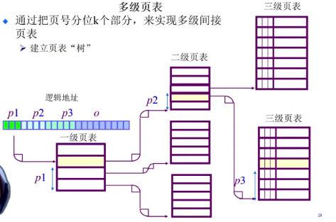

-   通过把页号分为k个部分, 来实现多级间接页表, 建立一棵页表"树"

#### 反向页表

解决大地址空间问题

目的 : 根据帧号获得页号

反向页表只需要存在一张即可

-   有大地址空间(64-bits), 前向映射页表变得繁琐. 比如 : 使用了5级页表
-   不是让页表与逻辑地址空间的大小相对应, 而是当页表与物理地址空间的大小相对应. 逻辑地址空间增长速度快于物理地址空间

##### 基于页寄存器(Page Registers)的方案

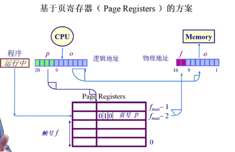

存储 (帧号, 页号) 使得表大小与物理内存大小相关, 而与逻辑内存关联减小.

每一个帧和一个寄存器关联, 寄存器内容包括 :

-   resident bit : 此帧是否被占用
-   occupier : 对应的页号 p
-   protection bits : 保护位

实例 :

-   物理内存大小是 : 4096 * 4096 = 4K * 4KB = 16 MB
-   页面大小是 : 4096 bytes = 4 KB
-   页帧数 : 4096 = 4 K
-   页寄存器使用的空间(假设8 bytes / register) : 8 * 4096 = 32 Kbytes
-   页寄存器带来的额外开销 : 32K / 16M = 0.2%
-   虚拟内存大小 : 任意

优势 :

-   转换表的大小相对于物理内存来说很小
-   转换表的大小跟逻辑地址空间的大小无关

劣势 :

-   需要的信息对调了, 即根据帧号可以找到页号
-   如何转换回来? (如何根据页号找到帧号)
-   在需要在反向页表中搜索想要的页号

##### 基于关联内存(associative memory)的方案

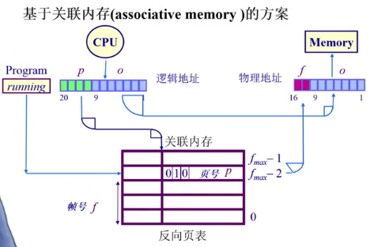

硬件设计复杂, 容量不大, 需要放置在CPU中

-   如果帧数较少, 页寄存器可以被放置在关联内存中
-   在关联内存中查找逻辑页号
    -   成功 : 帧号被提取
    -   失败 : 页错误异常 (page fault)
-   限制因素:
    -   大量的关联内存非常昂贵(
        -   难以在单个时钟周期内完成 
        -    耗电

##### 基于哈希(hash)的方案

- 反置页表也是基于hash映射查找页对应的帧，
- 但是反置页表将进程号也考虑进来，对进程号和页号同时进行hash。
- 最初给进程分配帧的时候就是根据哈希值进行分配的，因此查找时自然可以根据哈希值进行查询。
- 冲突解决方式依然是链表的方式解决，查询发现第一个地址内的进程号与页号与需要的进程号与页号不一致时则继续查询链表中的下一个节点。
- 过程如下：
  - 哈希值加反置页表基址得到反置页表中的位置，验证进程号和页号
  - 命中则根据hash结果查询物理内存。
    

哈希函数 : h(PID, p) 从 PID 标号获得页号

在反向页表中通过哈希算法来搜索一个页对应的帧号

-   对页号做哈希计算, 为了在帧表中获取对应的帧号
-   页 i 被放置在表 f(i) 位置, 其中 f 是设定的哈希函数
-   为了查找页 i , 执行下列操作 :
    -   计算哈希函数 f(i) 并且使用它作为页寄存器表的索引, 获取对应的页寄存器
    -   检查寄存器标签是否包含 i, 如果包含, 则代表成功, 否则失败

