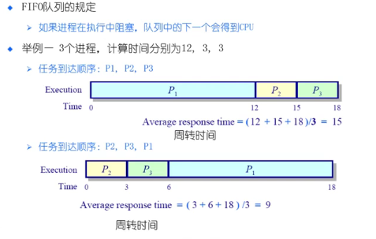
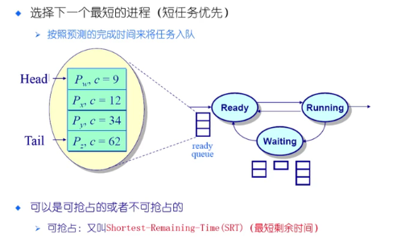
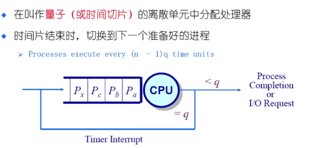
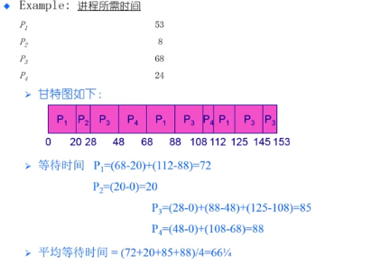
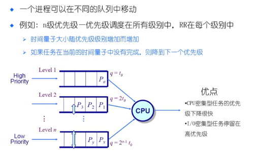
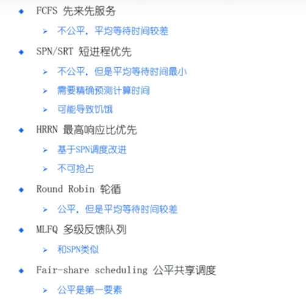
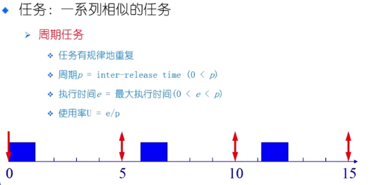

# OS第八章

> 调度算法

## 背景

**上下文切换**

-   切换CPU的当前任务, 从一个进程/线程到另一个
-   保存当前进程/线程在PCB/TCB中的执行上下文(CPU状态)
-   读取下一个进程/线程的上下文

**CPU调度**

-   从就绪队列中挑选一个进程/线程作为CPU将要运行的下一个进程/线程
-   调度程序: 挑选进程/线程的内核函数(通过一些调度策略)
-   什么时候进行调度?

**内核运行调度程序的条件(满足一条即可)**

-   一个进程从运行状态切换到等待状态
-   一个进程被终结

**不可抢占**

-   调度程序必须等待事件结束

**可以抢占**

- 调度程序在中断被相应后执行

- 当前的进程从运行切换到就绪, 或者一个进程从等待切换到就绪

- 当前运行的进程可以被换出

  

> 碎碎念：
>
> 上下文切换的定义简单解释：
>
> - 暂停当前运行进程，从运行状态变成其他状态
> - 调度另一个进程从就绪状态变成运行状态
>
> 上下文切换的要求：
>
> - 切换前，保存进程上下文
> - 切换后，恢复进程上下文
> - 快速切换
>
> 进程存储的生命周期的信息：
>
> - 寄存器（PC，SP，...）
> - CPU状态
> - 内存地址空间

## 调度原则

- 调度策略

  人们通常都需要"更快"的服务

  什么是更快?

  -   传输文件时的高带宽
  -   玩游戏时的低延迟
  -   这两个因素是独立的

  和水管类比

  -   低延迟: 喝水的时候想要一打开水龙头水就流出来
  -   高带宽: 给游泳池充水时希望从水龙头里同时流出大量的水,并且不介意是否存在延迟

  我们的目标:

  -   减少响应时间: 及时处理用户的输出并且尽快将输出提供给用户
  -   减少平均响应时间的波动: 在交互系统中,可预测性比高差异性低平均更重要
  -   增加吞吐量: 
      -   减少开销(操作系统开销,上下文切换)
      -   系统资源的高效率用(CPU,IO设备)
  -   减少等待时间: 减少每个进程的等待时间

- 程序执行模型

  

  执行模型 : 程序在CPU突发和IO中交替

  -   每个调度决定都是关于在下一个CPU突发时将哪个工作交给CPU
  -   在时间分片机制下,线程可能在结束当前CPU突发前被迫放弃CPU

- 评价指标

  - CPU使用率: CPU处于忙状态所占时间的百分比

  - 吞吐量: 在单位时间内完成的进程数量

  - 周转时间: 一个进程从初始化到结束,包括所有等待时间所花费的时间

  - 等待时间: 进程在**就绪队列**中的总时间（**处于就绪态的时间，与阻塞态无关**）

  - 响应时间: 从一个请求被提交到产生第一次响应所花费的总时间

- 各指标在操作系统上的表现:

  - 低延迟调度增加了交互式表现(如果移动了鼠标,但是屏幕中的光标却没动,我们可能会重启电脑)

  - 操作系统需要保证低吞吐量不受影响(我想要结束长时间的编程,所以操作系统必须不时进行调度,即使存在许多交互任务)

  - 吞吐量是操作系统的计算带宽

  - 响应时间是操作系统的计算延迟

- 公平的目标

  举例:

  -   保证每个进程占用相同的CPU时间
  -   这公平嘛?如果一个用户比其他用户运行更多的进程怎么办

  举例:

  -   保证每个进程都等待相同的时间

  公平通常会增加平均响应时间
  
  

## 调度算法

- **FCFS(先来先服务)**

  **First come, First Served**

  如果进程在执行中阻塞,队列中的下一个会得到CPU

  优点: 简单

  缺点:

  -   平均等待时间波动较大
  -   花费时间少的任务可能排在花费时间长的任务后面
  -   可能导致IO和CPU之间的重叠处理(CPU密集型进程会导致IO设备闲置时,IO密集型进程也在等待)

---

​	谁先来就处理谁

- **SPN(SJF) SRT(短进程优先(短作业优先)短剩余时间优先)[最优平均等待时间]**

  Shortest Process Next(Shortest Job First) Shortest Remaining Time

  **按照进程需要的执行时间选择**

  可以是抢占的或者是不可抢占的

  

  > 按照预测的完成时间将任务入队
  >
  > 若有一个Pa , c= 5 进来，直接插队

  

  可能导致饥饿

  -   连续的短任务流会使场任务饥饿
  -   短任务可用时的任何场任务的CPU时间都会增加平均等待时间

  需要预测未来

  -   怎么预估下一个CPU突发的持续时间
  -   简单的解决: 询问用户
  -   如果用户欺骗就杀死进程
  -   如果不知道怎么办?

  

- **HRRN(最高响应比优先)**

  Highest Response Ratio Next

  **按照就绪队列内的等待时间长短选择**

  - 在SPN基础上改进

  - 不可抢占

  - 关注进程等待多长时间

  - 防止无限期推迟

    $$R = ( w + s / s)$$

    $w = waiting time$

    $s = service time$

    选择R值最高的进程

- **Round Robin(轮循)**

  **按照先来先服务，但每个进程执行时间不超过时间片长度，超出会被抢占。经验规则是维持上下文切换开销处于1%以内，大小通常在10ms左右。**

  使用时间切片和抢占来轮流执行任务

  在叫做量子(或者时间切片)的离散单元中分配处理器

  时间片结束时,切换到下一个准备好的进程

  

  

  > - 设置时间片为20
  >   - 若使用了20，切换下一个
  >   - 要是20内就好了，继续换下一个

  

  花销: 额外的上下文切换

  时间量子太大:

  -   等待时间过长
  -   **极限情况退化成FCFS**

  时间量子太小:

  -   反应迅速
  -   吞吐量由于大量的上下文切换开销受到影响

  目标:

  -   选择一个合适的时间量子
  -   **经验规则: 维持上下文切换开销处于1%以内**

  

- **Multilevel Feedback Queues(多级反馈队列)**

  **维护多个就绪进程队列，对不同队列可以使用不同调度策略**

  就绪队列被划分成独立的队列:

  - 如前台(交互),
  - 后台(批处理)

  每个队列拥有自己的调度策略: 

  - 前台(RR),
  - 后台(FCFS)

  调度必须在队列间进行:

  -   固定优先级: 先处理前台,然后处理后台;可能导致饥饿
  -   时间切片: 每个队列都得到一个确定的能够调度其进程的CPU总时间;比如80%使用RR的前台,20%使用FCFS的后台

  一个进程可以在不同的队列中移动

  例如,n级优先级-优先级调度在所有级别中,RR在每个级别中

  -   时间量子大小随优先级级别增加而增加
  -   如果任务在当前的时间量子中没有完成,则降到下一个优先级

  优点: CPU密集型任务的优先级下降很快;IO密集型任务停留在高优先级

- **Fair Share Scheduling(公平共享调度)**

  **按照进程占用资源情况选择**

  FSS控制用户对系统资源的访问

  -   一些用户组比其他用户组更重要
  -   保证不重要的组无法垄断资源
  -   未使用的资源按照每个组所分配的资源的比例来分配
  -   没有达到资源使用率目标的组获得更高的优先级

  

> 在用户层面上保持公平，不是在进程层面上保持公平

**评价方式**

- 确定性建模: 确定一个工作量,然后计算每个算法的表现

- 队列模型: 用来处理随机工作负载的数学方法

- 实现/模拟: 建立一个允许算法运行实际数据的系统;最灵活,最具一般性

调度小结

## 实时调度

- 实时系统

  定义: 正确性依赖于其**时间**和功能两方面的一个操作系统

  性能指标: **时间约束的及时性**;速度和平均性能相对不重要

  主要特征: 时间约束的可预测性

  分类:

  -   强实时系统: 需要在保证时间内完成重要的任务,必须完成
  -   弱实时系统: 要求重要的进程的优先级更高,尽量完成,并非必须

  任务(工作单元): 一次计算,一次文件读取,一次信息传递等

  属性: 

  - 取的进展所需要的资源
  - 定时参数

- 单调速率(RM)

  -   最佳静态优先级调度
  -   通过周期安排优先级
  -   周期越短优先级越高
  -   执行周期最短的任务
- 截止日期最早优先(EDF)

  -   最佳的动态优先级调度
  -   Deadline越早优先级越高
  -   执行Deadline最早的任务

**多处理器调度**

多处理器的CPU调度更复杂:

-   多个相同的单处理器组成一个多处理器
-   优点: 复杂共享

对称多处理器(SMP)

-   每个处理器运行自己的调度程序
-   需要在调度程序中同步

**优先级反转**

- 可以发生在任务基于优先级的可抢占的调度机制中

- 当系统内的环境强制使高优先级任务等待低优先级任务时发生

