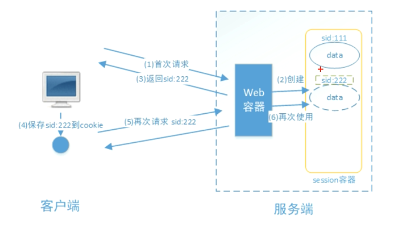
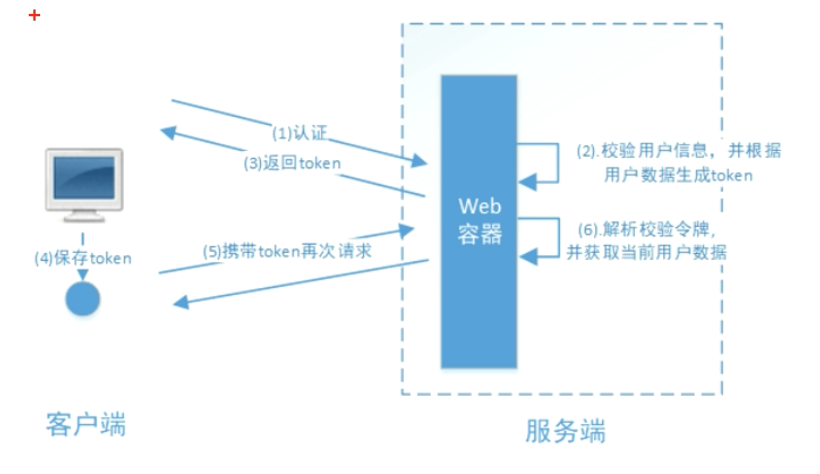
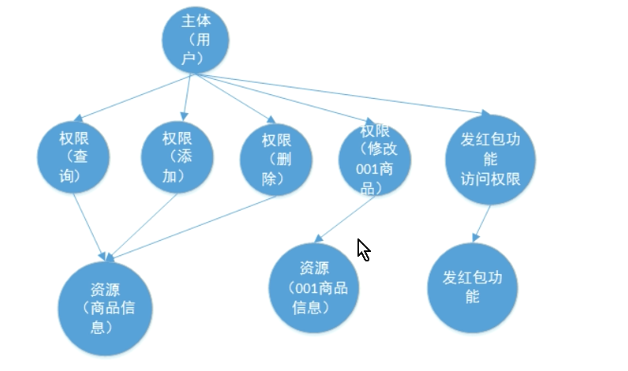
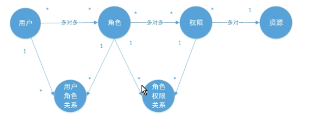
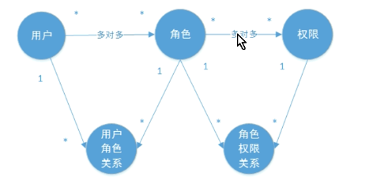
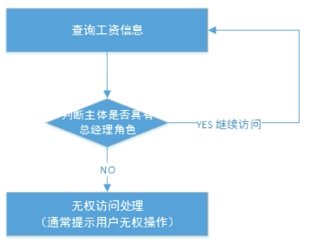
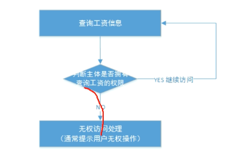

# Spring Security

## 1 基本概念

### 1.1  认证

**系统为什么要认证？**

- 认证是为了保护系统的隐私数据与资源，用户的身份合法方可访问该系统的资源。 
- 认证 
  - 用户认证就是判断一个用户的身份是否合法的过程
  - 用户去访问系统资源时系统要求验证用户的身份信息
    - 身份合法方可继续访问
    - 不合法则拒绝访问
- 常见的用户身份认证方式有
  - 用户名密码登录
  - 二维码登录
  - 手机短信登录
  - 指纹认证等方式


### 1.2 会话

用户认证通过后，为了避免用户的每次操作都进行认证可将用户的信息保证在会话中。

**会话**

- 是系统为了保持当前 用户的登录状态所提供的机制
- 常见的有基于session方式、基于token方式等。

---

基于session的认证方式如下图： 
交互流程
- 用户认证成功后，在服务端生成用户相关的数据保存在session(当前会话)中
- 发给客户端的 sesssion_id 存放到 cookie 中
- 此时用户客户端请求时带上 session_id 就可以验证服务器端是否存在 session 数 据，以此完成用户的合法校验
- 当用户退出系统或session过期销毁时,客户端的session_id也就无效了




基于token的认证方式如下图：

交互流程

- 用户认证成功后，服务端生成一个token发给客户端
- 客户端可以放到 cookie 或 localStorage 等存储中
- 每次请求时带上 token，服务端收到token通过验证后即可确认用户身份。




基于session的认证方式由Servlet规范定制，服务端要存储session信息需要占用内存资源，客户端需要支持 cookie；

基于token的方式则一般不需要服务端存储token，并且不限制客户端的存储方式。如今移动互联网时代 更多类型的客户端需要接入系统，系统多是采用前后端分离的架构进行实现，所以基于token的方式更适合。

---


### 1.3 授权

为什么要授权?

- 认证是为了保证用户身份的合法性,授权则是为了更细粒度的对隐私数据进行划分
- 授权是在认证通过后发生的， 控制不同的用户能够访问不同的资源。 
- 授权： 授权是用户认证通过根据用户的**权限**来控制用户访问**资源**的过程，拥有资源的访问权限则正常访问，没有 权限则拒绝访问。


### 1.4 授权的数据模型

授权可简单理解为Who对What(which)进行How操作

- Who，即主体（Subject）
  - 主体一般是指用户，也可以是程序，需要访问系统中的资源。
-  What，即资源 （Resource）
  - 如系统菜单、页面、按钮、代码方法、系统商品信息、系统订单信息等。
  - 系统菜单、页面、按钮、代码方法都属于系统功能资源
  - 对于web系统每个功能资源通常对应一个URL；系统商品信息、系统订单信息 都属于实体资源（数据资源）
    - 实体资源由资源类型和资源实例组成
      - 比如商品信息为资源类型
      - 商品编号 为001 的商品为资源实例
-  How，权限/许可（Permission）
  - 规定了用户对资源的操作许可，权限离开资源没有意义

主体、资源、权限关系如下图




**正常权限模型建立**

主体、资源、权限相关的数据模型如下： 

- 主体（用户id、账号、密码、...）
- 资源（资源id、资源名称、访问地址、...） 
- 权限（权限id、权限标识、权限名称、资源id、...） 
- 角色（角色id、角色名称、...） 
- 角色和权限关系（角色id、权限id、...） 
- 主体（用户）和角色关系（用户id、角色id、...） 

主体（用户）、资源、权限关系如下图：




- 用角色赋予用户权限
  - 角色--权限：由角色权限关系控制
  - 用户--角色：由用户角色关系控制


**优化的模型建立**

- 资源（资源id、资源名称、访问地址、...） 
- 权限（权限id、权限标识、权限名称、资源id、...） 

合并为 

- 权限（权限id、权限标识、权限名称、资源名称、资源访问地址、...）

(6张表变成5张表)


修改后数据模型之间的关系如下图




### 1.5 RBAC
如何实现授权？业界通常基于RBAC实现授权。 

#### 1.5.1 基于角色的访问控制

RBAC基于角色的访问控制（Role-Based Access Control）是按角色进行授权

比如：主体的角色为总经理可以查询企业运营报表，查询员工工资信息等

访问控制流程如下：




根据上图逻辑，授权伪代码如下：

```java
if(host.hasRole("总经理角色id")){
    select salary
}
```

如果查询工资所需要的角色变化为总经理和部门经理

此时就需要修改判断逻辑为“判断用户的角色是否是 总经理或部门经理”，修改代码如下：

```java
if(host.hasRole("总经理角色id") || host.hasRole("部门经理角色id")){
	select salary
}
```


#### 1.5.2 基于资源的访问控制

RBAC基于资源的访问控制（Resource-Based Access Control）是按资源（或权限）进行授权

比如：用户必须 具有查询工资权限才可以查询员工工资信息等

访问控制流程如下：



```java
if(salary.hasPermission("查询工资权限标识")){
	selcet salary
}

```


> 优点：系统设计时定义好查询工资的权限标识，即使查询工资所需要的角色变化为总经理和部门经理也不需要修改 授权代码，系统可扩展性强。


## 2 基于Session的认证方式

### 2.1 认证流程

基于session的认证方式如下图： 
交互流程

- 用户认证成功后，在服务端生成用户相关的数据保存在session(当前会话)中
- 发给客户端的 sesssion_id 存放到 cookie 中
- 此时用户客户端请求时带上 session_id 就可以验证服务器端是否存在 session 数 据，以此完成用户的合法校验
- 当用户退出系统或session过期销毁时,客户端的session_id也就无效了


基于Session的认证机制由Servlet规范定制，Servlet容器已实现，用户通过HttpSession的操作

方法即可实现

如下是HttpSession相关的操作API:

| 方法                                        | 含义                    |
| ------------------------------------------- | ----------------------- |
| HttoSession getSession(Boolean create)      | 获取当前HttpSession对象 |
| void setAttribute(String name,Object value) | 向session中存放对象     |
| object getAttribute(Stirng name)            | 从session中获取对象     |
| void removeAttribute(Stirng name)           | 移除session中对象       |
| void invalidate()                           | 使HttpSession失效       |


